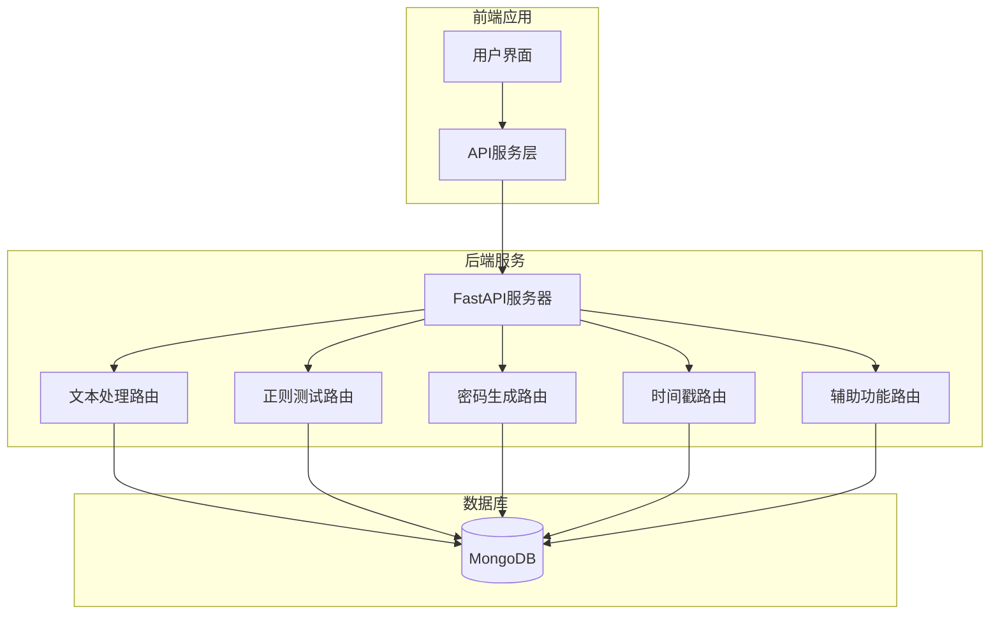
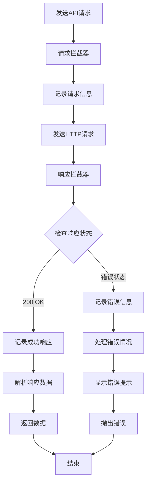

# API文档

<cite>
**本文档中引用的文件**
- [ZYTool/src/services/api.ts](file://ZYTool/src/services/api.ts)
- [backend/app.py](file://backend/app.py)
- [backend/routers/text.py](file://backend/routers/text.py)
- [backend/routers/regex.py](file://backend/routers/regex.py)
- [backend/routers/password.py](file://backend/routers/password.py)
- [backend/routers/timestamp.py](file://backend/routers/timestamp.py)
- [backend/routers/misc.py](file://backend/routers/misc.py)
- [backend/schemas.py](file://backend/schemas.py)
- [ZYTool/src/views/HomeView.vue](file://ZYTool/src/views/HomeView.vue)
- [ZYTool/src/views/JsonToolView.vue](file://ZYTool/src/views/JsonToolView.vue)
- [ZYTool/src/views/DiffToolView.vue](file://ZYTool/src/views/DiffToolView.vue)
- [ZYTool/src/views/TimestampToolView.vue](file://ZYTool/src/views/TimestampToolView.vue)
</cite>

## 目录
1. [简介](#简介)
2. [API架构概览](#api架构概览)
3. [核心接口详解](#核心接口详解)
4. [错误处理机制](#错误处理机制)
5. [调用示例](#调用示例)
6. [最佳实践](#最佳实践)
7. [故障排除指南](#故障排除指南)

## 简介

ZYTool是一个集成了多种实用工具的在线平台，采用前后端分离架构。后端使用FastAPI构建RESTful API，前端使用Vue.js开发用户界面。本文档详细介绍了所有公开的API接口，包括核心功能接口和辅助接口。

### 技术栈
- **后端**: FastAPI (Python)
- **前端**: Vue.js + TypeScript
- **通信协议**: HTTP/HTTPS
- **数据格式**: JSON

## API架构概览



**图表来源**
- [backend/app.py](file://backend/app.py#L11-L32)
- [ZYTool/src/services/api.ts](file://ZYTool/src/services/api.ts#L1-L178)

### 服务器配置

- **基础URL**: `http://localhost:8000/api`
- **超时设置**: 10秒
- **CORS配置**: 允许来自`http://localhost:5173`和`http://localhost:3000`的跨域请求
- **内容类型**: `application/json`

**章节来源**
- [backend/app.py](file://backend/app.py#L14-L20)
- [ZYTool/src/services/api.ts](file://ZYTool/src/services/api.ts#L4-L10)

## 核心接口详解

### 文本处理接口

#### POST /api/text/process

**功能**: 处理各种文本格式转换操作

**请求参数**:
```typescript
interface TextProcessRequest {
    text: string;           // 待处理的文本内容
    action: 'json_format' | 'base64_encode' | 'base64_decode' | 'url_encode' | 'url_decode';
}
```

**响应格式**:
```typescript
interface TextProcessResponse {
    result: string;         // 处理后的结果
    success: boolean;       // 操作是否成功
}
```

**支持的操作类型**:
- `json_format`: JSON格式化
- `base64_encode`: Base64编码
- `base64_decode`: Base64解码
- `url_encode`: URL编码
- `url_decode`: URL解码

**错误码**:
- 400: 不支持的操作类型
- 500: 处理过程中发生异常

**章节来源**
- [backend/routers/text.py](file://backend/routers/text.py#L13-L42)
- [ZYTool/src/services/api.ts](file://ZYTool/src/services/api.ts#L106-L109)

### 文本对比接口

#### POST /api/text/compare

**功能**: 对比两个文本的差异，支持逐行比较

**请求参数**:
```typescript
interface TextCompareRequest {
    text1: string;          // 第一个文本
    text2: string;          // 第二个文本
}
```

**响应格式**:
```typescript
interface TextCompareResponse {
    differences: Array<{
        line: number;           // 行号
        text1: string;          // 文本1的内容
        text2: string;          // 文本2的内容
        type: 'modified' | 'added' | 'removed';  // 差异类型
    }>;
    summary: {
        total_lines: number;    // 总行数
        different_lines: number;// 不同行数
        identical: boolean;     // 是否完全相同
    };
}
```

**章节来源**
- [backend/routers/text.py](file://backend/routers/text.py#L45-L73)
- [ZYTool/src/services/api.ts](file://ZYTool/src/services/api.ts#L112-L128)

### 正则表达式测试接口

#### POST /api/regex/test

**功能**: 测试正则表达式匹配结果

**请求参数**:
```typescript
interface RegexTestRequest {
    pattern: string;        // 正则表达式模式
    text: string;           // 待匹配的文本
}
```

**响应格式**:
```typescript
interface RegexTestResponse {
    matches: string[];      // 所有匹配结果
    match_details: Array<{
        match: string;          // 匹配的完整文本
        start: number;          // 匹配开始位置
        end: number;            // 匹配结束位置
        groups: string[];       // 捕获组内容
    }>;
    success: boolean;       // 操作是否成功
}
```

**错误码**:
- 400: 正则表达式语法错误
- 500: 匹配过程中发生异常

**章节来源**
- [backend/routers/regex.py](file://backend/routers/regex.py#L10-L33)
- [ZYTool/src/services/api.ts](file://ZYTool/src/services/api.ts#L130-L142)

### 密码生成接口

#### POST /api/password/generate

**功能**: 生成符合指定要求的安全密码

**请求参数**:
```typescript
interface PasswordGenerateRequest {
    length?: number;                    // 密码长度，默认12
    include_symbols?: boolean;          // 是否包含符号，默认true
    include_numbers?: boolean;          // 是否包含数字，默认true
    include_uppercase?: boolean;        // 是否包含大写字母，默认true
    include_lowercase?: boolean;        // 是否包含小写字母，默认true
}
```

**响应格式**:
```typescript
interface PasswordGenerateResponse {
    password: string;                   // 生成的密码
    length: number;                     // 密码长度
    character_types: {
        lowercase: boolean;             // 包含小写字母
        uppercase: boolean;             // 包含大写字母
        numbers: boolean;               // 包含数字
        symbols: boolean;               // 包含符号
    };
}
```

**约束条件**:
- 至少需要选择一种字符类型
- 密码长度范围：6-50字符

**错误码**:
- 400: 至少需要选择一种字符类型
- 500: 密码生成过程中发生异常

**章节来源**
- [backend/routers/password.py](file://backend/routers/password.py#L11-L38)
- [ZYTool/src/services/api.ts](file://ZYTool/src/services/api.ts#L145-L158)

### 时间戳转换接口

#### POST /api/timestamp/convert

**功能**: 在时间戳和日期时间之间相互转换

**请求参数**:
```typescript
interface TimestampConvertRequest {
    timestamp: number;                  // 时间戳
    action: 'to_datetime' | 'to_timestamp';  // 转换方向
}
```

**响应格式**:
```typescript
interface TimestampConvertResponse {
    datetime: string;                   // 日期时间字符串 (YYYY-MM-DD HH:mm:ss)
    timestamp: number;                  // 转换后的时间戳
    action: string;                     // 执行的转换操作
}
```

**支持的操作**:
- `to_datetime`: 将时间戳转换为日期时间
- `to_timestamp`: 将日期时间转换为时间戳

**章节来源**
- [backend/routers/timestamp.py](file://backend/routers/timestamp.py#L10-L33)
- [ZYTool/src/services/api.ts](file://ZYTool/src/services/api.ts#L160-L168)

### 辅助功能接口

#### GET /api/categories

**功能**: 获取工具分类列表

**响应格式**:
```typescript
interface CategoriesResponse {
    categories: Array<{
        id: number;
        name: string;
        description: string;
        tools: Array<{
            id: number;
            name: string;
            icon: string;
            description: string;
            type?: 'frontend' | 'backend';
        }>;
    }>;
}
```

**章节来源**
- [backend/routers/misc.py](file://backend/routers/misc.py#L7-L45)

#### GET /api/health

**功能**: 健康检查接口

**响应格式**:
```typescript
interface HealthCheckResponse {
    status: string;     // 健康状态
    message: string;    // 状态消息
}
```

**响应示例**:
```json
{
    "status": "healthy",
    "message": "ZYTool API is running"
}
```

**章节来源**
- [backend/routers/misc.py](file://backend/routers/misc.py#L48-L51)

## 错误处理机制

### HTTP状态码

| 状态码 | 含义 | 使用场景 |
|--------|------|----------|
| 200 | 成功 | 请求正常处理完成 |
| 400 | 客户端错误 | 请求参数无效或格式错误 |
| 404 | 资源不存在 | 接口路径不存在 |
| 500 | 服务器内部错误 | 后端处理过程中发生异常 |

### 错误响应格式

```typescript
interface ErrorResponse {
    error?: string;     // 错误描述信息
    success: boolean;   // 操作失败标记
    [key: string]: any; // 其他错误相关信息
}
```

### 前端错误处理



**图表来源**
- [ZYTool/src/services/api.ts](file://ZYTool/src/services/api.ts#L13-L33)

**章节来源**
- [ZYTool/src/services/api.ts](file://ZYTool/src/services/api.ts#L13-L33)

## 调用示例

### TypeScript/JavaScript调用示例

```typescript
import { ApiService } from './services/api';

// 文本处理示例
try {
    const result = await ApiService.processText({
        text: '{"name":"ZYTool","version":"1.0.0"}',
        action: 'json_format'
    });
    console.log('格式化结果:', result.result);
} catch (error) {
    console.error('文本处理失败:', error);
}

// 正则测试示例
try {
    const regexResult = await ApiService.testRegex({
        pattern: '\\d+',
        text: '订单编号: 12345，客户ID: ABCD'
    });
    console.log('匹配结果:', regexResult.matches);
} catch (error) {
    console.error('正则测试失败:', error);
}

// 密码生成示例
try {
    const passwordResult = await ApiService.generatePassword({
        length: 16,
        include_symbols: true,
        include_numbers: true,
        include_uppercase: true,
        include_lowercase: true
    });
    console.log('生成的密码:', passwordResult.password);
} catch (error) {
    console.error('密码生成失败:', error);
}

// 时间戳转换示例
try {
    const timestampResult = await ApiService.convertTimestamp({
        timestamp: 1640995200,
        action: 'to_datetime'
    });
    console.log('转换后的日期:', timestampResult.datetime);
} catch (error) {
    console.error('时间戳转换失败:', error);
}
```

### 健康检查示例

```typescript
// 健康检查
try {
    const health = await ApiService.healthCheck();
    console.log('服务状态:', health.status);
} catch (error) {
    console.error('服务不可用');
}
```

### 文本对比示例

```typescript
// 文本对比
try {
    const compareResult = await ApiService.compareText({
        text1: '第一行\n第二行\n第三行',
        text2: '第一行\n修改后的第二行\n第三行'
    });
    
    console.log('差异数量:', compareResult.summary.different_lines);
    compareResult.differences.forEach(diff => {
        console.log(`第${diff.line}行 (${diff.type}):`, diff.text1, '->', diff.text2);
    });
} catch (error) {
    console.error('文本对比失败:', error);
}
```

**章节来源**
- [ZYTool/src/services/api.ts](file://ZYTool/src/services/api.ts#L106-L174)

## 最佳实践

### 1. 请求优化

- **合理设置超时时间**: 根据网络环境调整超时设置
- **使用适当的请求频率**: 避免频繁调用API导致服务器压力
- **缓存响应数据**: 对于不经常变化的数据进行本地缓存

### 2. 错误处理

- **全面的错误捕获**: 捕获所有可能的异常情况
- **友好的用户提示**: 向用户提供清晰的错误信息
- **重试机制**: 对于临时性错误实现自动重试

### 3. 安全考虑

- **输入验证**: 对所有用户输入进行严格验证
- **防止XSS攻击**: 对输出内容进行适当转义
- **限制请求频率**: 实现API访问频率限制

### 4. 性能优化

- **批量处理**: 对于大量数据处理，考虑批量操作
- **异步处理**: 对于耗时操作使用异步处理
- **资源清理**: 及时释放不再使用的资源

## 故障排除指南

### 常见问题及解决方案

#### 1. CORS跨域问题

**症状**: 浏览器控制台出现CORS错误

**解决方案**:
- 确保后端CORS配置正确
- 检查前端请求的Origin是否在允许列表中
- 验证预检请求是否通过

#### 2. 请求超时

**症状**: API请求长时间无响应

**解决方案**:
- 检查网络连接状态
- 增加请求超时时间
- 优化请求参数，避免处理大量数据

#### 3. 认证失败

**症状**: 返回401未授权错误

**解决方案**:
- 检查认证令牌的有效性
- 验证请求头中的认证信息
- 确认用户权限设置

#### 4. 数据格式错误

**症状**: 返回400错误，提示请求格式错误

**解决方案**:
- 检查请求参数的类型和格式
- 验证必填字段是否完整
- 确认数据编码格式正确

### 调试技巧

1. **启用详细日志**: 在开发环境中开启详细的请求和响应日志
2. **使用开发者工具**: 利用浏览器的网络面板监控API调用
3. **单元测试**: 编写单元测试验证API接口的正确性
4. **监控指标**: 设置API调用的成功率和响应时间监控

**章节来源**
- [ZYTool/src/services/api.ts](file://ZYTool/src/services/api.ts#L13-L33)

## 结论

ZYTool的API设计遵循RESTful原则，提供了完整的工具处理功能。通过合理的错误处理机制和详细的文档说明，开发者可以轻松集成和使用这些API接口。建议在实际使用中遵循最佳实践，确保系统的稳定性和安全性。