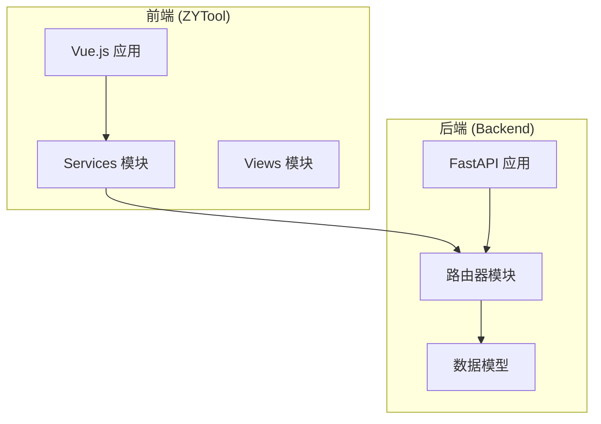
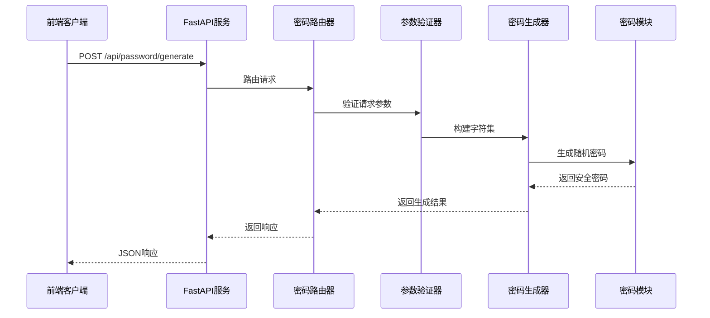
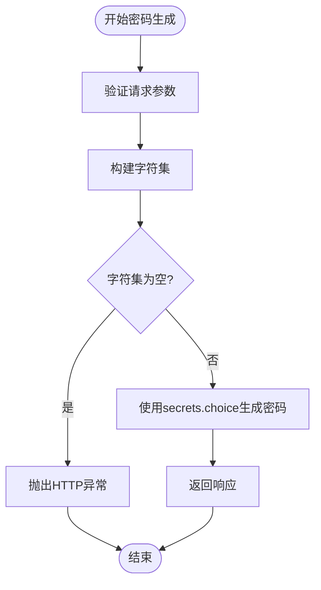
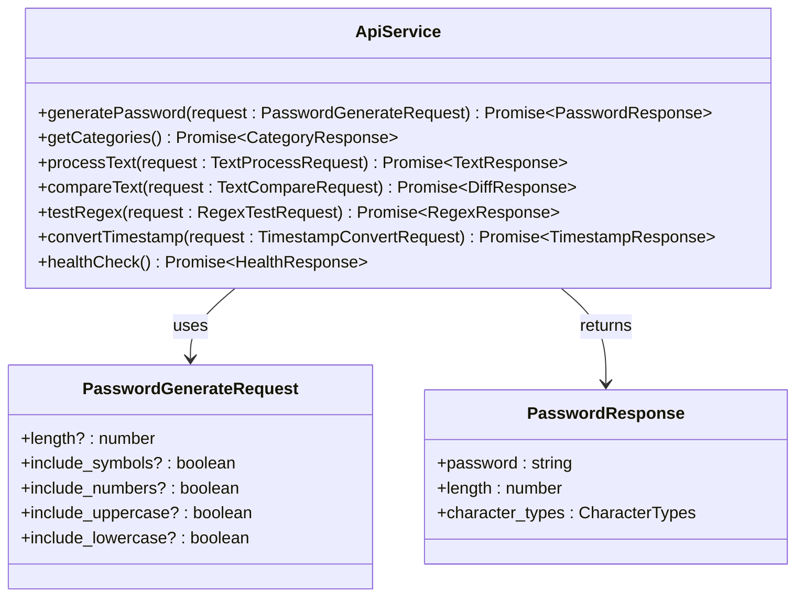
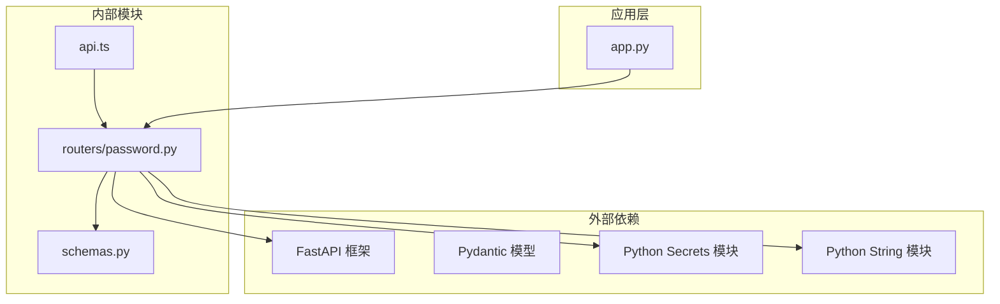

# 密码生成API

<cite>
**本文档中引用的文件**
- [backend/routers/password.py](file://backend/routers/password.py)
- [ZYTool/src/services/api.ts](file://ZYTool/src/services/api.ts)
- [backend/schemas.py](file://backend/schemas.py)
- [backend/app.py](file://backend/app.py)
</cite>

## 目录
1. [简介](#简介)
2. [项目结构](#项目结构)
3. [核心组件](#核心组件)
4. [架构概览](#架构概览)
5. [详细组件分析](#详细组件分析)
6. [依赖关系分析](#依赖关系分析)
7. [性能考虑](#性能考虑)
8. [故障排除指南](#故障排除指南)
9. [结论](#结论)

## 简介

100_Code项目的密码生成API是一个基于FastAPI框架构建的RESTful服务，专门用于生成安全密码。该API提供了灵活的密码生成选项，允许用户通过配置不同的字符类型来定制生成的密码。系统采用前后端分离架构，前端使用Vue.js框架，后端使用Python FastAPI框架，确保了良好的用户体验和高性能的密码生成能力。

## 项目结构

密码生成API的项目结构清晰地分为前端和后端两部分：



**图表来源**
- [ZYTool/src/services/api.ts](file://ZYTool/src/services/api.ts#L1-L178)
- [backend/app.py](file://backend/app.py#L1-L33)
- [backend/routers/password.py](file://backend/routers/password.py#L1-L41)

**章节来源**
- [ZYTool/src/services/api.ts](file://ZYTool/src/services/api.ts#L1-L178)
- [backend/app.py](file://backend/app.py#L1-L33)

## 核心组件

密码生成API的核心组件包括数据模型、API路由器和密码生成逻辑：

### 数据模型组件

系统定义了两个关键的数据模型：

1. **PasswordGenerateRequest**: 定义了密码生成的请求参数
2. **ApiResponse**: 定义了密码生成的响应格式

这些模型确保了请求和响应的数据结构一致性，并提供了类型安全的验证机制。

### API路由器组件

路由器负责处理HTTP请求，实现了标准的RESTful API设计模式，支持幂等性和状态管理。

### 密码生成引擎

密码生成引擎使用Python的secrets模块，确保生成的密码具有加密安全性，适合生产环境使用。

**章节来源**
- [backend/schemas.py](file://backend/schemas.py#L14-L19)
- [backend/routers/password.py](file://backend/routers/password.py#L11-L38)

## 架构概览

密码生成API采用了现代化的微服务架构，具有清晰的分层设计：



**图表来源**
- [ZYTool/src/services/api.ts](file://ZYTool/src/services/api.ts#L145-L158)
- [backend/routers/password.py](file://backend/routers/password.py#L11-L38)

## 详细组件分析

### POST /api/password/generate 端点

#### HTTP方法和URL路径
- **方法**: POST
- **路径**: `/api/password/generate`
- **内容类型**: `application/json`

#### 请求体结构

PasswordGenerateRequest数据模型定义了以下参数：

| 参数名 | 类型 | 默认值 | 描述 |
|--------|------|--------|------|
| length | number | 12 | 生成密码的长度 |
| include_symbols | boolean | true | 是否包含特殊符号 |
| include_numbers | boolean | true | 是否包含数字 |
| include_uppercase | boolean | true | 是否包含大写字母 |
| include_lowercase | boolean | true | 是否包含小写字母 |

#### 请求示例

```typescript
// 完整配置请求
{
  length: 16,
  include_symbols: true,
  include_numbers: true,
  include_uppercase: true,
  include_lowercase: true
}

// 自定义配置请求
{
  length: 10,
  include_symbols: false,
  include_numbers: true,
  include_uppercase: false,
  include_lowercase: true
}
```

#### 成功响应格式

当密码生成成功时，API返回以下结构的JSON响应：

```typescript
interface PasswordResponse {
  password: string;      // 生成的密码
  length: number;        // 密码长度
  character_types: {     // 字符类型配置
    lowercase: boolean;
    uppercase: boolean;
    numbers: boolean;
    symbols: boolean;
  };
}
```

#### 错误响应

如果请求参数无效，API会返回相应的错误响应：

```typescript
// 至少需要选择一种字符类型
{
  "detail": "至少需要选择一种字符类型"
}
```

**章节来源**
- [backend/routers/password.py](file://backend/routers/password.py#L11-L38)
- [backend/schemas.py](file://backend/schemas.py#L14-L19)

### 后端实现分析

#### 密码生成算法

后端密码生成器使用了Python的secrets模块，这是一个专门用于密码学安全操作的标准库模块：



**图表来源**
- [backend/routers/password.py](file://backend/routers/password.py#L14-L26)
- [backend/routers/password.py](file://backend/routers/password.py#L27-L38)

#### 字符集构建逻辑

系统根据用户的选择动态构建字符集：

- **小写字母**: `string.ascii_lowercase` (`abcdefghijklmnopqrstuvwxyz`)
- **大写字母**: `string.ascii_uppercase` (`ABCDEFGHIJKLMNOPQRSTUVWXYZ`)
- **数字**: `string.digits` (`0123456789`)
- **特殊符号**: `!@#$%^&*()_+-=[]{}|;:,.<>?`

#### 安全性保证

密码生成过程使用了以下安全特性：
- 使用`secrets.choice()`而非`random.choice()`，确保密码学安全性
- 支持任意长度的密码生成
- 提供多种字符类型的组合选项

**章节来源**
- [backend/routers/password.py](file://backend/routers/password.py#L14-L26)
- [backend/routers/password.py](file://backend/routers/password.py#L27-L38)

### 前端集成分析

#### ApiService接口

前端通过ApiService类提供统一的API访问接口：



**图表来源**
- [ZYTool/src/services/api.ts](file://ZYTool/src/services/api.ts#L67-L73)
- [ZYTool/src/services/api.ts](file://ZYTool/src/services/api.ts#L146-L158)

#### 前端调用示例

前端可以使用以下方式调用密码生成API：

```typescript
// 基础用法
const password = await ApiService.generatePassword({
  length: 12,
  include_symbols: true,
  include_numbers: true,
  include_uppercase: true,
  include_lowercase: true
});

// 自定义配置
const customPassword = await ApiService.generatePassword({
  length: 16,
  include_symbols: false,
  include_numbers: true,
  include_uppercase: false,
  include_lowercase: true
});
```

**章节来源**
- [ZYTool/src/services/api.ts](file://ZYTool/src/services/api.ts#L145-L158)

## 依赖关系分析

系统的依赖关系展现了清晰的分层架构：



**图表来源**
- [backend/routers/password.py](file://backend/routers/password.py#L1-L6)
- [ZYTool/src/services/api.ts](file://ZYTool/src/services/api.ts#L1-L10)

**章节来源**
- [backend/routers/password.py](file://backend/routers/password.py#L1-L6)
- [ZYTool/src/services/api.ts](file://ZYTool/src/services/api.ts#L1-L10)

## 性能考虑

### 密码生成性能

- **时间复杂度**: O(n)，其中n是密码长度
- **空间复杂度**: O(c)，其中c是字符集的大小
- **内存使用**: 由于使用迭代器和字符串拼接，内存占用最小化

### 并发处理

- FastAPI框架支持异步处理，能够高效处理并发请求
- 密码生成过程是无状态的，适合水平扩展

### 缓存策略

虽然密码生成本身不适合缓存，但可以考虑：
- 对于相同的配置，可以实现客户端缓存
- 后端可以实现频率限制防止滥用

## 故障排除指南

### 常见错误及解决方案

#### 1. 至少需要选择一种字符类型
**错误原因**: 用户没有启用任何字符类型选项
**解决方案**: 确保至少启用一个字符类型（小写、大写、数字、符号）

#### 2. 密码长度超出范围
**错误原因**: 请求的密码长度小于1或大于合理上限
**解决方案**: 设置合理的密码长度范围（通常建议6-128字符）

#### 3. 后端服务不可用
**错误原因**: FastAPI服务未启动或网络连接问题
**解决方案**: 检查服务状态，确保后端API正常运行

### 调试技巧

1. **检查网络连接**: 确认前端能够访问后端API
2. **验证请求格式**: 确保请求体符合PasswordGenerateRequest模型
3. **监控日志**: 查看FastAPI服务器的日志输出
4. **测试健康检查**: 使用`GET /api/health`端点验证服务状态

**章节来源**
- [backend/routers/password.py](file://backend/routers/password.py#L24-L25)

## 结论

100_Code项目的密码生成API是一个设计良好、安全可靠的密码生成解决方案。它结合了现代Web技术栈的优势，提供了灵活的配置选项和强大的安全性保障。通过使用FastAPI框架和Vue.js前端，系统实现了高性能的密码生成功能，同时保持了良好的用户体验。

该API的主要优势包括：
- 基于Python secrets模块的密码学安全性
- 灵活的字符类型配置选项
- 清晰的RESTful API设计
- 前后端分离的架构模式
- 完善的错误处理机制

对于开发者而言，这个API提供了一个优秀的参考实现，展示了如何构建安全、可扩展的密码生成服务。