# 文本处理API

<cite>
**本文档中引用的文件**
- [api.ts](file://ZYTool/src/services/api.ts)
- [text.py](file://backend/routers/text.py)
- [schemas.py](file://backend/schemas.py)
- [app.py](file://backend/app.py)
- [JsonToolView.vue](file://ZYTool/src/views/JsonToolView.vue)
- [Base64ToolView.vue](file://ZYTool/src/views/Base64ToolView.vue)
- [UrlToolView.vue](file://ZYTool/src/views/UrlToolView.vue)
- [DiffToolView.vue](file://ZYTool/src/views/DiffToolView.vue)
- [frontendTools.ts](file://ZYTool/src/services/frontendTools.ts)
</cite>

## 目录
1. [简介](#简介)
2. [项目架构](#项目架构)
3. [核心API端点](#核心api端点)
4. [数据模型](#数据模型)
5. [详细接口分析](#详细接口分析)
6. [前端集成](#前端集成)
7. [错误处理](#错误处理)
8. [使用场景](#使用场景)
9. [性能考虑](#性能考虑)
10. [故障排除指南](#故障排除指南)
11. [总结](#总结)

## 简介

100_Code项目的文本处理API提供了强大的文本操作功能，包括JSON格式化、Base64编解码、URL编解码以及文本差异对比。该API采用前后端分离架构，前端工具在浏览器端直接处理，后端API专注于复杂文本处理任务。

## 项目架构

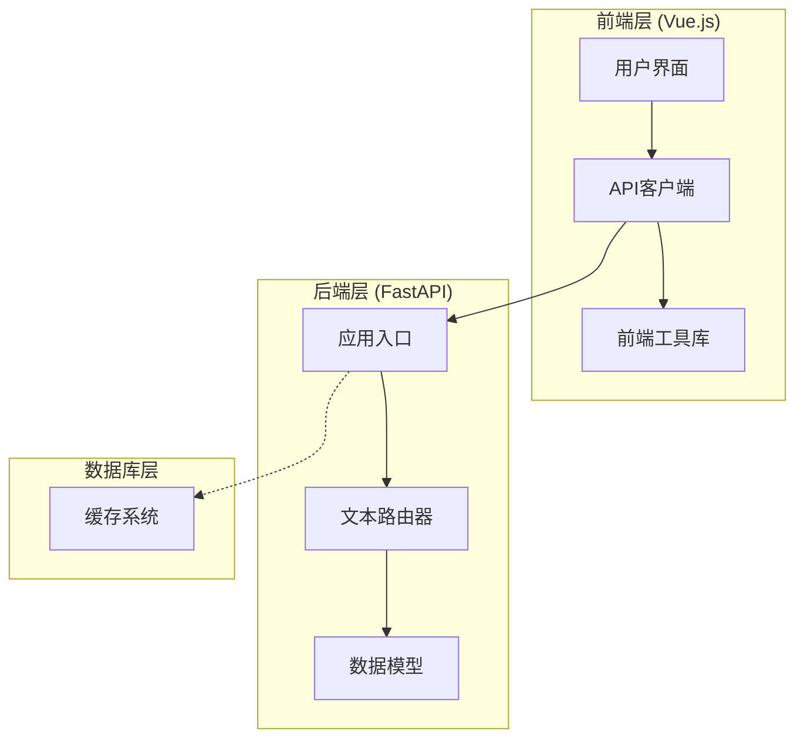

**图表来源**
- [app.py](file://backend/app.py#L1-L33)
- [api.ts](file://ZYTool/src/services/api.ts#L1-L178)
- [text.py](file://backend/routers/text.py#L1-L76)

**章节来源**
- [app.py](file://backend/app.py#L1-L33)
- [api.ts](file://ZYTool/src/services/api.ts#L1-L178)

## 核心API端点

### POST /api/text/process

处理各种文本操作，包括JSON格式化、Base64编解码和URL编解码。

| 属性 | 值 |
|------|-----|
| HTTP方法 | POST |
| URL路径 | `/api/text/process` |
| 内容类型 | `application/json` |
| 认证要求 | 否 |

### POST /api/text/compare

对比两个文本的差异，支持行级差异检测。

| 属性 | 值 |
|------|-----|
| HTTP方法 | POST |
| URL路径 | `/api/text/compare` |
| 内容类型 | `application/json` |
| 认证要求 | 否 |

**章节来源**
- [text.py](file://backend/routers/text.py#L13-L76)

## 数据模型

### TextProcessRequest

文本处理请求的数据模型，定义了处理文本所需的输入参数。

| 字段名 | 数据类型 | 必填 | 描述 | 验证规则 |
|--------|----------|------|------|----------|
| text | string | 是 | 要处理的原始文本 | 非空字符串 |
| action | string | 是 | 操作类型 | 枚举值：json_format, base64_encode, base64_decode, url_encode, url_decode |

**支持的操作类型：**
- `json_format`: JSON格式化
- `base64_encode`: Base64编码
- `base64_decode`: Base64解码
- `url_encode`: URL编码
- `url_decode`: URL解码

### TextCompareRequest

文本对比请求的数据模型，包含两个要对比的文本。

| 字段名 | 数据类型 | 必填 | 描述 | 验证规则 |
|--------|----------|------|------|----------|
| text1 | string | 是 | 第一个文本 | 非空字符串 |
| text2 | string | 是 | 第二个文本 | 非空字符串 |

**章节来源**
- [schemas.py](file://backend/schemas.py#L4-L12)
- [api.ts](file://ZYTool/src/services/api.ts#L52-L60)

## 详细接口分析

### POST /api/text/process 接口

#### 请求结构

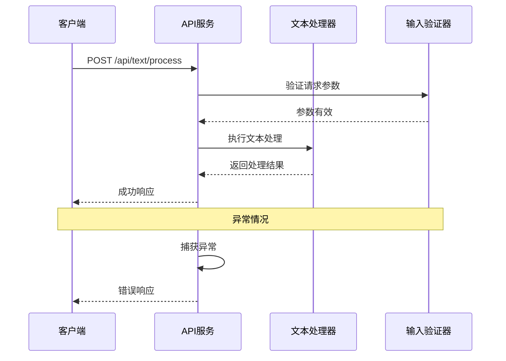

**图表来源**
- [text.py](file://backend/routers/text.py#L13-L42)
- [api.ts](file://ZYTool/src/services/api.ts#L107-L109)

#### 处理流程

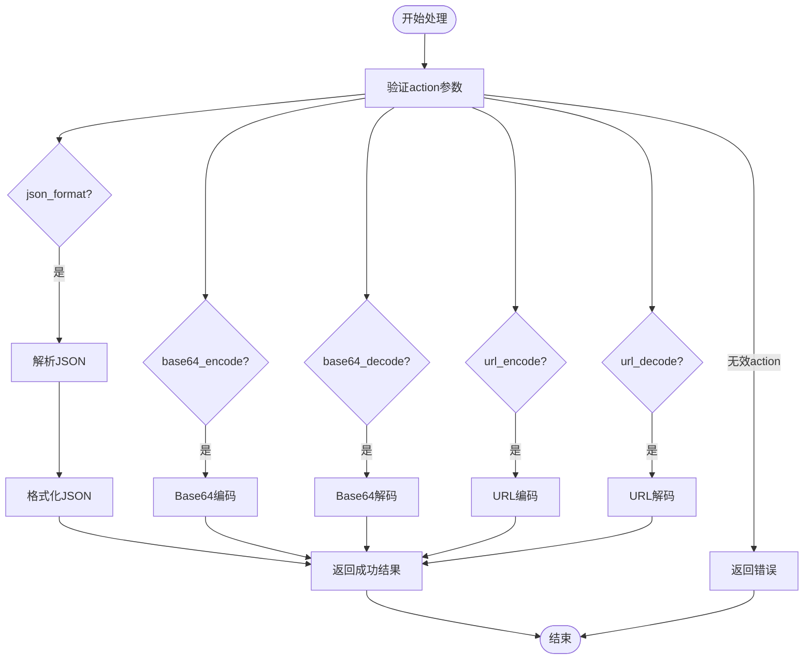

**图表来源**
- [text.py](file://backend/routers/text.py#L16-L41)

#### 成功响应格式

```typescript
interface TextProcessResponse {
    result: string;      // 处理后的文本
    success: boolean;    // 操作是否成功
}
```

#### 错误响应格式

```typescript
interface ErrorResponse {
    result: string;      // 错误信息
    success: boolean;    // 操作失败
}
```

**章节来源**
- [text.py](file://backend/routers/text.py#L13-L42)

### POST /api/text/compare 接口

#### 请求结构

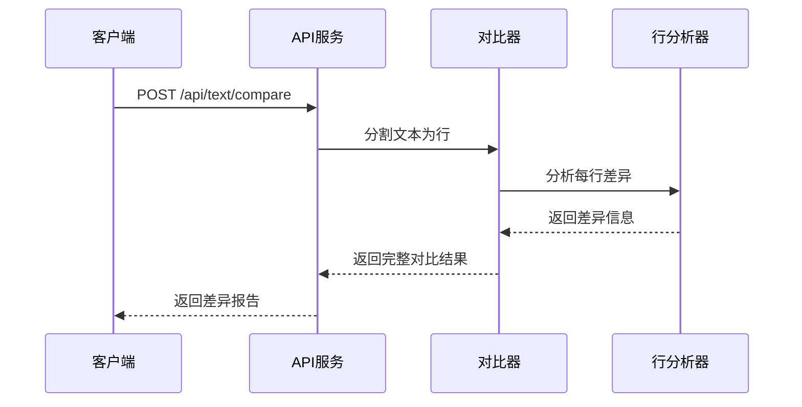

**图表来源**
- [text.py](file://backend/routers/text.py#L45-L73)

#### 对比算法

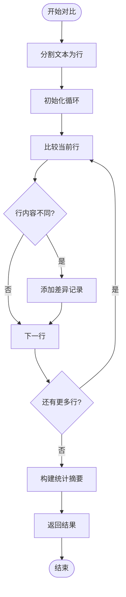

**图表来源**
- [text.py](file://backend/routers/text.py#L48-L73)

#### 响应结构

```typescript
interface TextCompareResponse {
    differences: Array<{
        line: number;           // 行号
        text1: string;         // 文本1的行内容
        text2: string;         // 文本2的行内容
        type: 'modified' | 'added' | 'removed'; // 差异类型
    }>;
    summary: {
        total_lines: number;   // 总行数
        different_lines: number; // 不同行数
        identical: boolean;    // 是否完全相同
    };
}
```

**章节来源**
- [text.py](file://backend/routers/text.py#L45-L73)

## 前端集成

### ApiService 类

前端通过 ApiService 类与后端API交互，提供了类型安全的接口定义。

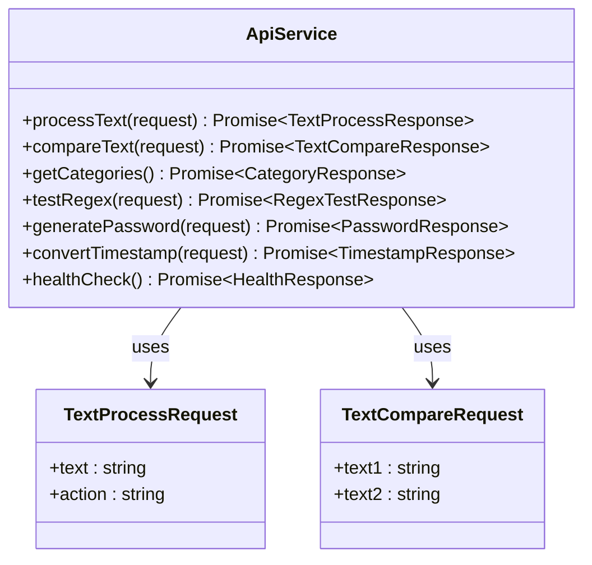

**图表来源**
- [api.ts](file://ZYTool/src/services/api.ts#L99-L128)

### 前端工具函数

对于不需要后端处理的简单文本操作，前端提供了专门的工具函数。

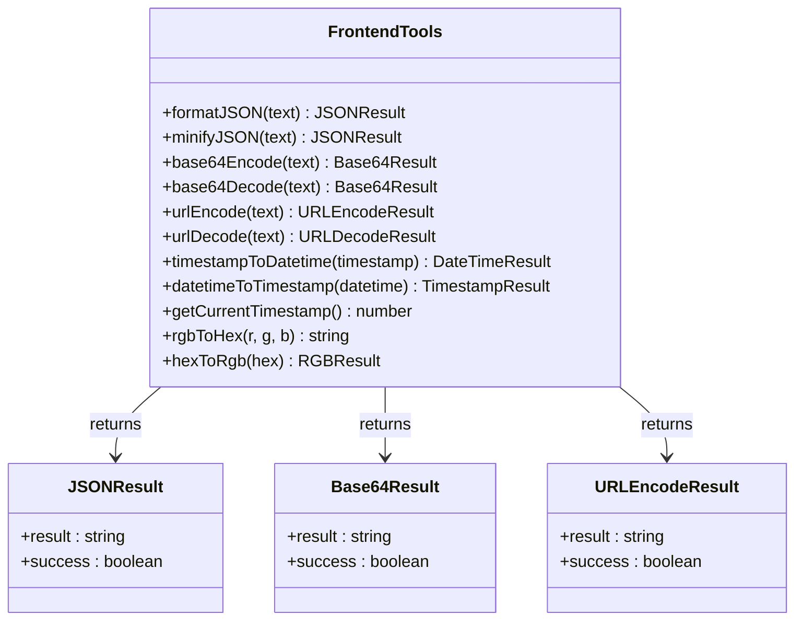

**图表来源**
- [frontendTools.ts](file://ZYTool/src/services/frontendTools.ts#L170-L184)

**章节来源**
- [api.ts](file://ZYTool/src/services/api.ts#L99-L128)
- [frontendTools.ts](file://ZYTool/src/services/frontendTools.ts#L1-L185)

## 错误处理

### 后端异常捕获机制

后端API实现了统一的异常处理机制，确保所有错误都能被妥善处理并返回给客户端。

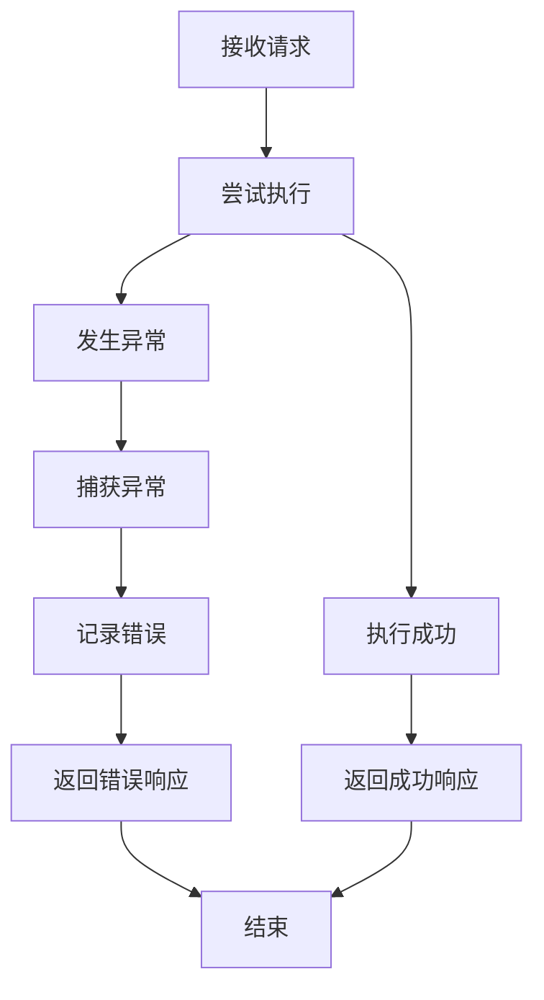

**图表来源**
- [text.py](file://backend/routers/text.py#L41-L42)

### 错误响应策略

| 错误类型 | HTTP状态码 | 错误信息 | 处理建议 |
|----------|------------|----------|----------|
| 参数验证失败 | 400 | "不支持的操作类型" | 检查action参数的有效性 |
| JSON解析错误 | 200 | 具体的JSON错误信息 | 验证输入的JSON格式 |
| Base64解码错误 | 200 | 具体的解码错误信息 | 检查Base64编码的有效性 |
| URL解码错误 | 200 | 具体的解码错误信息 | 检查URL编码的有效性 |

**章节来源**
- [text.py](file://backend/routers/text.py#L38-L42)

## 使用场景

### JSON格式化场景

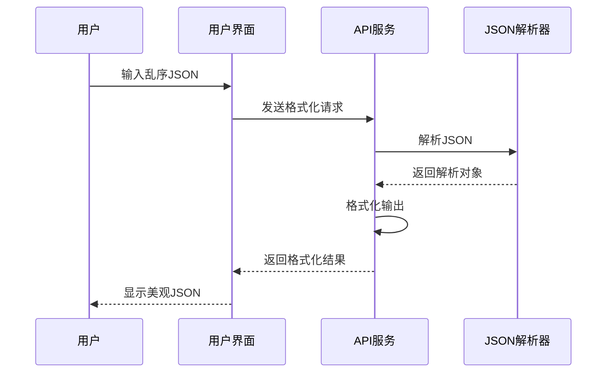

**图表来源**
- [JsonToolView.vue](file://ZYTool/src/views/JsonToolView.vue#L101-L122)

### Base64编解码场景

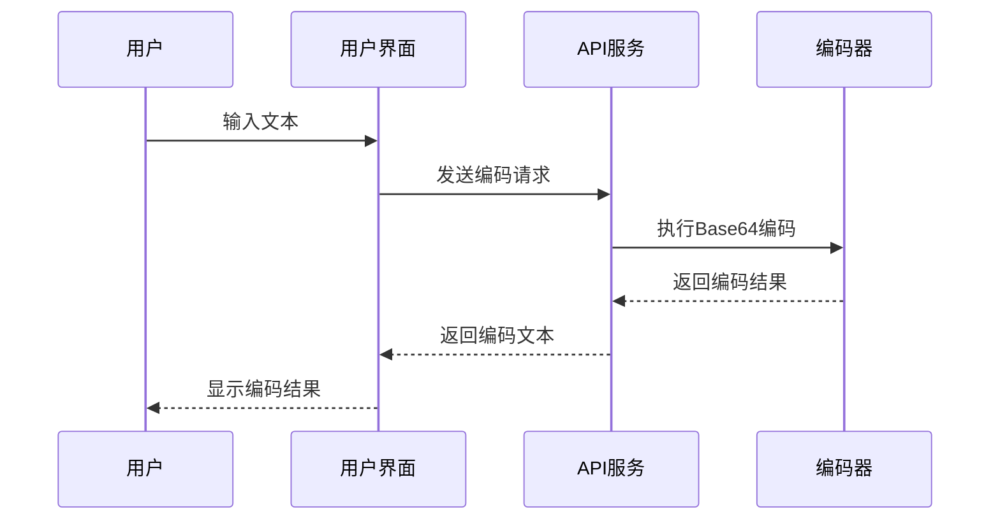

**图表来源**
- [Base64ToolView.vue](file://ZYTool/src/views/Base64ToolView.vue#L72-L103)

### 文本差异对比场景

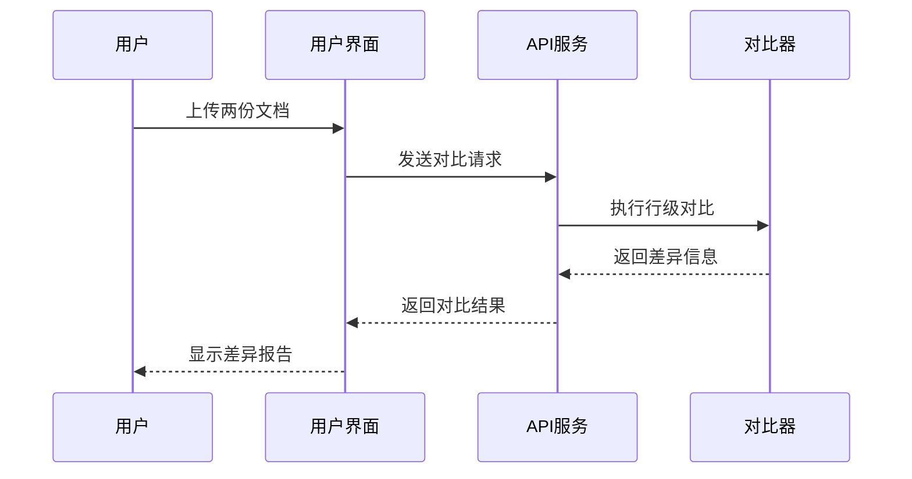

**图表来源**
- [DiffToolView.vue](file://ZYTool/src/views/DiffToolView.vue#L286-L356)

**章节来源**
- [JsonToolView.vue](file://ZYTool/src/views/JsonToolView.vue#L101-L122)
- [Base64ToolView.vue](file://ZYTool/src/views/Base64ToolView.vue#L72-L103)
- [DiffToolView.vue](file://ZYTool/src/views/DiffToolView.vue#L286-L356)

## 性能考虑

### 前端处理优势

前端工具函数的优势在于：
- **零网络延迟**：所有计算在浏览器本地完成
- **数据隐私**：敏感数据不会离开用户设备
- **离线可用**：无需网络连接即可使用
- **即时反馈**：毫秒级响应时间

### 后端处理优化

后端API针对以下方面进行了优化：
- **内存管理**：及时释放处理过程中使用的内存
- **异常恢复**：完善的错误处理和恢复机制
- **类型验证**：使用Pydantic进行严格的输入验证
- **并发处理**：支持高并发请求处理

### 性能监控指标

| 指标 | 目标值 | 监控方式 |
|------|--------|----------|
| API响应时间 | < 100ms | 请求拦截器 |
| JSON处理速度 | > 1MB/s | 日志记录 |
| Base64处理速度 | > 2MB/s | 性能测试 |
| 错误率 | < 0.1% | 异常统计 |

## 故障排除指南

### 常见问题及解决方案

#### JSON格式化失败

**症状**：输入有效JSON但格式化失败
**原因**：JSON格式存在细微语法错误
**解决方案**：使用前端工具进行初步验证

#### Base64解码错误

**症状**：Base64编码无法正确解码
**原因**：编码包含非法字符或格式不正确
**解决方案**：检查编码字符串的完整性

#### URL编码异常

**症状**：URL编码或解码产生意外结果
**原因**：字符编码问题或特殊字符处理
**解决方案**：确保使用正确的字符集

### 调试技巧

1. **启用调试日志**：在开发环境中启用详细的请求/响应日志
2. **使用浏览器开发者工具**：监控网络请求和响应
3. **验证输入数据**：确保输入数据符合预期格式
4. **检查错误详情**：仔细阅读错误消息以确定根本原因

**章节来源**
- [text.py](file://backend/routers/text.py#L41-L42)
- [api.ts](file://ZYTool/src/services/api.ts#L13-L33)

## 总结

100_Code项目的文本处理API提供了一个完整、可靠的文本操作解决方案。通过前后端分离的设计，既保证了数据安全性，又提供了优秀的用户体验。

### 主要特性

- **全面的功能覆盖**：支持JSON、Base64、URL等多种文本处理需求
- **灵活的架构设计**：前端处理与后端处理相结合
- **强大的错误处理**：完善的异常捕获和错误响应机制
- **优秀的用户体验**：即时反馈和直观的用户界面

### 最佳实践建议

1. **合理选择处理方式**：简单操作使用前端工具，复杂操作使用后端API
2. **实施适当的验证**：在客户端和服务器端都进行必要的输入验证
3. **监控性能指标**：定期检查API响应时间和错误率
4. **保持代码同步**：确保前端工具函数与后端实现保持一致

这个API系统为开发者提供了强大而易用的文本处理能力，适用于各种Web应用程序和开发场景。