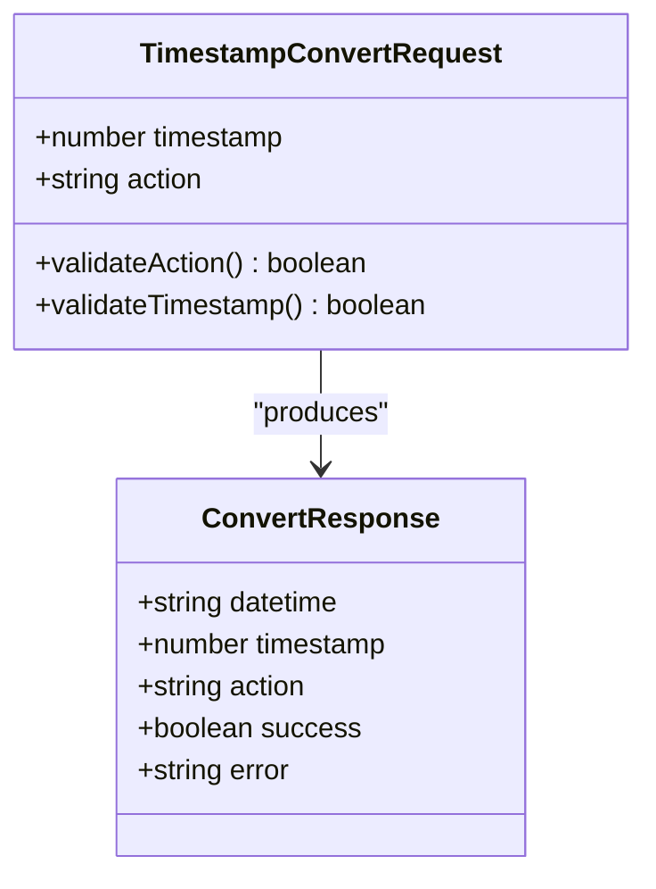
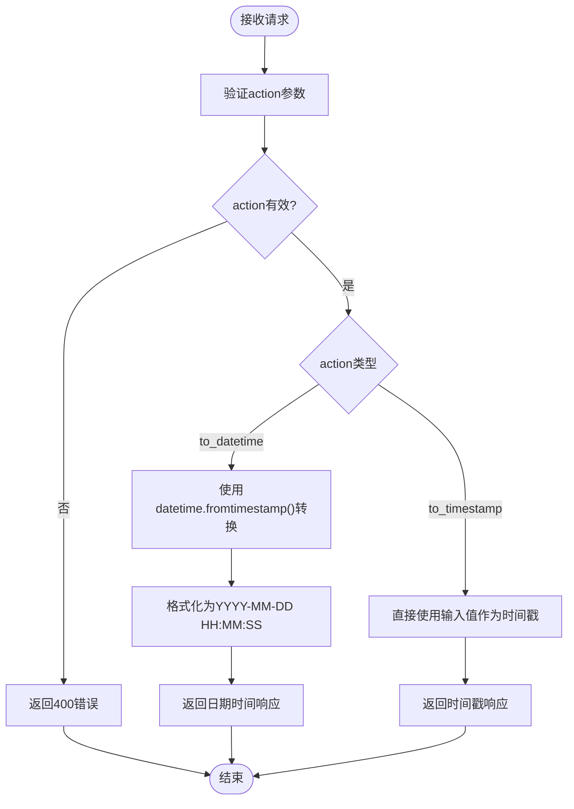
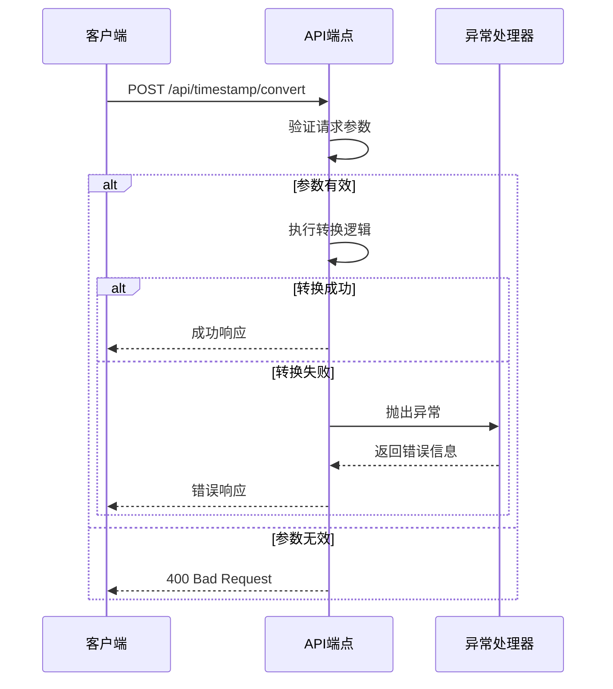
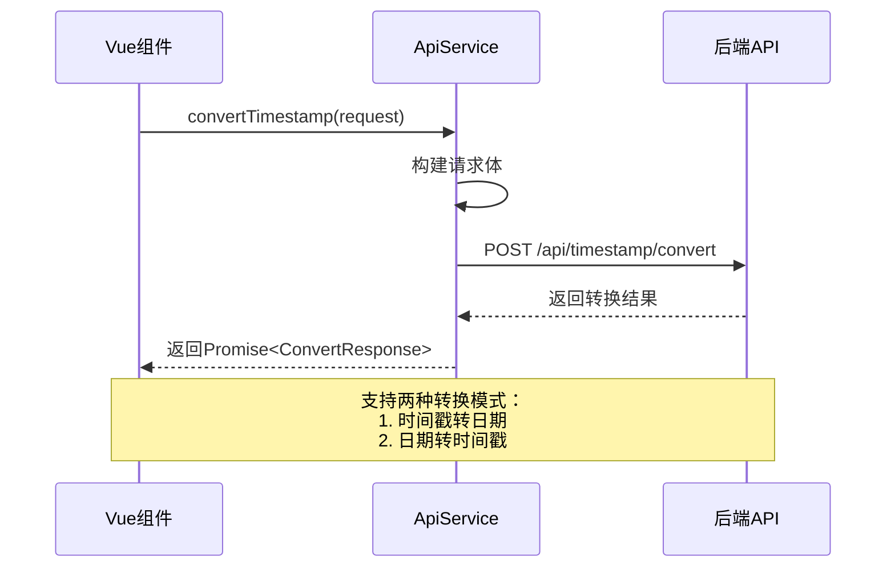
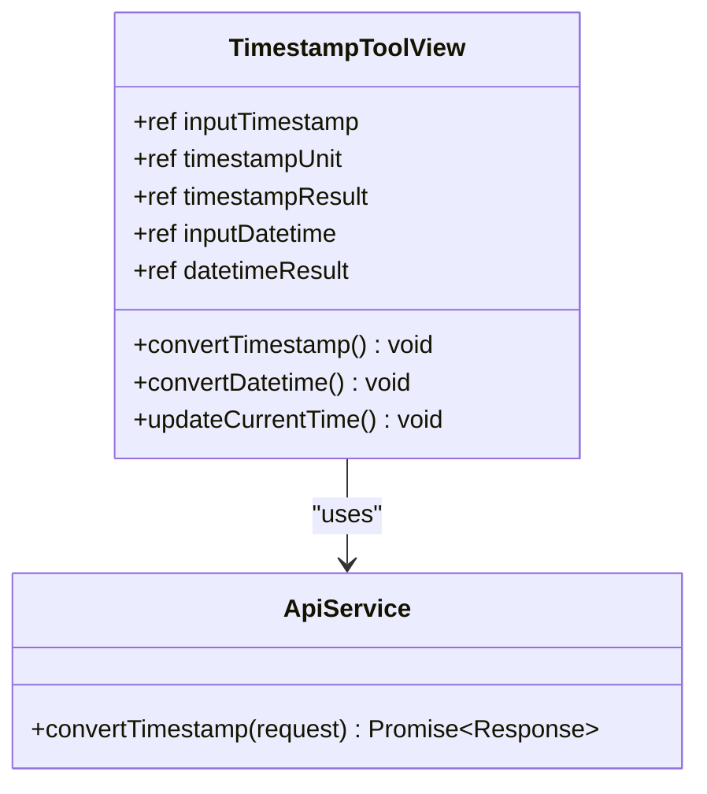
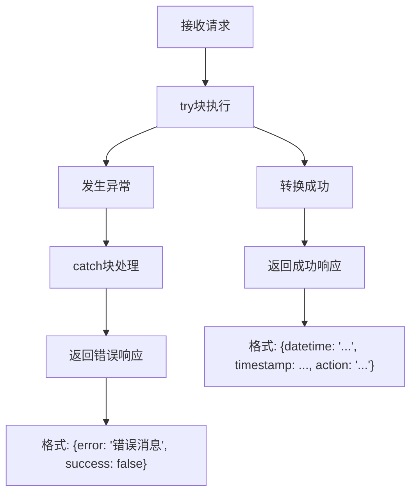

# 时间戳转换API

<cite>
**本文档中引用的文件**
- [backend/routers/timestamp.py](file://backend/routers/timestamp.py)
- [backend/schemas.py](file://backend/schemas.py)
- [ZYTool/src/services/api.ts](file://ZYTool/src/services/api.ts)
- [ZYTool/src/views/TimestampToolView.vue](file://ZYTool/src/views/TimestampToolView.vue)
- [backend/app.py](file://backend/app.py)
</cite>

## 目录
1. [简介](#简介)
2. [API端点概述](#api端点概述)
3. [数据模型详解](#数据模型详解)
4. [后端实现逻辑](#后端实现逻辑)
5. [前端调用示例](#前端调用示例)
6. [错误处理机制](#错误处理机制)
7. [使用场景](#使用场景)
8. [总结](#总结)

## 简介

时间戳转换API是一个专门用于在时间戳和日期时间字符串之间进行双向转换的RESTful服务。该API提供了灵活的转换功能，支持两种主要操作模式：将时间戳转换为日期时间字符串（to_datetime），或将日期时间字符串转换为时间戳（to_timestamp）。该服务采用FastAPI框架构建，具有高性能和类型安全的特点。

## API端点概述

### HTTP方法和URL路径

- **HTTP方法**: `POST`
- **URL路径**: `/api/timestamp/convert`
- **Content-Type**: `application/json`

### 请求头配置

| 参数 | 值 | 描述 |
|------|-----|------|
| Content-Type | application/json | 指定请求体为JSON格式 |
| Accept | application/json | 接受JSON格式的响应 |

### 请求体结构

时间戳转换API接受一个包含以下字段的JSON对象：

| 字段名 | 类型 | 必需 | 描述 |
|--------|------|------|------|
| timestamp | number | 是 | 要转换的时间戳值 |
| action | string | 是 | 转换操作类型，可选值为"to_datetime"或"to_timestamp" |

## 数据模型详解

### TimestampConvertRequest数据模型

根据后端schemas.py文件中的定义，TimestampConvertRequest数据模型具有以下结构：



**图表来源**
- [backend/schemas.py](file://backend/schemas.py#L27-L30)
- [backend/routers/timestamp.py](file://backend/routers/timestamp.py#L11-L33)

#### timestamp字段

- **类型**: `number`
- **用途**: 表示要转换的时间戳值
- **单位**: 支持秒级和毫秒级时间戳
- **验证**: 自动转换为整数类型

#### action字段

- **类型**: `string`
- **可选值**: 
  - `"to_datetime"`: 将时间戳转换为日期时间字符串
  - `"to_timestamp"`: 将日期时间字符串转换为时间戳
- **用途**: 指定转换的方向和类型

**章节来源**
- [backend/schemas.py](file://backend/schemas.py#L27-L30)

## 后端实现逻辑

### 核心转换函数

后端的convert_timestamp函数实现了核心的转换逻辑：



**图表来源**
- [backend/routers/timestamp.py](file://backend/routers/timestamp.py#L11-L33)

### 具体实现细节

#### to_datetime操作

当action为"to_datetime"时：
1. 使用`datetime.fromtimestamp()`将时间戳转换为Python datetime对象
2. 使用`strftime("%Y-%m-%d %H:%M:%S")`格式化为字符串
3. 返回包含datetime字符串、原始时间戳和操作类型的响应

#### to_timestamp操作

当action为"to_timestamp"时：
1. 直接使用输入的timestamp值
2. 将其转换为整数类型
3. 返回包含日期时间字符串、时间戳值和操作类型的响应

#### 异常处理流程



**图表来源**
- [backend/routers/timestamp.py](file://backend/routers/timestamp.py#L11-L33)

**章节来源**
- [backend/routers/timestamp.py](file://backend/routers/timestamp.py#L11-L33)

## 前端调用示例

### ApiService.convertTimestamp方法

前端通过ApiService类提供的convertTimestamp方法调用该API：



**图表来源**
- [ZYTool/src/services/api.ts](file://ZYTool/src/services/api.ts#L160-L168)

### 前端使用示例

#### 时间戳转日期时间

```typescript
// 示例：将时间戳转换为日期时间
const timestampRequest = {
    timestamp: 1640995200,  // 10位秒级时间戳
    action: 'to_datetime'
};

try {
    const result = await ApiService.convertTimestamp(timestampRequest);
    console.log('转换结果:', result);
    // 输出: { datetime: "2022-01-01 00:00:00", timestamp: 1640995200, action: "to_datetime" }
} catch (error) {
    console.error('转换失败:', error);
}
```

#### 日期时间转时间戳

```typescript
// 示例：将日期时间转换为时间戳
const datetimeRequest = {
    timestamp: '2022-01-01 00:00:00',  // 日期时间字符串
    action: 'to_timestamp'
};

try {
    const result = await ApiService.convertTimestamp(datetimeRequest);
    console.log('转换结果:', result);
    // 输出: { datetime: "2022-01-01 00:00:00", timestamp: 1640995200, action: "to_timestamp" }
} catch (error) {
    console.error('转换失败:', error);
}
```

### 前端工具界面集成

前端的TimestampToolView组件集成了时间戳转换功能：



**图表来源**
- [ZYTool/src/views/TimestampToolView.vue](file://ZYTool/src/views/TimestampToolView.vue#L149-L232)
- [ZYTool/src/services/api.ts](file://ZYTool/src/services/api.ts#L160-L168)

**章节来源**
- [ZYTool/src/services/api.ts](file://ZYTool/src/services/api.ts#L160-L168)
- [ZYTool/src/views/TimestampToolView.vue](file://ZYTool/src/views/TimestampToolView.vue#L149-L232)

## 错误处理机制

### 后端错误处理

后端实现了多层次的错误处理机制：

#### 参数验证错误

| 错误类型 | HTTP状态码 | 错误详情 | 处理方式 |
|----------|------------|----------|----------|
| 无效操作类型 | 400 | "不支持的操作类型" | 返回具体错误信息 |
| 时间戳格式错误 | 400 | "无效的时间戳格式" | 提示用户检查输入 |
| 超出范围的时间戳 | 400 | "时间戳超出有效范围" | 提供范围提示 |

#### 异常捕获机制



**图表来源**
- [backend/routers/timestamp.py](file://backend/routers/timestamp.py#L32-L33)

### 前端错误处理

前端通过Promise的catch机制处理API调用错误：

```typescript
// 前端错误处理示例
try {
    const result = await ApiService.convertTimestamp(request);
    // 处理成功响应
    handleSuccess(result);
} catch (error) {
    // 处理网络错误或API错误
    handleError(error);
    // 显示用户友好的错误信息
    message.error('时间戳转换失败，请重试');
}
```

**章节来源**
- [backend/routers/timestamp.py](file://backend/routers/timestamp.py#L29-L33)

## 使用场景

### 常见应用场景

#### 1. 数据库存储优化
- 将人类可读的日期时间存储为时间戳以节省空间
- 在数据库中建立时间索引提高查询性能

#### 2. API接口设计
- 统一API响应中的时间表示格式
- 支持多种客户端的时间处理需求

#### 3. 日志系统
- 记录事件发生的时间戳而非日期字符串
- 支持精确到毫秒的时间记录

#### 4. 缓存管理
- 设置基于时间的缓存过期时间
- 实现分布式系统的时钟同步

### 单位转换注意事项

| 时间单位 | 位数 | 示例值 | 应用场景 |
|----------|------|--------|----------|
| 秒级时间戳 | 10位 | 1640995200 | Unix系统、大多数编程语言 |
| 毫秒级时间戳 | 13位 | 1640995200000 | JavaScript、现代Web应用 |

## 总结

时间戳转换API是一个功能完善、设计精良的RESTful服务，具有以下特点：

### 技术优势
- **高性能**: 基于FastAPI框架，支持异步处理
- **类型安全**: 使用Pydantic进行数据验证
- **错误友好**: 完善的错误处理和响应格式
- **易于集成**: 清晰的API设计和文档

### 功能特性
- **双向转换**: 支持时间戳与日期时间的相互转换
- **灵活操作**: 可选择转换方向和输出格式
- **广泛适用**: 适用于各种编程语言和平台

### 最佳实践建议
1. **输入验证**: 始终验证输入的时间戳格式和范围
2. **错误处理**: 实现完善的错误处理机制
3. **性能优化**: 对频繁转换的场景考虑缓存策略
4. **安全性**: 注意防止时间戳注入攻击

该API为开发者提供了可靠的时间戳转换解决方案，能够满足各种应用场景的需求，是现代Web应用中不可或缺的工具组件。