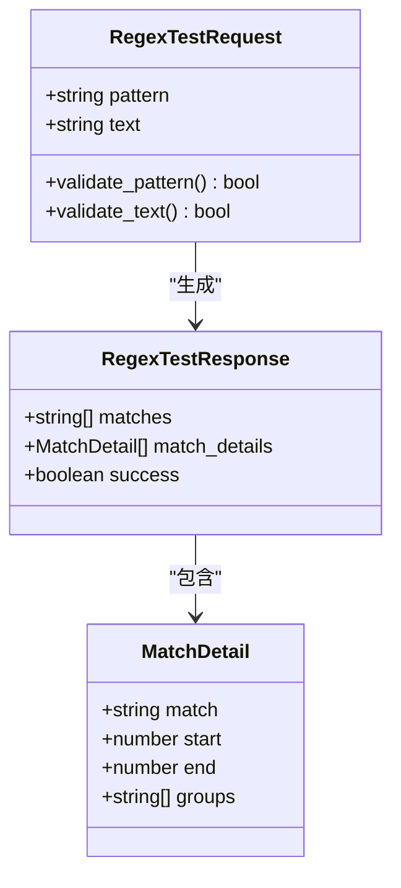
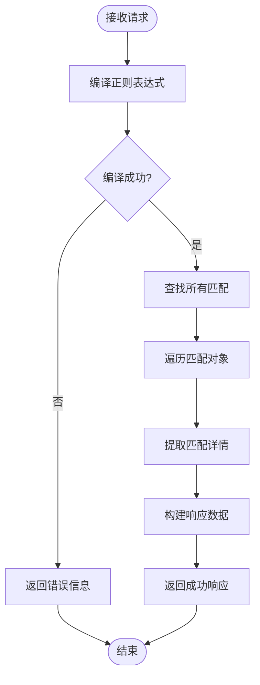
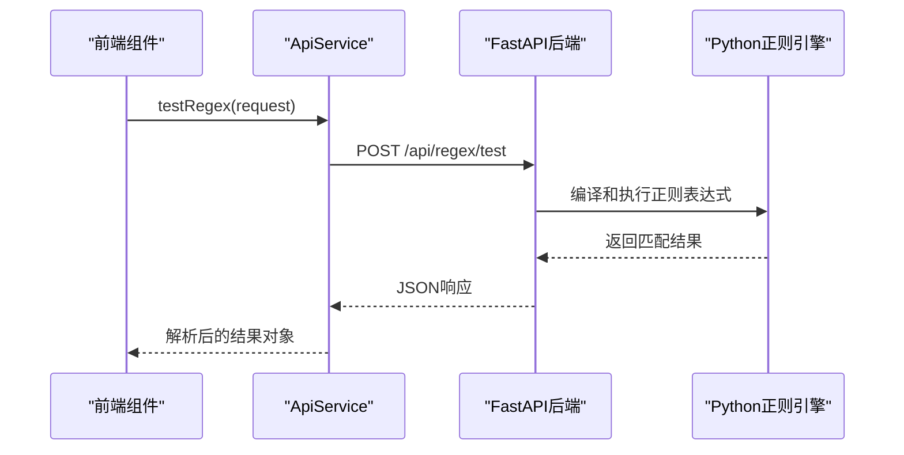
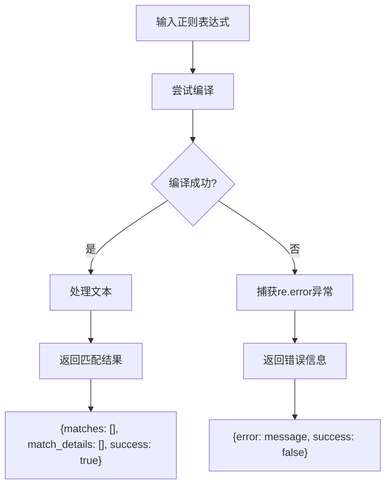
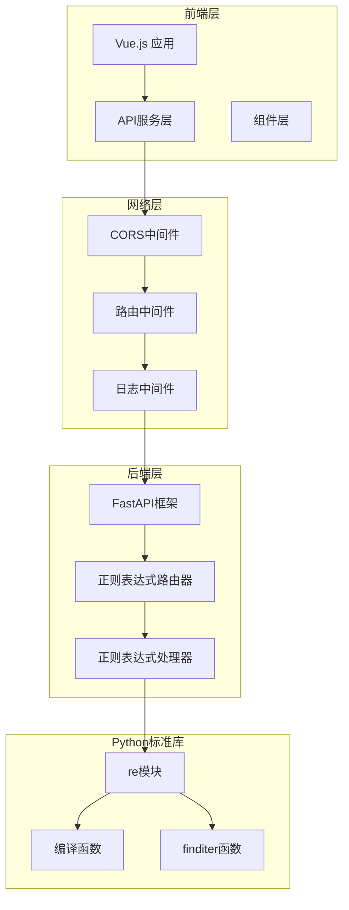

# 正则表达式测试API

<cite>
**本文档中引用的文件**
- [api.ts](file://ZYTool/src/services/api.ts)
- [regex.py](file://backend/routers/regex.py)
- [schemas.py](file://backend/schemas.py)
- [app.py](file://backend/app.py)
- [ToolView.vue](file://ZYTool/src/views/ToolView.vue)
- [HomeView.vue](file://ZYTool/src/views/HomeView.vue)
- [JsonToolView.vue](file://ZYTool/src/views/JsonToolView.vue)
- [README.md](file://README.md)
</cite>

## 目录
1. [简介](#简介)
2. [API端点概述](#api端点概述)
3. [数据模型详解](#数据模型详解)
4. [后端实现机制](#后端实现机制)
5. [前端集成](#前端集成)
6. [错误处理](#错误处理)
7. [使用示例](#使用示例)
8. [架构设计](#架构设计)
9. [性能考虑](#性能考虑)
10. [故障排除](#故障排除)

## 简介

正则表达式测试API是100_Code项目中的一个重要功能模块，允许用户通过Web界面测试和验证正则表达式模式。该API采用前后端分离架构，前端使用Vue.js框架，后端基于FastAPI构建，提供了完整的正则表达式测试解决方案。

该API的核心功能包括：
- 正则表达式语法验证
- 文本匹配结果提取
- 匹配位置信息获取
- 分组捕获结果分析
- 错误处理和反馈

## API端点概述

### HTTP方法和URL路径

**端点**: `POST /api/regex/test`

**请求方法**: POST  
**内容类型**: `application/json`  
**认证**: 无特殊要求  
**跨域**: 支持（CORS配置）

### 请求体结构

| 字段名 | 类型 | 必需 | 描述 | 限制 |
|--------|------|------|------|------|
| pattern | string | 是 | 正则表达式模式 | 最大长度未明确限制，但建议不超过1000字符 |
| text | string | 是 | 要测试的文本内容 | 支持任意长度的文本 |

### 成功响应格式

```typescript
interface RegexTestResponse {
  matches: string[];           // 所有匹配结果的数组
  match_details: MatchDetail[]; // 详细的匹配信息数组
  success: boolean;           // 操作成功标志
}

interface MatchDetail {
  match: string;             // 匹配的完整文本
  start: number;             // 匹配开始位置（字节索引）
  end: number;               // 匹配结束位置（字节索引）
  groups: string[];          // 捕获组的内容数组
}
```

### 响应示例

```json
{
  "matches": ["abc", "def", "ghi"],
  "match_details": [
    {
      "match": "abc",
      "start": 0,
      "end": 3,
      "groups": []
    },
    {
      "match": "def",
      "start": 10,
      "end": 13,
      "groups": []
    }
  ],
  "success": true
}
```

**节来源**
- [api.ts](file://ZYTool/src/services/api.ts#L130-L143)
- [regex.py](file://backend/routers/regex.py#L10-L33)

## 数据模型详解

### RegexTestRequest数据模型

正则表达式测试API的数据模型定义在多个地方，确保了前后端的一致性：

#### 后端Pydantic模型



**图表来源**
- [schemas.py](file://backend/schemas.py#L22-L24)
- [api.ts](file://ZYTool/src/services/api.ts#L62-L64)

#### 前端TypeScript接口

前端使用TypeScript接口来确保类型安全：

| 字段 | 类型 | 描述 | 验证规则 |
|------|------|------|----------|
| pattern | string | 正则表达式模式 | 由Python re模块验证 |
| text | string | 待测试的文本 | 无长度限制，支持任意文本 |

**节来源**
- [schemas.py](file://backend/schemas.py#L22-L24)
- [api.ts](file://ZYTool/src/services/api.ts#L62-L64)

## 后端实现机制

### 核心算法流程

正则表达式测试的后端实现采用了Python标准库的re模块，提供了高效的正则表达式处理能力：



**图表来源**
- [regex.py](file://backend/routers/regex.py#L13-L33)

### 关键实现细节

#### 1. 正则表达式编译

使用`re.compile()`函数编译正则表达式模式，这是性能优化的关键步骤。编译后的模式对象可以重复使用，避免每次测试都重新编译。

#### 2. 匹配结果收集

- **findall()**: 提取所有匹配结果，返回字符串列表
- **finditer()**: 提供迭代器，逐个访问匹配对象，获取详细信息

#### 3. 匹配详情提取

对于每个匹配对象，提取以下信息：
- `group()`: 完整匹配内容
- `start()`: 匹配开始位置
- `end()`: 匹配结束位置
- `groups()`: 捕获组内容

**节来源**
- [regex.py](file://backend/routers/regex.py#L14-L24)

## 前端集成

### ApiService类集成

前端通过`ApiService`类提供的`testRegex`方法与正则表达式测试API交互：



**图表来源**
- [api.ts](file://ZYTool/src/services/api.ts#L130-L143)
- [regex.py](file://backend/routers/regex.py#L10-L33)

### 实际调用代码示例

以下是前端调用正则表达式测试API的典型代码模式：

```typescript
// 1. 构建请求参数
const regexRequest: RegexTestRequest = {
  pattern: '^\\w+@[a-zA-Z_]+?\\.[a-zA-Z]{2,3}$',
  text: 'user@example.com\ninvalid-email\nanother.user@domain.org'
};

// 2. 调用API服务
try {
  const response = await ApiService.testRegex(regexRequest);
  
  if (response.success) {
    // 处理成功响应
    console.log('匹配结果:', response.matches);
    console.log('详细匹配信息:', response.match_details);
  } else {
    // 处理错误情况
    console.error('正则表达式错误:', response.error);
  }
} catch (error) {
  // 处理网络错误
  console.error('API调用失败:', error);
}
```

**节来源**
- [api.ts](file://ZYTool/src/services/api.ts#L130-L143)

## 错误处理

### 正则语法错误处理

当用户输入无效的正则表达式模式时，系统会进行适当的错误处理：



**图表来源**
- [regex.py](file://backend/routers/regex.py#L32-L33)

### 错误响应格式

```json
{
  "error": "unterminated character set at position 5",
  "success": false
}
```

### 前端错误处理策略

前端应该实现完善的错误处理机制：

```typescript
try {
  const response = await ApiService.testRegex(request);
  
  if (!response.success) {
    // 显示正则语法错误
    message.error(`正则表达式错误: ${response.error}`);
    return;
  }
  
  // 处理正常响应
  handleRegexResults(response);
  
} catch (error) {
  // 处理网络错误或超时
  if (error.response) {
    message.error(`服务器错误: ${error.response.status}`);
  } else {
    message.error('网络连接失败，请检查后端服务');
  }
}
```

**节来源**
- [regex.py](file://backend/routers/regex.py#L32-L33)

## 使用示例

### 基本使用场景

#### 1. 邮箱地址验证

```typescript
const emailPattern = '^\\w+@[a-zA-Z_]+?\\.[a-zA-Z]{2,3}$';
const emailText = `
user@example.com
invalid-email
another.user@domain.org
`;

const result = await ApiService.testRegex({
  pattern: emailPattern,
  text: emailText
});
```

#### 2. 数字提取

```typescript
const numberPattern = '\\d+';
const numberText = 'Price: $19.99, Discount: 25%';

const result = await ApiService.testRegex({
  pattern: numberPattern,
  text: numberText
});
```

#### 3. 分组捕获

```typescript
const capturePattern = '(\\d{4})-(\\d{2})-(\\d{2})';
const dateText = 'Date: 2024-01-15, Deadline: 2024-12-31';

const result = await ApiService.testRegex({
  pattern: capturePattern,
  text: dateText
});
```

### 高级使用技巧

#### 1. 多行模式

```typescript
const multilinePattern = '^\\w+'; // 匹配每行开头的单词
const multilineText = `First line
Second line
Third line`;
```

#### 2. 忽略大小写

```typescript
const caseInsensitivePattern = 'hello'; // 默认不区分大小写
const caseInsensitiveText = 'Hello world HELLO';
```

#### 3. 贪婪与非贪婪匹配

```typescript
// 贪婪匹配（默认）
const greedyPattern = '<.*>';

// 非贪婪匹配
const nonGreedyPattern = '<.*?>';
```

**节来源**
- [api.ts](file://ZYTool/src/services/api.ts#L130-L143)

## 架构设计

### 整体架构图



**图表来源**
- [app.py](file://backend/app.py#L1-L33)
- [regex.py](file://backend/routers/regex.py#L1-L36)

### 技术栈特点

#### 前端技术栈
- **Vue.js 3**: 组件化开发，响应式状态管理
- **TypeScript**: 类型安全，提升开发体验
- **Axios**: 强大的HTTP客户端
- **Ant Design Vue**: 丰富的UI组件库

#### 后端技术栈
- **FastAPI**: 高性能异步Web框架
- **Python re模块**: 标准库正则表达式处理
- **Pydantic**: 数据验证和序列化

**节来源**
- [app.py](file://backend/app.py#L1-L33)
- [api.ts](file://ZYTool/src/services/api.ts#L1-L10)

## 性能考虑

### 性能优化策略

#### 1. 正则表达式编译缓存

虽然当前实现没有显式的编译缓存，但在高并发场景下可以考虑：
- 将常用模式编译结果缓存
- 实现LRU缓存机制
- 避免重复编译相同模式

#### 2. 大文本处理优化

对于大型文本文件：
- 实现流式处理
- 添加进度指示器
- 设置合理的超时时间

#### 3. 并发处理

```typescript
// 并发测试多个正则表达式
const testPatterns = [
  { pattern: 'pattern1', text: text },
  { pattern: 'pattern2', text: text },
  { pattern: 'pattern3', text: text }
];

const results = await Promise.all(
  testPatterns.map(pattern => ApiService.testRegex(pattern))
);
```

### 性能监控指标

| 指标 | 监控方法 | 告警阈值 |
|------|----------|----------|
| 响应时间 | 请求拦截器 | >2秒 |
| 错误率 | 响应拦截器 | >5% |
| 内存使用 | 系统监控 | >512MB |
| CPU使用率 | 系统监控 | >80% |

## 故障排除

### 常见问题及解决方案

#### 1. 后端服务不可用

**症状**: 前端显示"后端服务不可用"警告
**原因**: FastAPI服务器未启动或端口被占用
**解决方案**:
```bash
# 检查端口占用
netstat -tulpn | grep 8000

# 启动后端服务
cd backend
python app.py
```

#### 2. CORS跨域问题

**症状**: 浏览器控制台显示CORS错误
**原因**: 前端和后端域名不匹配
**解决方案**:
```python
# 修改app.py中的CORS配置
app.add_middleware(
    CORSMiddleware,
    allow_origins=["http://localhost:5173", "http://localhost:3000"],
    allow_credentials=True,
    allow_methods=["*"],
    allow_headers=["*"],
)
```

#### 3. 正则表达式性能问题

**症状**: 大文本处理时响应缓慢
**原因**: 正则表达式过于复杂或文本过大
**解决方案**:
- 简化正则表达式模式
- 分割大文本进行分批处理
- 添加处理进度提示

#### 4. 类型错误

**症状**: TypeScript编译错误或运行时类型错误
**原因**: 前后端数据模型不一致
**解决方案**:
```typescript
// 确保前后端数据模型同步
// 后端schemas.py中的RegexTestRequest
// 前端api.ts中的RegexTestRequest接口
```

### 调试技巧

#### 1. 启用详细日志

```typescript
// 在api.ts中启用详细日志
api.interceptors.request.use(
  (config) => {
    console.log('发送请求:', config.method?.toUpperCase(), config.url, config.data);
    return config;
  }
);

api.interceptors.response.use(
  (response) => {
    console.log('收到响应:', response.status, response.data);
    return response;
  }
);
```

#### 2. 使用浏览器开发者工具

- **Network面板**: 查看API请求和响应
- **Console面板**: 检查JavaScript错误
- **Application面板**: 查看存储的配置和状态

#### 3. 后端调试

```python
# 在regex.py中添加调试信息
import logging

logging.basicConfig(level=logging.DEBUG)

@router.post("/test")
async def test_regex(request: RegexTestRequest):
    logging.debug(f"Received regex test request: pattern={request.pattern}, text_length={len(request.text)}")
    # ... 其他代码
```

**节来源**
- [app.py](file://backend/app.py#L13-L20)
- [regex.py](file://backend/routers/regex.py#L13-L33)

## 结论

正则表达式测试API是100_Code项目中的一个精心设计的功能模块，它成功地将复杂的正则表达式处理能力封装成简单易用的REST API。通过前后端分离的架构设计，该API不仅提供了强大的正则表达式测试功能，还具备良好的可维护性和扩展性。

### 主要优势

1. **简洁的API设计**: 清晰的请求响应结构，易于理解和使用
2. **完善的错误处理**: 语法错误和运行时错误都有适当的处理
3. **类型安全保障**: 前后端都使用强类型语言，确保数据一致性
4. **高性能实现**: 利用Python标准库的re模块，保证处理效率
5. **用户体验友好**: 前端提供直观的交互界面和反馈机制

### 发展方向

1. **正则表达式编辑器**: 集成可视化正则表达式编辑器
2. **模式库**: 提供常用正则表达式模板
3. **性能监控**: 添加更详细的性能指标和监控
4. **批量测试**: 支持同时测试多个正则表达式模式
5. **导出功能**: 支持将测试结果导出为多种格式

这个API为开发者提供了一个强大而易用的正则表达式测试工具，大大简化了正则表达式开发和调试的过程。