# 前端架构

<cite>
**本文档引用的文件**
- [App.vue](file://ZYTool/src/App.vue)
- [main.ts](file://ZYTool/src/main.ts)
- [router/index.ts](file://ZYTool/src/router/index.ts)
- [HomeView.vue](file://ZYTool/src/views/HomeView.vue)
- [ToolView.vue](file://ZYTool/src/views/ToolView.vue)
- [JsonToolView.vue](file://ZYTool/src/views/JsonToolView.vue)
- [ColorPickerView.vue](file://ZYTool/src/views/ColorPickerView.vue)
- [TimestampToolView.vue](file://ZYTool/src/views/TimestampToolView.vue)
- [HelloWorld.vue](file://ZYTool/src/components/HelloWorld.vue)
- [api.ts](file://ZYTool/src/services/api.ts)
- [frontendTools.ts](file://ZYTool/src/services/frontendTools.ts)
- [variables.css](file://ZYTool/src/styles/variables.css)
- [index.css](file://ZYTool/src/styles/index.css)
- [package.json](file://ZYTool/package.json)
- [vite.config.ts](file://ZYTool/vite.config.ts)
</cite>

## 目录
1. [项目概述](#项目概述)
2. [技术栈与架构](#技术栈与架构)
3. [应用入口与初始化](#应用入口与初始化)
4. [路由系统设计](#路由系统设计)
5. [MVVM架构实现](#mvvm架构实现)
6. [组件化开发范式](#组件化开发范式)
7. [状态管理与响应式系统](#状态管理与响应式系统)
8. [事件流处理机制](#事件流处理机制)
9. [设计系统与样式架构](#设计系统与样式架构)
10. [性能优化策略](#性能优化策略)
11. [总结](#总结)

## 项目概述

ZYTool是一个基于Vue 3的现代化前端工具集合应用，采用Composition API构建，提供多种实用工具如JSON格式化、Base64编码、颜色选择器等。项目展现了现代前端架构的最佳实践，包括模块化设计、响应式编程和组件化开发。

## 技术栈与架构

### 核心技术栈

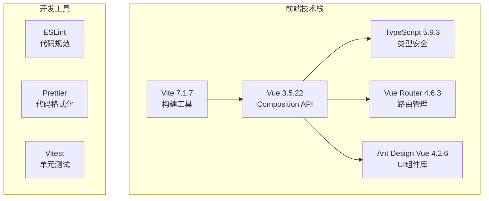

**图表来源**
- [package.json](file://ZYTool/package.json#L11-L16)
- [vite.config.ts](file://ZYTool/vite.config.ts#L1-L8)

### 架构层次划分

项目采用分层架构设计，清晰分离关注点：

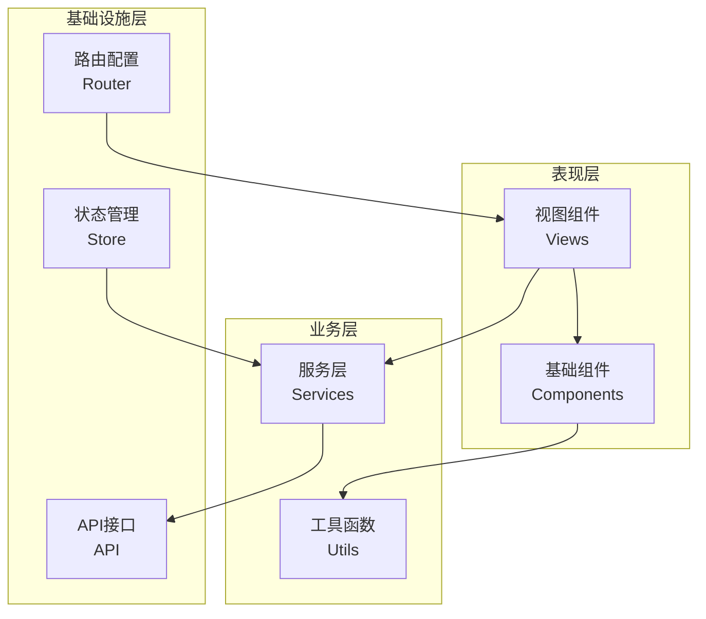

**节来源**
- [App.vue](file://ZYTool/src/App.vue#L1-L124)
- [main.ts](file://ZYTool/src/main.ts#L1-L12)

## 应用入口与初始化

### main.ts - 应用启动核心

App.vue作为根组件，负责整体布局管理和导航控制，体现了MVVM架构中的View层职责。

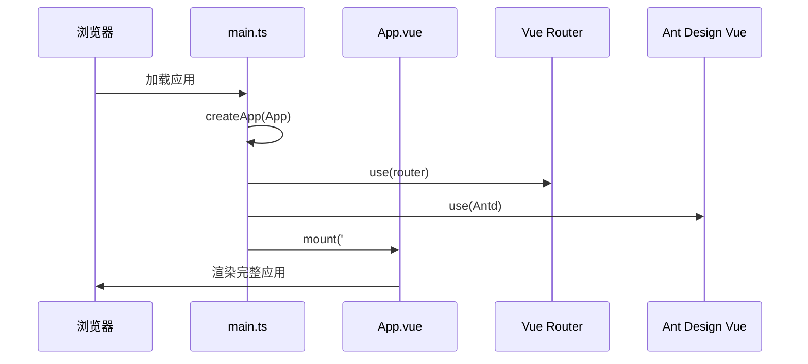

**图表来源**
- [main.ts](file://ZYTool/src/main.ts#L8-L11)
- [App.vue](file://ZYTool/src/App.vue#L5-L22)

### 应用初始化流程

应用初始化遵循以下步骤：

1. **应用创建**：通过`createApp(App)`创建Vue应用实例
2. **插件注册**：依次注册路由、UI组件库等插件
3. **挂载渲染**：将应用挂载到DOM元素上

这种初始化方式确保了应用的模块化和可扩展性，便于后续功能扩展和维护。

**节来源**
- [main.ts](file://ZYTool/src/main.ts#L1-L12)

## 路由系统设计

### 路由配置架构

Vue Router提供了完整的前端路由解决方案，支持嵌套路由、动态路由和路由守卫。

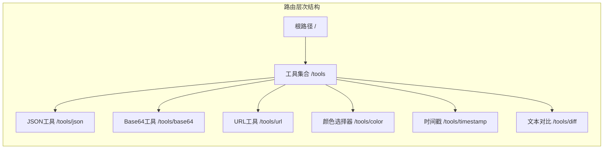

**图表来源**
- [router/index.ts](file://ZYTool/src/router/index.ts#L12-L55)

### 路由导航机制

路由系统采用声明式导航方式，通过`router-link`组件实现页面间的平滑切换：

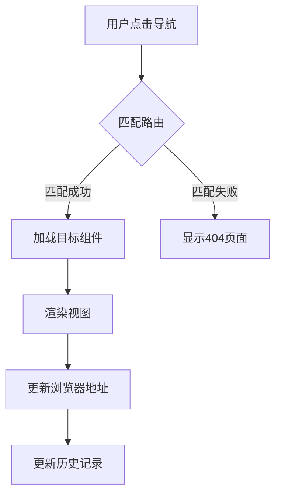

**图表来源**
- [App.vue](file://ZYTool/src/App.vue#L10-L16)

**节来源**
- [router/index.ts](file://ZYTool/src/router/index.ts#L1-L59)

## MVVM架构实现

### Model-View-ViewModel模式

Vue 3的Composition API天然支持MVVM架构模式：

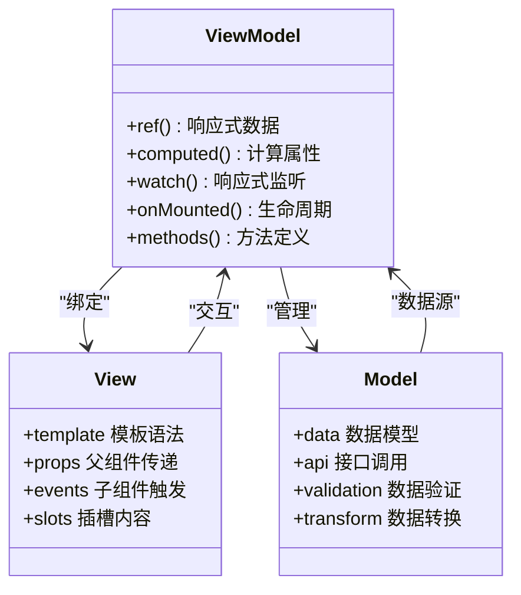

### 响应式数据绑定

Composition API提供了强大的响应式系统，支持复杂的数据绑定场景：

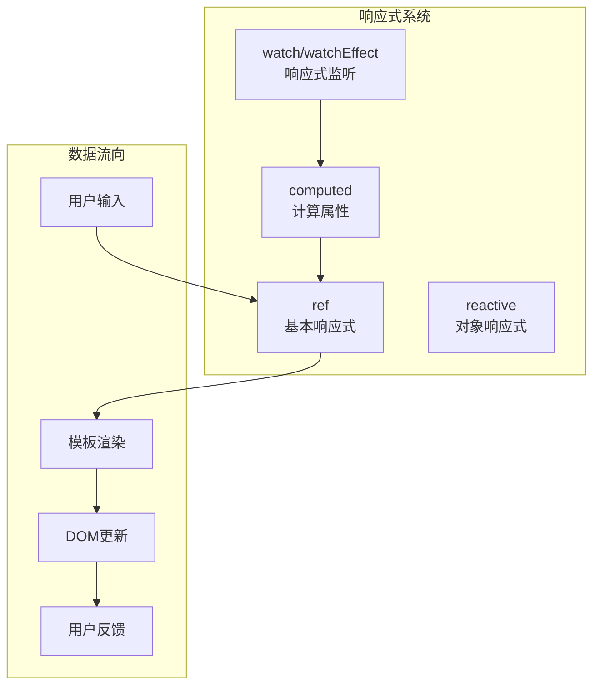

**节来源**
- [HomeView.vue](file://ZYTool/src/views/HomeView.vue#L57-L155)
- [JsonToolView.vue](file://ZYTool/src/views/JsonToolView.vue#L91-L200)

## 组件化开发范式

### 组件层次结构

项目采用清晰的组件层次结构，实现了高度的模块化和复用性：

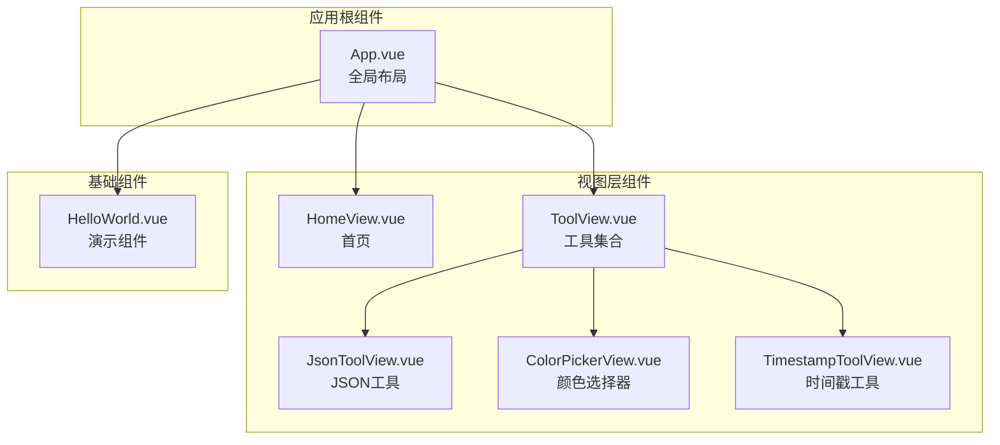

**图表来源**
- [App.vue](file://ZYTool/src/App.vue#L5-L22)
- [HomeView.vue](file://ZYTool/src/views/HomeView.vue#L1-L396)

### 组件通信模式

组件间通信采用多种模式，满足不同场景需求：

```mermaid
sequenceDiagram
participant Parent as 父组件
participant Child as 子组件
participant Event as 事件系统
participant Props as 属性传递
Note over Parent,Child : 父子组件通信
Parent->>Child : props传递数据
Child->>Parent : emit事件通知
Parent->>Event : 事件处理器
Note over Parent,Child : 兄弟组件通信
Parent->>Event : 中央事件总线
Event->>Child : 广播消息
Note over Parent,Child : 全局状态共享
Parent->>GlobalState[全局状态]
GlobalState->>Child
```

**节来源**
- [HelloWorld.vue](file://ZYTool/src/components/HelloWorld.vue#L1-L42)
- [JsonToolView.vue](file://ZYTool/src/views/JsonToolView.vue#L177-L180)

## 状态管理与响应式系统

### 响应式数据管理

项目广泛使用Vue 3的响应式系统，实现高效的状态管理：

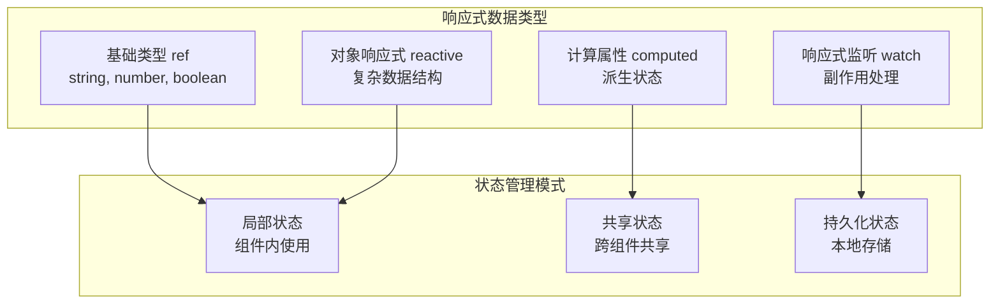

### 实际应用示例

以颜色选择器为例，展示复杂的响应式状态管理：

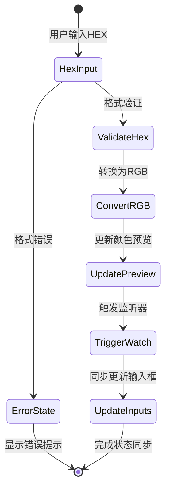

**图表来源**
- [ColorPickerView.vue](file://ZYTool/src/views/ColorPickerView.vue#L111-L156)

**节来源**
- [ColorPickerView.vue](file://ZYTool/src/views/ColorPickerView.vue#L111-L156)
- [TimestampToolView.vue](file://ZYTool/src/views/TimestampToolView.vue#L149-L197)

## 事件流处理机制

### 事件处理架构

项目采用统一的事件处理机制，支持多种事件类型和处理模式：

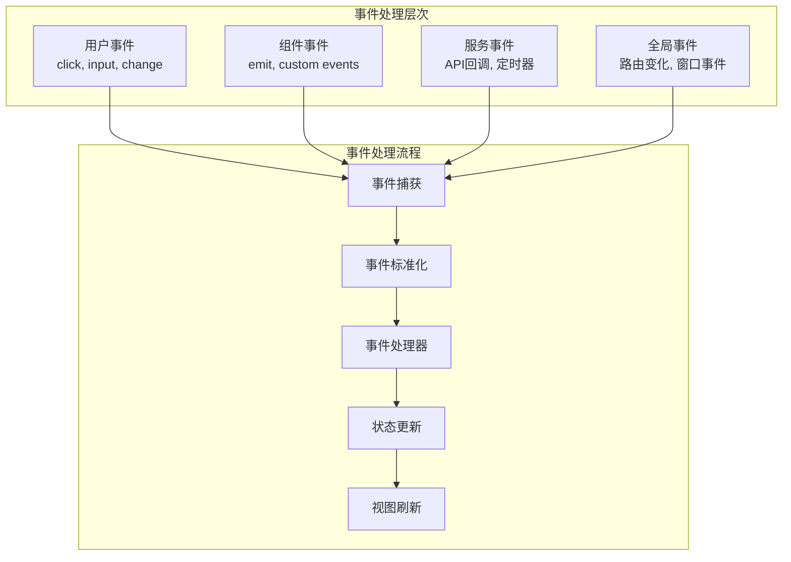

### 异步事件处理

项目大量使用异步事件处理，特别是在API调用和定时任务中：

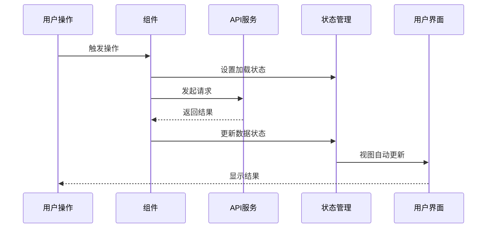

**图表来源**
- [HomeView.vue](file://ZYTool/src/views/HomeView.vue#L67-L114)
- [ToolView.vue](file://ZYTool/src/views/ToolView.vue#L53-L102)

**节来源**
- [HomeView.vue](file://ZYTool/src/views/HomeView.vue#L67-L155)
- [ToolView.vue](file://ZYTool/src/views/ToolView.vue#L53-L142)

## 设计系统与样式架构

### 主题系统设计

项目采用CSS变量驱动的主题系统，支持深色和浅色模式：

```mermaid
graph TB
subgraph "主题变量体系"
PrimaryColors[主色调变量<br/>--primary-color]
BackgroundColors[背景色变量<br/>--bg-primary]
TextColors[文字色变量<br/>--text-primary]
BorderColors[边框色变量<br/>--border-color]
ShadowVars[阴影变量<br/>--shadow-md]
end
subgraph "响应式主题"
LightMode[浅色模式<br/>:root]
DarkMode[深色模式<br/>@media prefers-color-scheme]
CustomTheme[自定义主题<br/>动态切换]
end
PrimaryColors --> LightMode
BackgroundColors --> LightMode
TextColors --> LightMode
BorderColors --> LightMode
ShadowVars --> LightMode
PrimaryColors --> DarkMode
BackgroundColors --> DarkMode
TextColors --> DarkMode
BorderColors --> DarkMode
ShadowVars --> DarkMode
```

**图表来源**
- [variables.css](file://ZYTool/src/styles/variables.css#L1-L94)

### 样式架构组织

采用模块化的样式架构，确保样式的可维护性和复用性：

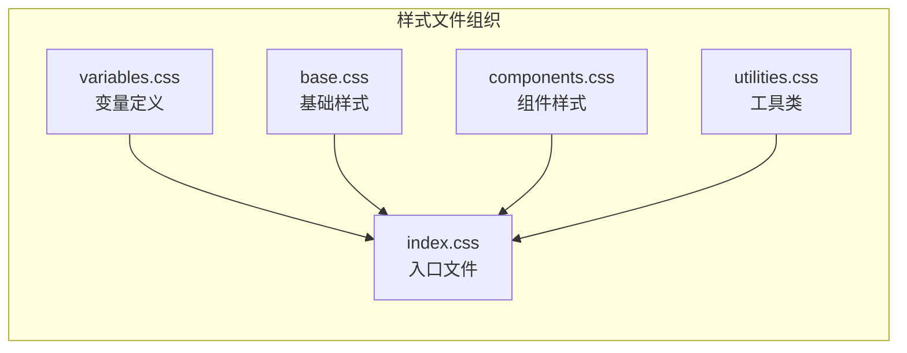

**图表来源**
- [index.css](file://ZYTool/src/styles/index.css#L1-L8)

**节来源**
- [variables.css](file://ZYTool/src/styles/variables.css#L1-L94)
- [index.css](file://ZYTool/src/styles/index.css#L1-L8)

## 性能优化策略

### 组件性能优化

项目采用多种性能优化策略：

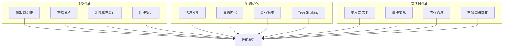

### 开发体验优化

Vite构建工具提供了优秀的开发体验：

- **快速热更新**：模块热替换技术
- **TypeScript支持**：完整的类型检查
- **ESLint集成**：代码质量保证
- **自动依赖解析**：简化开发配置

**节来源**
- [vite.config.ts](file://ZYTool/vite.config.ts#L1-L8)
- [package.json](file://ZYTool/package.json#L6-L10)

## 总结

ZYTool项目展现了现代Vue 3前端架构的最佳实践，通过以下关键特性实现了高质量的前端应用：

### 核心优势

1. **模块化架构**：清晰的分层设计和组件化开发
2. **响应式编程**：充分利用Composition API的响应式特性
3. **类型安全**：完整的TypeScript支持
4. **设计系统**：统一的主题和样式管理
5. **性能优化**：多层次的性能优化策略

### 技术亮点

- **MVVM架构**：完美结合Vue 3的响应式系统
- **组件复用**：高内聚低耦合的组件设计
- **状态管理**：简洁高效的响应式状态管理
- **路由系统**：灵活的前端路由解决方案
- **开发体验**：现代化的开发工具链

### 最佳实践

项目在多个方面体现了前端开发的最佳实践：
- 采用Composition API替代Options API
- 实现了完整的TypeScript类型系统
- 建立了统一的设计语言和主题系统
- 提供了良好的错误处理和用户体验
- 注重代码的可维护性和可扩展性

这个项目为现代前端开发提供了优秀的参考范例，展示了如何构建高质量、高性能的单页应用。