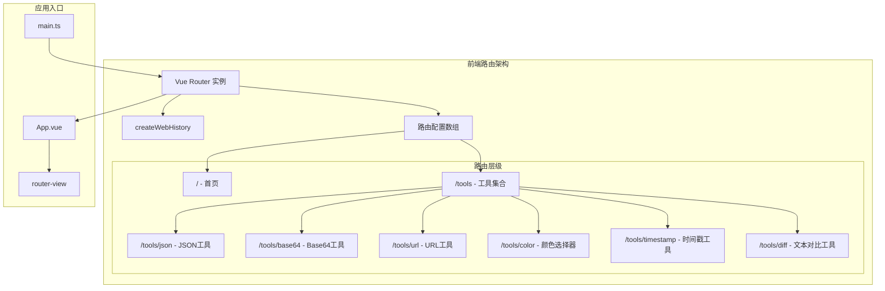
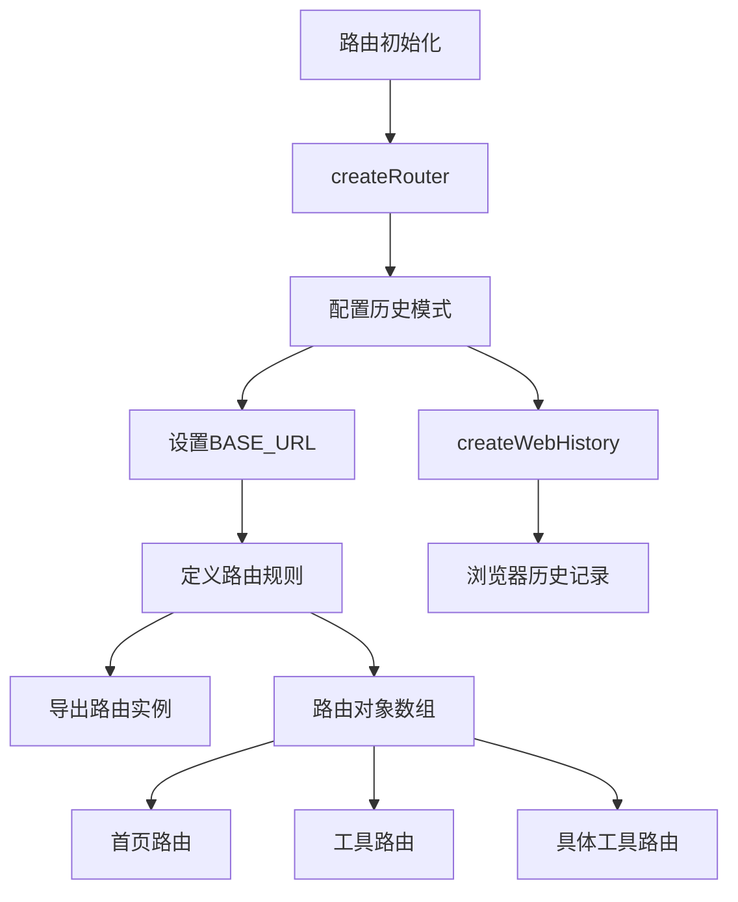
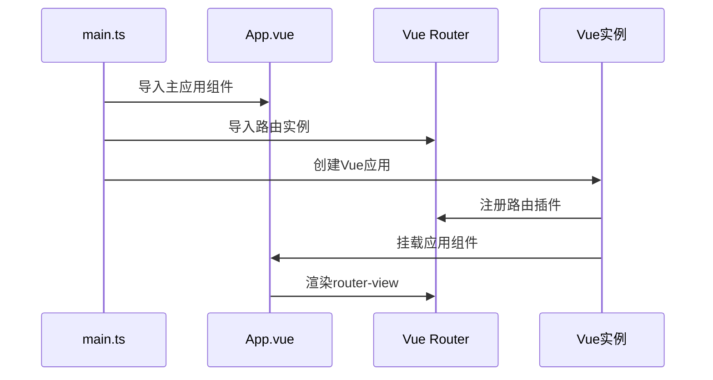
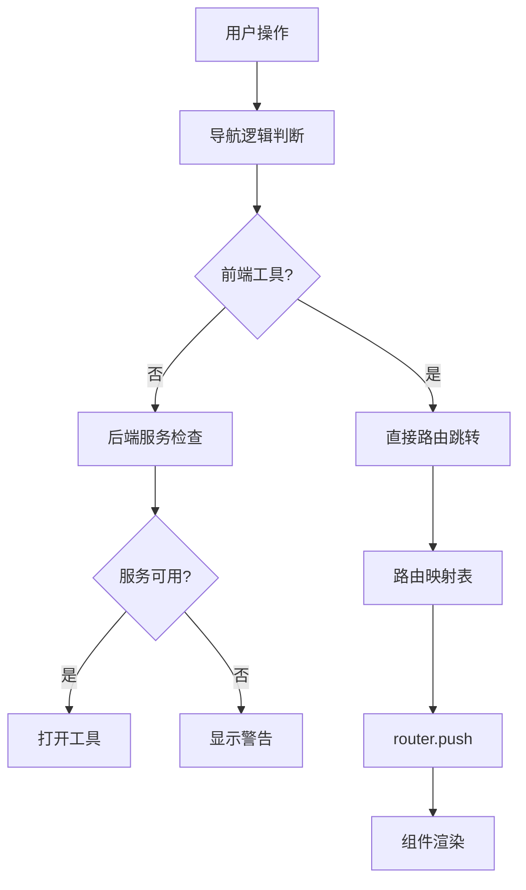
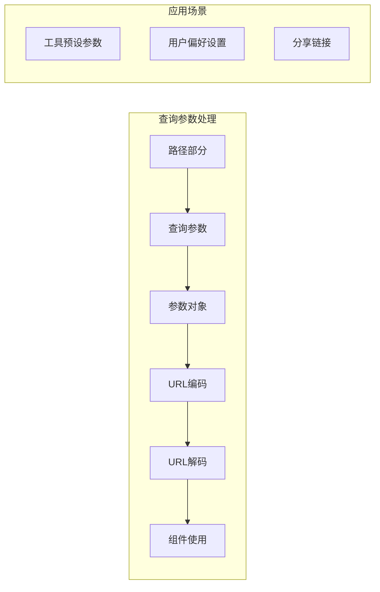
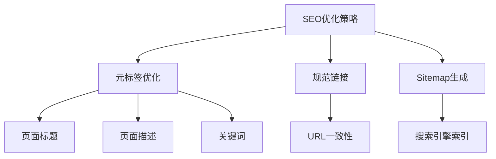
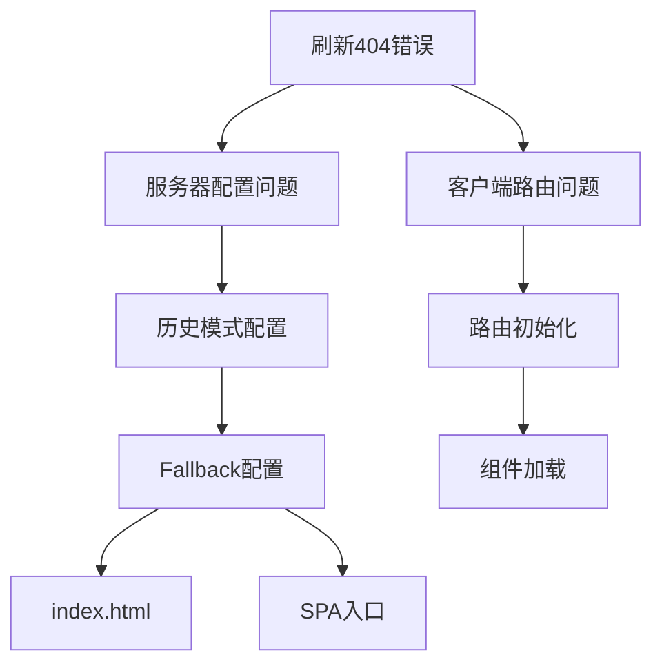
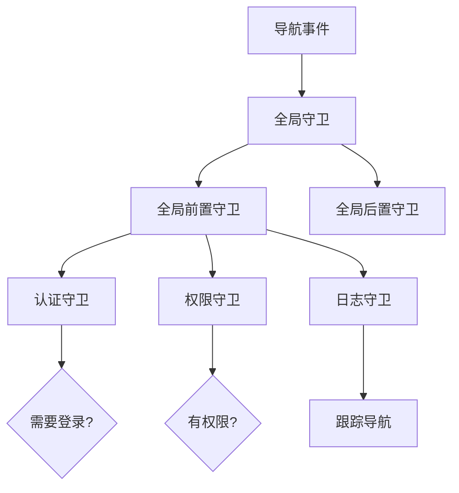
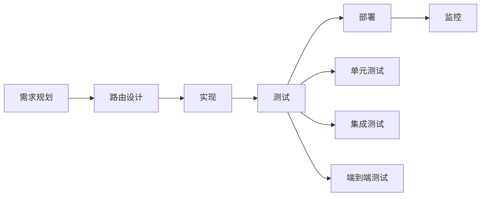

# 前端路由机制

<cite>
**本文档引用的文件**
- [router/index.ts](file://ZYTool/src/router/index.ts)
- [main.ts](file://ZYTool/src/main.ts)
- [App.vue](file://ZYTool/src/App.vue)
- [ToolView.vue](file://ZYTool/src/views/ToolView.vue)
- [JsonToolView.vue](file://ZYTool/src/views/JsonToolView.vue)
- [UrlToolView.vue](file://ZYTool/src/views/UrlToolView.vue)
- [frontendTools.ts](file://ZYTool/src/services/frontendTools.ts)
- [package.json](file://ZYTool/package.json)
- [vite.config.ts](file://ZYTool/vite.config.ts)
</cite>

## 目录
1. [项目概述](#项目概述)
2. [路由架构设计](#路由架构设计)
3. [路由配置详解](#路由配置详解)
4. [路由实例注入](#路由实例注入)
5. [编程式导航](#编程式导航)
6. [路由参数与查询](#路由参数与查询)
7. [SEO优化策略](#seo优化策略)
8. [常见问题排查](#常见问题排查)
9. [最佳实践建议](#最佳实践建议)

## 项目概述

ZYTool项目采用现代化的Vue 3单页应用架构，基于Vue Router 4构建前端路由系统。项目提供了丰富的在线工具集合，包括JSON格式化、Base64编码、URL编码等多种实用工具。路由系统的设计充分考虑了用户体验和性能优化，采用了历史模式（History Mode）和编程式导航相结合的方式。

### 技术栈概览

- **前端框架**: Vue 3.5.22
- **路由库**: Vue Router 4.6.3
- **构建工具**: Vite 7.1.7
- **UI组件库**: Ant Design Vue 4.2.6

**章节来源**
- [package.json](file://ZYTool/package.json#L12-L16)
- [router/index.ts](file://ZYTool/src/router/index.ts#L1-L2)

## 路由架构设计

### 整体架构图



**图表来源**
- [router/index.ts](file://ZYTool/src/router/index.ts#L12-L56)
- [main.ts](file://ZYTool/src/main.ts#L8-L11)
- [App.vue](file://ZYTool/src/App.vue#L20-L21)

### 路由层次结构

项目采用扁平化的路由设计，主要包含以下层级：

1. **根路径** (`/`): 应用首页
2. **工具集合** (`/tools`): 工具分类页面
3. **具体工具** (`/tools/{tool}`): 各种专用工具页面

这种设计避免了复杂的嵌套路由，简化了维护成本，同时保持了良好的用户体验。

**章节来源**
- [router/index.ts](file://ZYTool/src/router/index.ts#L15-L54)

## 路由配置详解

### 基于createWebHistory的配置

路由系统使用Vue Router 4的`createWebHistory`函数创建历史模式路由：



**图表来源**
- [router/index.ts](file://ZYTool/src/router/index.ts#L12-L56)

### 路由对象结构分析

每个路由对象都包含以下核心属性：

| 属性 | 类型 | 描述 | 示例值 |
|------|------|------|--------|
| `path` | string | 路由路径 | `'/'`, `'/tools'`, `'/tools/json'` |
| `name` | string | 命名路由 | `'home'`, `'tools'`, `'json-tool'` |
| `component` | Component | 对应的Vue组件 | `HomeView`, `ToolView`, `JsonToolView` |

### 路由命名规范

项目采用kebab-case命名法，具有以下特点：
- **语义清晰**: 如`json-tool`、`base64-tool`明确标识工具类型
- **便于维护**: 统一的命名风格便于团队协作
- **SEO友好**: URL更易被搜索引擎理解和索引

**章节来源**
- [router/index.ts](file://ZYTool/src/router/index.ts#L16-L54)

## 路由实例注入

### 应用启动流程



**图表来源**
- [main.ts](file://ZYTool/src/main.ts#L8-L11)

### 注入方式与时机

路由实例通过Vue应用的插件系统进行注册：

1. **导入阶段**: 在main.ts中导入路由实例
2. **注册阶段**: 使用`.use(router)`方法注册
3. **挂载阶段**: 在应用挂载时自动生效

这种方式确保了路由功能在整个应用生命周期中的可用性。

**章节来源**
- [main.ts](file://ZYTool/src/main.ts#L1-L11)

## 编程式导航

### 编程式导航实现

项目中广泛使用编程式导航来实现动态路由跳转：



**图表来源**
- [ToolView.vue](file://ZYTool/src/views/ToolView.vue#L104-L136)

### 路由映射表设计

在ToolView组件中实现了智能路由映射：

```typescript
// 路由映射表示例
const routeMap: Record<string, string> = {
    'JSON格式化': '/tools/json',
    'Base64编码': '/tools/base64',
    'URL编码': '/tools/url',
    '颜色选择器': '/tools/color',
    '时间戳转换': '/tools/timestamp'
}
```

这种设计的优势：
- **可维护性**: 易于添加新的工具和路由映射
- **灵活性**: 支持动态路由生成
- **一致性**: 确保路由名称与实际路径的一致性

### 编程式导航方法

项目中使用的主要导航方法：

| 方法 | 用途 | 示例 |
|------|------|------|
| `router.push()` | 导航到新路由 | `router.push({ path: '/tools/json' })` |
| `router.replace()` | 替换当前路由 | `router.replace('/tools/base64')` |
| `router.go()` | 历史记录导航 | `router.go(-1)` 返回上一页 |

**章节来源**
- [ToolView.vue](file://ZYTool/src/views/ToolView.vue#L108-L119)

## 路由参数与查询

### 查询参数处理

虽然当前项目主要使用路径导航，但Vue Router支持灵活的查询参数处理：



### 参数传递最佳实践

1. **状态管理**: 对于复杂的状态传递，建议使用Vuex或Pinia
2. **URL友好**: 确保查询参数对URL友好且易于理解
3. **默认值**: 为可选参数提供合理的默认值

**章节来源**
- [JsonToolView.vue](file://ZYTool/src/views/JsonToolView.vue#L177-L180)

## SEO优化策略

### 静态SEO优化



### 动态SEO解决方案

对于单页应用，建议实施以下SEO策略：

1. **服务端渲染(SSR)**: 使用Nuxt.js或Vite插件实现SSR
2. **预渲染**: 对静态页面进行预渲染
3. **动态元标签**: 根据路由动态更新页面元信息

### 路由级别的SEO考虑

- **页面标题**: 每个路由页面应有独特的标题
- **面包屑导航**: 提供清晰的页面层次结构
- **社交媒体优化**: 配置Open Graph和Twitter Card

## 常见问题排查

### 刷新404错误

这是SPA应用中最常见的问题之一：



#### 解决方案

1. **服务器配置**: 确保所有请求都指向index.html
2. **BASE_URL设置**: 正确配置应用的基础URL
3. **路由回退**: 实现适当的404页面处理

### 路由守卫扩展

虽然当前项目没有实现路由守卫，但可以考虑以下扩展：



### 性能优化

1. **路由懒加载**: 对大型应用考虑组件懒加载
2. **预取策略**: 预取用户可能访问的路由
3. **缓存机制**: 实现路由级别的缓存策略

**章节来源**
- [router/index.ts](file://ZYTool/src/router/index.ts#L13)

## 最佳实践建议

### 路由设计原则

1. **单一职责**: 每个路由负责一个明确的功能模块
2. **命名规范**: 保持一致的路由命名和路径结构
3. **可扩展性**: 设计时考虑未来的功能扩展需求

### 开发工作流



### 维护建议

1. **定期审查**: 定期检查路由配置的有效性和性能
2. **文档更新**: 保持路由文档与实际实现同步
3. **版本控制**: 对路由变更进行版本控制和记录

### 安全考虑

1. **路由验证**: 对敏感路由进行访问控制
2. **参数校验**: 对路由参数进行严格校验
3. **CSRF防护**: 在必要时实施CSRF防护措施

通过遵循这些最佳实践，可以构建一个稳定、高效且易于维护的前端路由系统，为用户提供优秀的单页应用体验。