# 状态管理与API客户端

<cite>
**本文档引用的文件**
- [api.ts](file://ZYTool/src/services/api.ts)
- [frontendTools.ts](file://ZYTool/src/services/frontendTools.ts)
- [Base64ToolView.vue](file://ZYTool/src/views/Base64ToolView.vue)
- [JsonToolView.vue](file://ZYTool/src/views/JsonToolView.vue)
- [HomeView.vue](file://ZYTool/src/views/HomeView.vue)
- [ToolView.vue](file://ZYTool/src/views/ToolView.vue)
- [main.ts](file://ZYTool/src/main.ts)
- [router/index.ts](file://ZYTool/src/router/index.ts)
</cite>

## 目录
1. [项目概述](#项目概述)
2. [API客户端架构设计](#api客户端架构设计)
3. [Axios实例化与配置](#axios实例化与配置)
4. [拦截器系统](#拦截器系统)
5. [前端工具函数库](#前端工具函数库)
6. [状态管理模式](#状态管理模式)
7. [数据流架构](#数据流架构)
8. [错误处理机制](#错误处理机制)
9. [性能优化策略](#性能优化策略)
10. [安全最佳实践](#安全最佳实践)
11. [调试与监控](#调试与监控)
12. [总结](#总结)

## 项目概述

ZYTool是一个基于Vue 3和TypeScript的前端工具集合应用，采用现代化的前端架构设计。项目通过精心设计的API客户端和服务层，实现了前后端分离的架构模式，为用户提供丰富的在线工具服务。

### 技术栈特点

- **前端框架**: Vue 3 + Composition API
- **状态管理**: 响应式数据绑定
- **HTTP客户端**: Axios + 拦截器
- **UI组件库**: Ant Design Vue
- **类型系统**: TypeScript接口定义
- **路由管理**: Vue Router

## API客户端架构设计

### 设计原则

API客户端采用模块化设计，遵循单一职责原则，将HTTP请求封装、错误处理、数据转换等功能分离到不同的模块中。

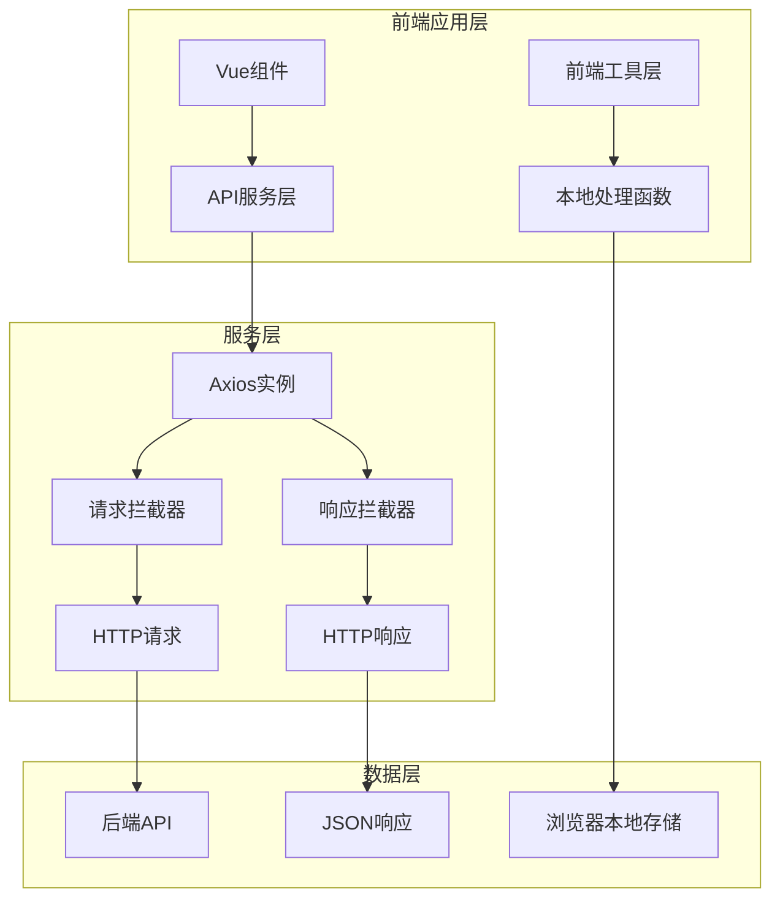

**图表来源**
- [api.ts](file://ZYTool/src/services/api.ts#L1-L178)
- [frontendTools.ts](file://ZYTool/src/services/frontendTools.ts#L1-L185)

### 核心组件分析

#### 1. Axios实例化配置

API客户端通过创建专门的Axios实例来管理所有的HTTP通信，这种设计提供了以下优势：

- **统一配置**: 所有请求共享相同的配置参数
- **可维护性**: 配置集中管理，便于修改和扩展
- **隔离性**: 避免全局Axios实例可能带来的冲突

#### 2. 类型安全设计

项目大量使用TypeScript接口来定义API请求和响应的数据结构，确保类型安全：

```typescript
// 接口定义示例
export interface TextProcessRequest {
    text: string
    action: 'json_format' | 'base64_encode' | 'base64_decode' | 'url_encode' | 'url_decode'
}

export interface Category {
    id: number
    name: string
    description: string
    tools: Tool[]
}
```

**章节来源**
- [api.ts](file://ZYTool/src/services/api.ts#L36-L175)

## Axios实例化与配置

### 基础配置

API客户端的基础配置包括基础URL、超时设置和默认头部信息：

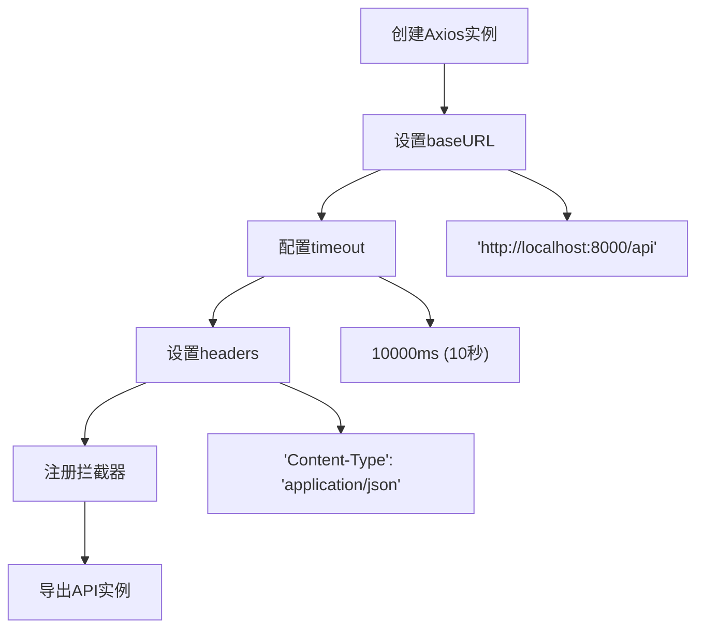

**图表来源**
- [api.ts](file://ZYTool/src/services/api.ts#L4-L10)

### 高级配置选项

除了基本配置外，还可以考虑以下高级配置：

- **重试机制**: 实现自动重试功能
- **缓存策略**: 添加请求缓存机制
- **认证令牌**: 自动添加JWT令牌
- **并发控制**: 限制同时请求数量

**章节来源**
- [api.ts](file://ZYTool/src/services/api.ts#L4-L10)

## 拦截器系统

### 请求拦截器

请求拦截器负责在请求发送前进行预处理，包括日志记录、认证令牌添加、请求参数验证等：

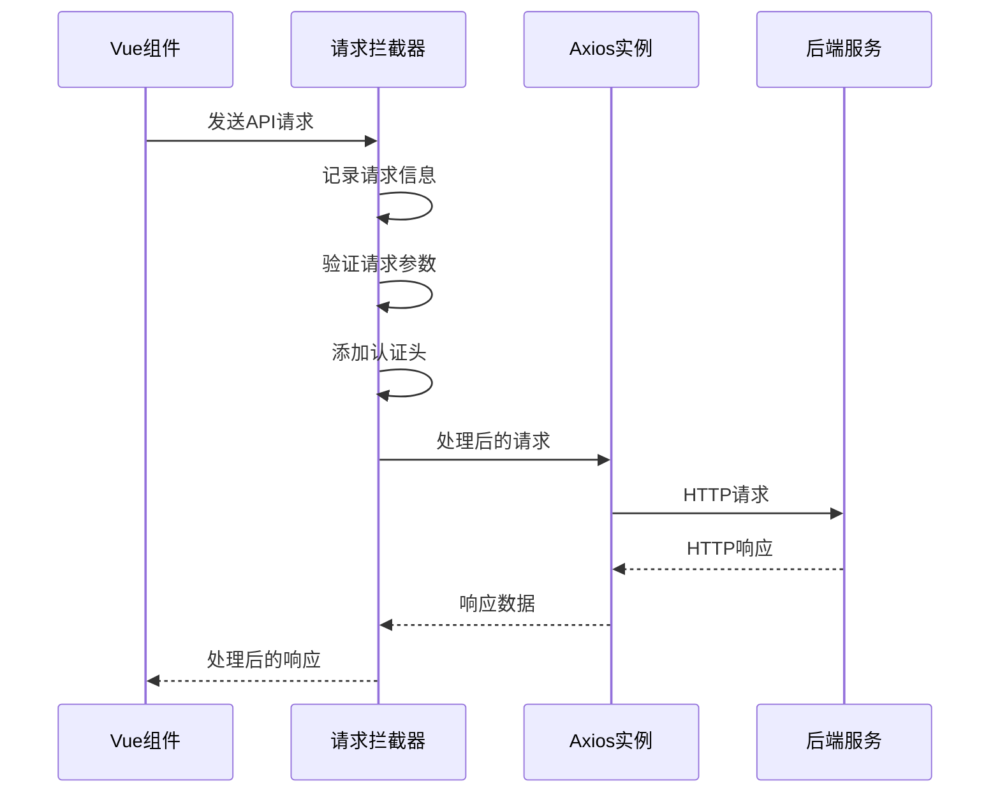

**图表来源**
- [api.ts](file://ZYTool/src/services/api.ts#L13-L21)

### 响应拦截器

响应拦截器处理服务器返回的数据，进行统一的错误处理和数据转换：

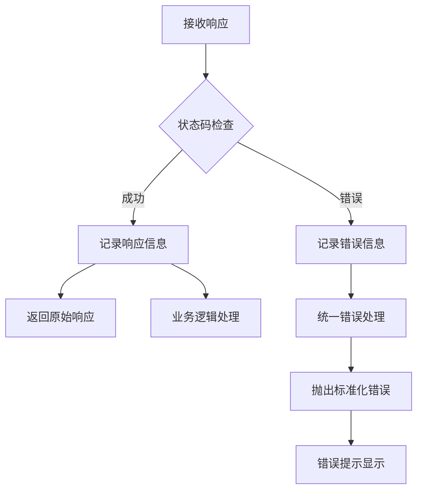

**图表来源**
- [api.ts](file://ZYTool/src/services/api.ts#L25-L33)

### 拦截器最佳实践

1. **日志记录**: 记录请求和响应的关键信息
2. **错误处理**: 统一处理网络错误和业务错误
3. **性能监控**: 记录请求耗时
4. **安全检查**: 验证响应数据的安全性

**章节来源**
- [api.ts](file://ZYTool/src/services/api.ts#L13-L33)

## 前端工具函数库

### 工具函数分类

前端工具函数库按照功能分为多个类别，每个类别都有明确的职责边界：

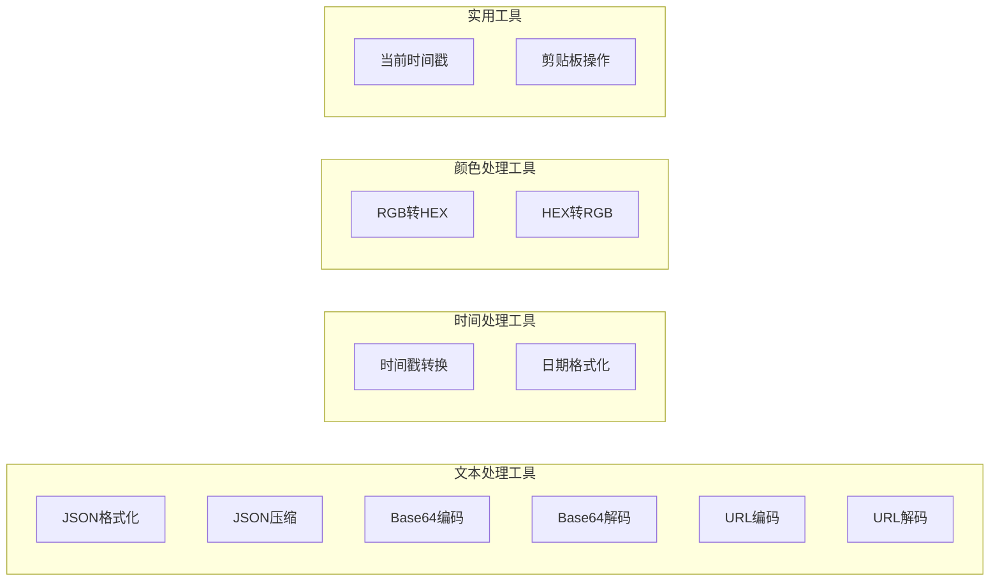

**图表来源**
- [frontendTools.ts](file://ZYTool/src/services/frontendTools.ts#L170-L184)

### Base64编解码实现

Base64编解码是前端工具中的重要功能，项目实现了完整的Unicode字符支持：

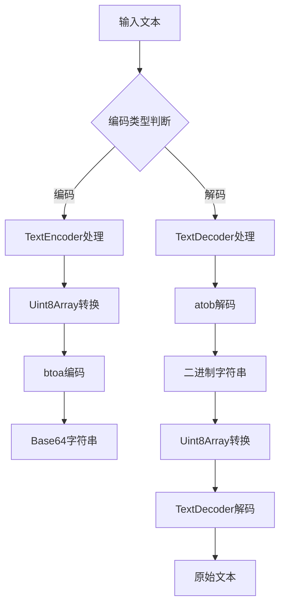

**图表来源**
- [frontendTools.ts](file://ZYTool/src/services/frontendTools.ts#L35-L80)

### 错误处理策略

所有工具函数都采用统一的错误处理模式：

```typescript
// 统一的返回格式
interface ToolResult {
    result: string
    success: boolean
}

// 错误处理示例
try {
    // 执行具体操作
    return { result: processedData, success: true }
} catch (error) {
    return {
        result: error instanceof Error ? error.message : '操作失败',
        success: false
    }
}
```

**章节来源**
- [frontendTools.ts](file://ZYTool/src/services/frontendTools.ts#L1-L185)

## 状态管理模式

### 响应式状态设计

Vue 3的Composition API提供了强大的响应式状态管理能力：

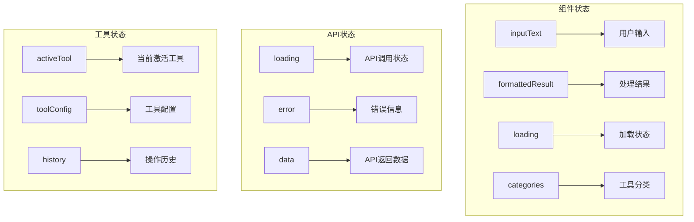

**图表来源**
- [JsonToolView.vue](file://ZYTool/src/views/JsonToolView.vue#L95-L98)
- [HomeView.vue](file://ZYTool/src/views/HomeView.vue#L62-L64)

### 状态同步机制

组件状态与API状态之间通过异步操作保持同步：

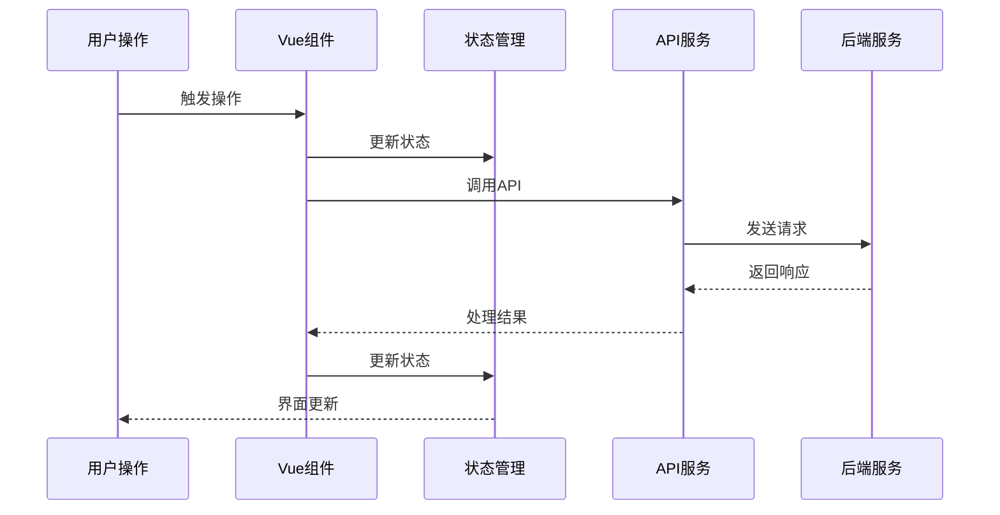

**图表来源**
- [JsonToolView.vue](file://ZYTool/src/views/JsonToolView.vue#L100-L147)

**章节来源**
- [JsonToolView.vue](file://ZYTool/src/views/JsonToolView.vue#L95-L147)
- [HomeView.vue](file://ZYTool/src/views/HomeView.vue#L62-L115)

## 数据流架构

### 前端数据流

前端采用单向数据流架构，确保数据流动的可预测性和可维护性：

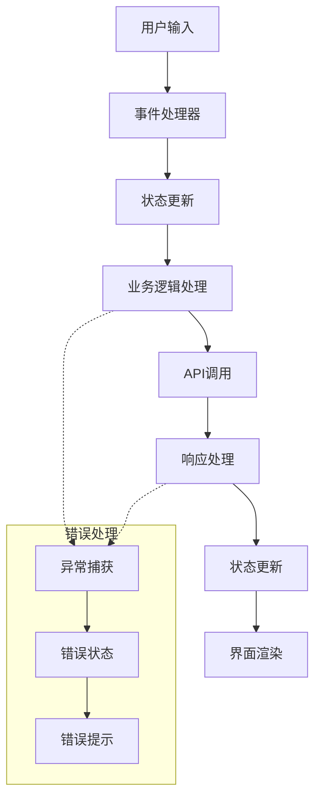

**图表来源**
- [Base64ToolView.vue](file://ZYTool/src/views/Base64ToolView.vue#L67-L103)

### 后端数据流

后端API提供标准化的数据接口，支持多种数据处理场景：

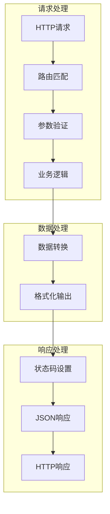

**图表来源**
- [api.ts](file://ZYTool/src/services/api.ts#L99-L175)

**章节来源**
- [Base64ToolView.vue](file://ZYTool/src/views/Base64ToolView.vue#L67-L103)
- [JsonToolView.vue](file://ZYTool/src/views/JsonToolView.vue#L100-L147)

## 错误处理机制

### 分层错误处理

项目采用分层的错误处理策略，确保不同层次的错误都能得到适当的处理：

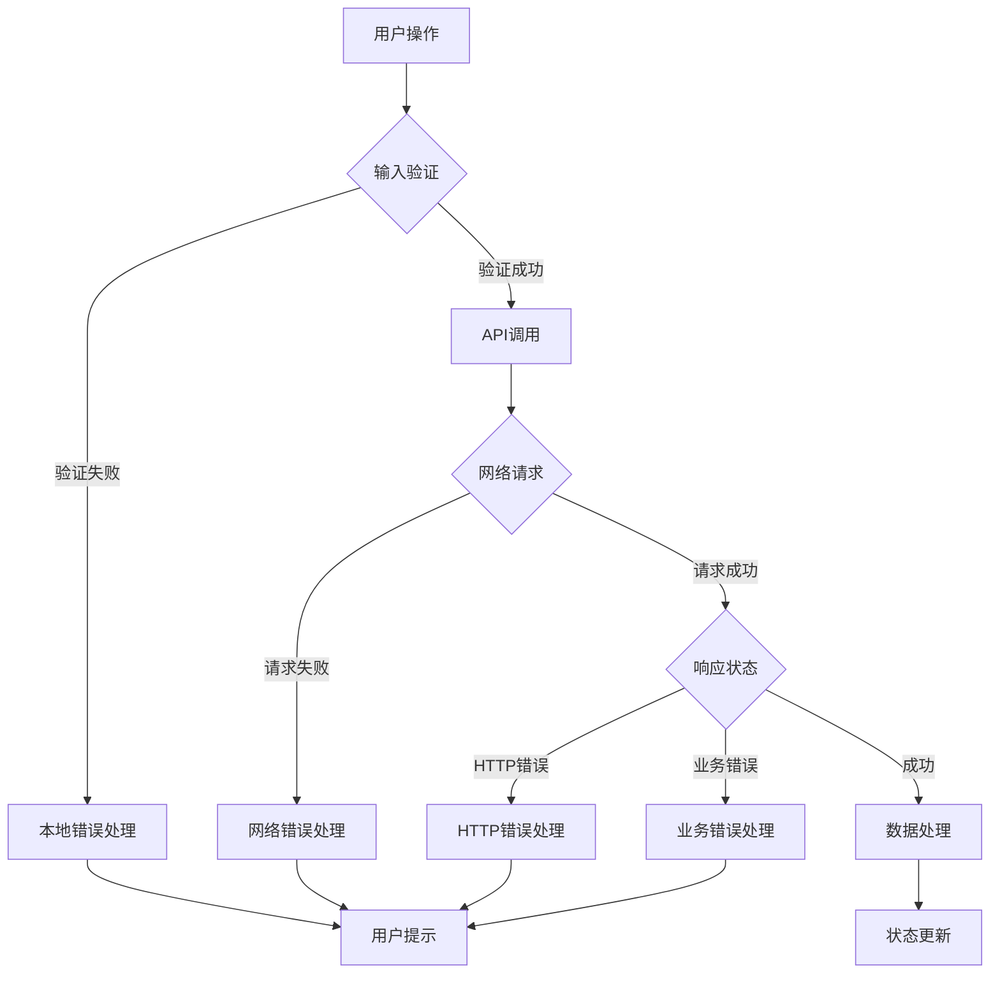

**图表来源**
- [api.ts](file://ZYTool/src/services/api.ts#L25-L33)

### 错误恢复策略

针对不同的错误类型，项目实现了相应的恢复策略：

1. **网络错误**: 自动重试机制
2. **API错误**: 使用本地备用数据
3. **解析错误**: 提供友好的错误提示
4. **权限错误**: 引导用户重新登录

**章节来源**
- [HomeView.vue](file://ZYTool/src/views/HomeView.vue#L70-L115)
- [ToolView.vue](file://ZYTool/src/views/ToolView.vue#L53-L63)

## 性能优化策略

### 请求优化

为了提高应用性能，项目采用了多种优化策略：

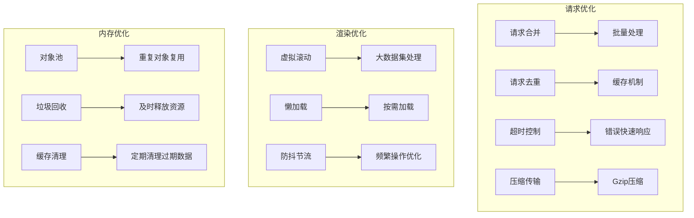

### 缓存策略

项目实现了多层次的缓存机制：

1. **内存缓存**: 临时存储常用数据
2. **本地存储**: 持久化存储用户偏好
3. **CDN缓存**: 静态资源加速

**章节来源**
- [api.ts](file://ZYTool/src/services/api.ts#L6-L10)

## 安全最佳实践

### XSS防护

项目在多个层面实施了XSS防护措施：

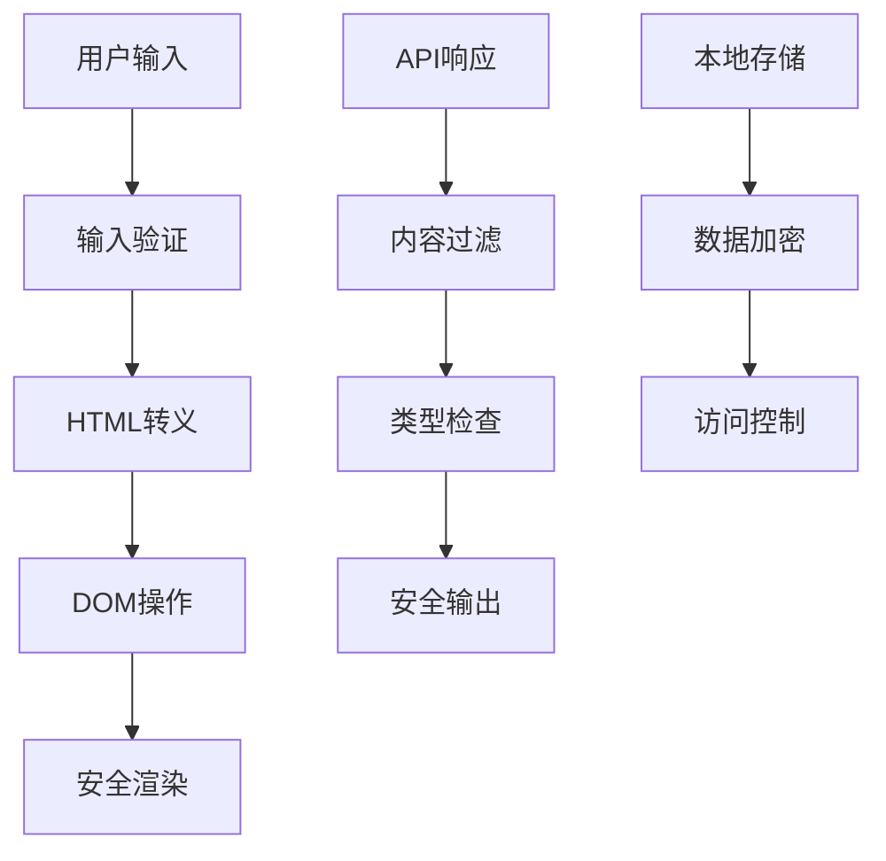

**图表来源**
- [frontendTools.ts](file://ZYTool/src/services/frontendTools.ts#L35-L80)

### 数据验证

所有用户输入都经过严格的验证：

```typescript
// 输入验证示例
const validateInput = (input: string): boolean => {
    // 长度限制
    if (input.length > MAX_INPUT_LENGTH) {
        return false
    }
    
    // 特殊字符检查
    if (containsDangerousCharacters(input)) {
        return false
    }
    
    return true
}
```

### 安全配置

项目的安全配置包括：

1. **CSP策略**: 限制脚本执行范围
2. **HTTPS强制**: 所有通信使用加密连接
3. **CSRF防护**: 防止跨站请求伪造
4. **内容安全策略**: 控制资源加载

**章节来源**
- [frontendTools.ts](file://ZYTool/src/services/frontendTools.ts#L1-L185)

## 调试与监控

### 日志系统

项目实现了完善的日志记录系统：

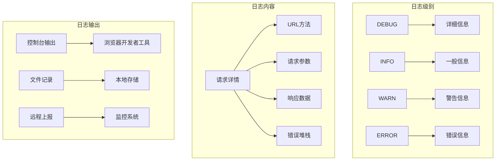

**图表来源**
- [api.ts](file://ZYTool/src/services/api.ts#L14-L32)

### 性能监控

项目集成了性能监控功能：

1. **请求耗时**: 记录每个API请求的响应时间
2. **错误率统计**: 监控API调用的成功率
3. **用户体验指标**: 测量页面加载时间和交互响应时间
4. **资源使用情况**: 监控内存和CPU使用情况

### 调试工具

项目提供了多种调试工具：

```typescript
// 调试辅助函数
const debugLog = (message: string, data?: any) => {
    if (process.env.NODE_ENV === 'development') {
        console.log(`[DEBUG] ${message}`, data)
    }
}

// 性能测量
const measurePerformance = (operation: string, fn: () => any) => {
    const start = performance.now()
    const result = fn()
    const end = performance.now()
    console.log(`[PERF] ${operation}: ${end - start}ms`)
    return result
}
```

**章节来源**
- [api.ts](file://ZYTool/src/services/api.ts#L14-L32)

## 总结

ZYTool项目的前端状态管理与API客户端设计体现了现代前端开发的最佳实践。通过精心设计的架构，项目实现了：

### 核心优势

1. **模块化设计**: 清晰的职责分离，便于维护和扩展
2. **类型安全**: TypeScript接口确保数据结构的正确性
3. **错误处理**: 完善的错误处理和恢复机制
4. **性能优化**: 多层次的性能优化策略
5. **安全保障**: 全方位的安全防护措施

### 技术亮点

- **Axios拦截器**: 统一的请求和响应处理
- **响应式状态管理**: Vue 3的Composition API
- **前端工具函数库**: 完整的本地处理能力
- **分层架构**: 前后端分离的设计模式

### 应用价值

该项目不仅展示了现代前端技术的应用，更为类似项目提供了可参考的架构模式和最佳实践。通过合理的抽象和封装，项目实现了高内聚、低耦合的系统设计，为用户提供稳定、高效、安全的工具服务体验。