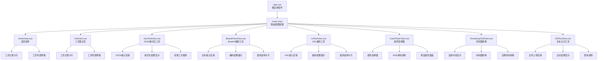
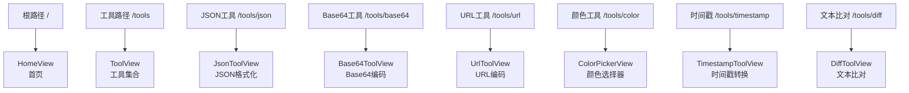

# 组件树

<cite>
**本文档引用的文件**
- [App.vue](file://ZYTool/src/App.vue)
- [HomeView.vue](file://ZYTool/src/views/HomeView.vue)
- [ToolView.vue](file://ZYTool/src/views/ToolView.vue)
- [JsonToolView.vue](file://ZYTool/src/views/JsonToolView.vue)
- [Base64ToolView.vue](file://ZYTool/src/views/Base64ToolView.vue)
- [UrlToolView.vue](file://ZYTool/src/views/UrlToolView.vue)
- [ColorPickerView.vue](file://ZYTool/src/views/ColorPickerView.vue)
- [TimestampToolView.vue](file://ZYTool/src/views/TimestampToolView.vue)
- [DiffToolView.vue](file://ZYTool/src/views/DiffToolView.vue)
- [router/index.ts](file://ZYTool/src/router/index.ts)
- [main.ts](file://ZYTool/src/main.ts)
- [frontendTools.ts](file://ZYTool/src/services/frontendTools.ts)
- [index.css](file://ZYTool/src/styles/index.css)
</cite>

## 目录
1. [项目概述](#项目概述)
2. [组件树架构](#组件树架构)
3. [根组件分析](#根组件分析)
4. [视图组件层次](#视图组件层次)
5. [工具组件详解](#工具组件详解)
6. [路由系统](#路由系统)
7. [样式隔离机制](#样式隔离机制)
8. [组件复用模式](#组件复用模式)
9. [性能优化策略](#性能优化策略)
10. [常见问题与解决方案](#常见问题与解决方案)

## 项目概述

ZYTool是一个基于Vue 3的前端工具集合应用，采用现代化的组件化架构设计。项目通过清晰的组件层次结构，实现了工具的模块化管理和用户界面的统一风格。

### 核心特性
- **模块化设计**：每个工具都是独立的Vue组件
- **前端处理**：大部分工具在浏览器端直接处理，无需后端交互
- **响应式布局**：支持移动端和桌面端自适应
- **主题系统**：内置深色/浅色主题切换
- **状态管理**：基于Vue 3 Composition API的状态管理

## 组件树架构

**图表来源**
- [App.vue](file://ZYTool/src/App.vue#L20-L21)
- [HomeView.vue](file://ZYTool/src/views/HomeView.vue#L1-L53)
- [ToolView.vue](file://ZYTool/src/views/ToolView.vue#L1-L39)

## 根组件分析

### App.vue - 应用根组件

App.vue作为整个应用的根组件，承担着全局布局和导航的核心职责。

#### 主要功能
- **全局导航**：提供顶部导航栏，包含首页和工具页面的链接
- **路由容器**：通过`<router-view>`实现动态视图渲染
- **样式管理**：定义全局样式变量和主题色彩

#### 导航栏设计
导航栏采用渐变背景和毛玻璃效果，提供流畅的视觉体验：
- **Logo区域**：可点击返回首页
- **导航链接**：支持路由跳转和激活状态高亮
- **响应式设计**：在移动设备上自动调整布局

#### 样式特点
- 使用CSS变量实现主题切换
- 模糊滤镜效果提升视觉层次
- 平滑过渡动画增强用户体验

**章节来源**
- [App.vue](file://ZYTool/src/App.vue#L1-L124)

## 视图组件层次

### HomeView.vue - 首页导航入口

HomeView.vue作为应用的首页，负责展示工具分类和引导用户进入具体工具。

#### 核心结构
- **英雄区域**：展示应用标题和简介
- **工具分类**：按功能分类展示可用工具
- **工具网格**：响应式布局的工具卡片网格

#### 数据流设计
- **异步加载**：从API获取工具分类数据
- **本地回退**：API失败时使用本地静态数据
- **工具筛选**：区分前端工具和后端工具

#### 用户交互
- **工具点击**：直接跳转到对应工具页面
- **状态反馈**：使用消息提示和加载状态
- **错误处理**：优雅降级到本地数据

**章节来源**
- [HomeView.vue](file://ZYTool/src/views/HomeView.vue#L1-L396)

### ToolView.vue - 工具集合容器

ToolView.vue作为工具集合的统一入口，提供标准化的工具浏览体验。

#### 设计理念
- **一致性**：与HomeView保持相同的工具展示风格
- **可扩展性**：支持新增工具类型的灵活扩展
- **用户体验**：提供清晰的工具分类和说明

#### 技术实现
- **API集成**：统一从后端获取工具分类数据
- **错误处理**：完善的网络异常处理机制
- **状态管理**：使用Vue响应式数据管理加载状态

**章节来源**
- [ToolView.vue](file://ZYTool/src/views/ToolView.vue#L1-L280)

## 工具组件详解

### JsonToolView.vue - JSON格式化工具

JsonToolView.vue专注于JSON数据的格式化和压缩处理。

#### 功能特性
- **格式化**：将JSON文本美化输出
- **压缩**：移除多余空白字符
- **实时验证**：输入时的语法检查
- **复制功能**：一键复制处理结果

#### 技术实现
- **前端处理**：完全在浏览器端执行
- **错误处理**：JSON解析异常的友好提示
- **示例数据**：内置示例帮助用户快速上手

#### UI设计
- **双栏布局**：输入区和输出区并排显示
- **按钮组**：提供格式化、压缩、复制、清空功能
- **结果展示**：语法高亮的代码块显示

**章节来源**
- [JsonToolView.vue](file://ZYTool/src/views/JsonToolView.vue#L1-L431)

### Base64ToolView.vue - Base64编码工具

Base64ToolView.vue提供Base64编码和解码功能，支持Unicode字符处理。

#### 核心功能
- **编码转换**：文本到Base64的双向转换
- **Unicode支持**：正确处理中文和其他语言字符
- **示例演示**：提供多种测试场景

#### 技术亮点
- **字符编码**：使用TextEncoder和TextDecoder处理Unicode
- **错误检测**：编码解码失败的异常捕获
- **用户引导**：详细的使用说明和最佳实践

#### 用户体验
- **即时反馈**：操作后的成功/失败提示
- **便捷操作**：一键复制结果功能
- **示例加载**：快速测试不同场景

**章节来源**
- [Base64ToolView.vue](file://ZYTool/src/views/Base64ToolView.vue#L1-L287)

### UrlToolView.vue - URL编码工具

UrlToolView.vue专门处理URL相关的编码和解码任务。

#### 功能特点
- **URL编码**：将特殊字符转换为URL安全格式
- **URL解码**：还原编码后的URL字符串
- **场景覆盖**：涵盖常见的URL处理需求

#### 实现细节
- **标准兼容**：遵循RFC 3986 URL编码规范
- **输入验证**：提供输入格式的实时验证
- **实用示例**：包含实际应用场景的测试数据

#### 界面设计
- **简洁布局**：突出核心功能的直观界面
- **说明卡片**：提供编码原理和使用指南
- **示例按钮**：快速加载典型测试用例

**章节来源**
- [UrlToolView.vue](file://ZYTool/src/views/UrlToolView.vue#L1-L290)

### ColorPickerView.vue - 颜色选择器

ColorPickerView.vue提供专业的颜色选择和转换功能。

#### 专业特性
- **多格式支持**：HEX、RGB、RGBA格式互转
- **可视化选择**：原生颜色选择器和滑块控制
- **预设调色板**：常用颜色的快速访问

#### 技术实现
- **实时转换**：颜色值变化时的即时计算
- **格式验证**：确保输入的有效性
- **复制功能**：一键复制各种格式的颜色值

#### 用户交互
- **直观操作**：支持鼠标和键盘的多种输入方式
- **视觉反馈**：颜色预览和实时更新
- **便捷访问**：预设颜色的快速选择

**章节来源**
- [ColorPickerView.vue](file://ZYTool/src/views/ColorPickerView.vue#L1-L372)

### TimestampToolView.vue - 时间戳转换

TimestampToolView.vue提供时间戳与日期时间之间的转换功能。

#### 核心能力
- **双向转换**：时间戳 ↔ 日期时间
- **精度控制**：毫秒和秒两种时间戳格式
- **实时显示**：当前时间的动态更新

#### 技术特色
- **精确计算**：毫秒级的时间戳处理
- **格式多样**：支持多种日期时间格式
- **快捷操作**：预设常用时间点的快速设置

#### 用户体验
- **实时更新**：当前时间的持续刷新
- **批量操作**：支持多个时间点的快速比较
- **复制便利**：各种格式的便捷复制

**章节来源**
- [TimestampToolView.vue](file://ZYTool/src/views/TimestampToolView.vue#L1-L397)

### DiffToolView.vue - 文本比对工具

DiffToolView.vue是最复杂的工具组件，支持文件和文件夹的比对功能。

#### 高级功能
- **文件比对**：逐行比较两个文件的差异
- **文件夹比对**：比较两个文件夹中相同文件的内容
- **差异高亮**：使用颜色区分新增、删除和修改的行

#### 技术挑战
- **大文件处理**：高效的文件读取和内存管理
- **算法优化**：快速识别文件差异的算法实现
- **用户界面**：复杂的文件上传和结果显示

#### 用户体验
- **直观展示**：清晰的差异标记和对比结果
- **批量操作**：支持多个文件的同时处理
- **进度反馈**：长时间操作的进度指示

**章节来源**
- [DiffToolView.vue](file://ZYTool/src/views/DiffToolView.vue#L1-L576)

## 路由系统

### 路由配置架构

路由系统采用Vue Router 4的标准配置，支持动态路由和嵌套路由。

**图表来源**
- [router/index.ts](file://ZYTool/src/router/index.ts#L12-L55)

### 路由特性

#### 动态路由
- **参数传递**：支持路由参数的动态传递
- **命名路由**：使用有意义的路由名称
- **嵌套路由**：支持组件的嵌套结构

#### 导航守卫
- **权限控制**：可扩展的访问控制机制
- **状态保持**：路由切换时的状态保存
- **错误处理**：404页面和错误边界处理

**章节来源**
- [router/index.ts](file://ZYTool/src/router/index.ts#L1-L59)

## 样式隔离机制

### CSS架构设计

项目采用模块化的CSS架构，确保组件间的样式隔离和复用。

#### 样式文件组织
- **variables.css**：CSS变量和主题色彩定义
- **base.css**：基础样式重置和通用规则
- **components.css**：组件级别的样式定义
- **utilities.css**：工具类和辅助样式

#### 样式隔离策略
- **Scoped CSS**：每个组件使用scoped样式
- **CSS Modules**：支持更严格的样式隔离
- **BEM命名**：采用BEM方法论的类名规范

### 主题系统

#### 变量驱动
- **颜色变量**：定义主色调、辅助色和中性色
- **尺寸变量**：统一的间距、字体大小和圆角
- **动画变量**：标准化的过渡时间和缓动函数

#### 响应式设计
- **断点系统**：基于Ant Design的设计系统
- **弹性布局**：使用Flexbox和Grid布局
- **自适应组件**：组件根据屏幕尺寸自动调整

**章节来源**
- [index.css](file://ZYTool/src/styles/index.css#L1-L8)

## 组件复用模式

### 通用组件模式

项目中存在多种可复用的组件模式，提高了开发效率和代码质量。

#### 表单组件复用
- **输入验证**：统一的表单验证逻辑
- **错误处理**：一致的错误提示机制
- **状态管理**：共享的表单状态管理

#### 结果展示模式
- **加载状态**：统一的加载指示器
- **空状态**：友好的空数据提示
- **错误状态**：标准化的错误处理

#### 操作按钮模式
- **按钮组**：统一的操作按钮布局
- **状态反馈**：操作成功/失败的视觉反馈
- **快捷操作**：常用功能的一键访问

### 工具组件模板

所有工具组件都遵循相似的结构模式：

#### 标准布局
- **页面头部**：标题和简短描述
- **核心功能区**：主要的工具操作区域
- **辅助信息**：使用说明和相关工具推荐

#### 交互模式
- **实时反馈**：操作后的即时状态更新
- **错误处理**：异常情况的友好提示
- **数据持久化**：用户输入的临时保存

## 性能优化策略

### 组件加载优化

#### 懒加载配置
- **路由级懒加载**：按需加载视图组件
- **组件级懒加载**：大型组件的延迟加载
- **资源预加载**：关键资源的提前加载

#### 内存管理
- **组件卸载**：及时清理事件监听器和定时器
- **数据缓存**：合理使用缓存避免重复计算
- **垃圾回收**：主动释放不再使用的对象

### 网络请求优化

#### API调用策略
- **请求合并**：减少不必要的API调用
- **缓存机制**：智能的数据缓存策略
- **错误重试**：网络异常的自动重试

#### 数据处理优化
- **防抖节流**：输入事件的防抖处理
- **虚拟滚动**：大量数据的虚拟化展示
- **分页加载**：大数据集的分页处理

### 渲染性能优化

#### Vue优化技巧
- **响应式优化**：合理使用ref和reactive
- **计算属性**：缓存复杂的计算结果
- **条件渲染**：按需渲染组件内容

#### 样式性能
- **CSS优化**：减少重绘和回流的操作
- **动画性能**：使用transform和opacity动画
- **图片优化**：合理的图片加载和缓存策略

## 常见问题与解决方案

### 路由相关问题

#### 问题：路由不生效
**症状**：点击导航链接但页面没有变化
**原因**：路由配置错误或组件导入问题
**解决方案**：
1. 检查路由配置中的路径和组件映射
2. 确认组件导出的正确性
3. 验证路由守卫的配置

#### 问题：页面刷新后路由丢失
**症状**：刷新页面后回到默认路由
**原因**：历史模式配置问题
**解决方案**：
1. 检查Vue Router的历史模式配置
2. 确认服务器的路由配置
3. 使用hash模式作为备选方案

### 样式相关问题

#### 问题：样式冲突
**症状**：组件样式被其他样式覆盖
**原因**：CSS选择器优先级问题
**解决方案**：
1. 使用scoped样式隔离
2. 提高CSS选择器优先级
3. 检查CSS变量的作用域

#### 问题：主题切换失效
**症状**：切换主题后部分样式未更新
**原因**：CSS变量未正确应用
**解决方案**：
1. 确保CSS变量的正确使用
2. 检查主题切换逻辑
3. 验证CSS变量的作用域

### 功能相关问题

#### 问题：工具功能异常
**症状**：特定工具无法正常工作
**原因**：JavaScript运行时错误或依赖缺失
**解决方案**：
1. 检查浏览器控制台的错误信息
2. 验证工具函数的正确性
3. 确认必要的polyfill加载

#### 问题：性能问题
**症状**：页面响应缓慢或卡顿
**原因**：过度的DOM操作或内存泄漏
**解决方案**：
1. 使用Vue DevTools分析性能
2. 优化组件的渲染逻辑
3. 检查内存使用情况

### 开发环境问题

#### 问题：热更新失效
**症状**：修改代码后页面未自动更新
**原因**：开发服务器配置问题
**解决方案**：
1. 重启开发服务器
2. 检查文件监听配置
3. 清理浏览器缓存

#### 问题：TypeScript类型错误
**症状**：编译时报类型错误
**原因**：类型定义不匹配或版本冲突
**解决方案**：
1. 更新相关依赖包
2. 检查类型定义文件
3. 配置正确的tsconfig选项

### 部署相关问题

#### 问题：生产环境构建失败
**症状**：npm run build命令报错
**原因**：构建配置或依赖问题
**解决方案**：
1. 检查package.json的构建脚本
2. 验证依赖包的版本兼容性
3. 清理node_modules重新安装

#### 问题：部署后功能异常
**症状**：生产环境某些功能不可用
**原因**：环境差异或配置问题
**解决方案**：
1. 对比开发和生产环境配置
2. 检查API接口的跨域设置
3. 验证静态资源的路径配置

## 总结

ZYTool项目通过精心设计的组件树架构，实现了功能丰富且易于维护的前端工具集合应用。项目的主要优势包括：

### 架构优势
- **清晰的层次结构**：从根组件到具体工具组件的明确分工
- **模块化设计**：每个工具都是独立的组件，便于维护和扩展
- **统一的风格**：一致的UI设计和交互模式

### 技术特色
- **前端处理为主**：大部分工具在浏览器端完成，提升安全性
- **响应式设计**：良好的移动端适配能力
- **性能优化**：合理的组件加载和渲染策略

### 开发体验
- **类型安全**：完整的TypeScript支持
- **开发工具**：丰富的开发和调试工具
- **文档完善**：清晰的代码注释和使用说明

通过深入理解这些组件的设计理念和实现细节，开发者可以更好地维护和扩展这个项目，同时也能从中学习到优秀的前端架构设计经验。