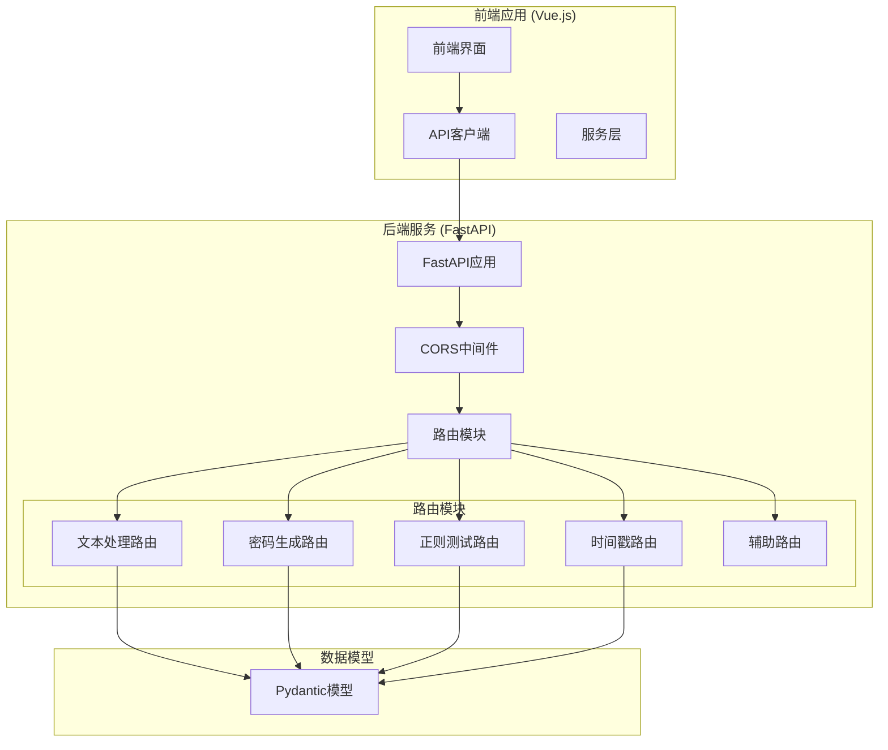
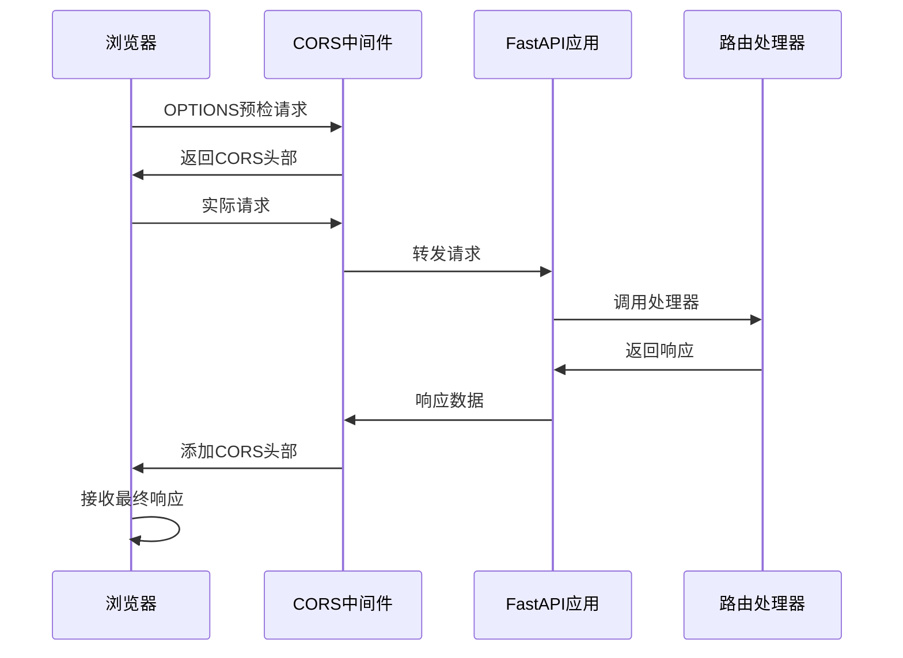
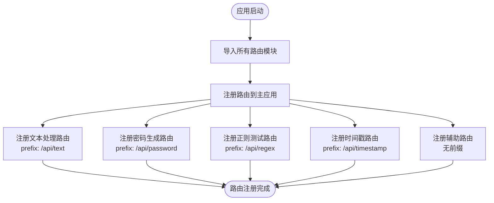
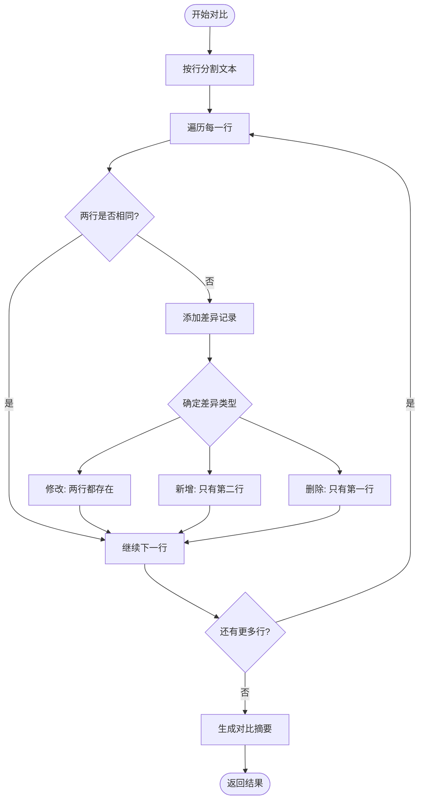
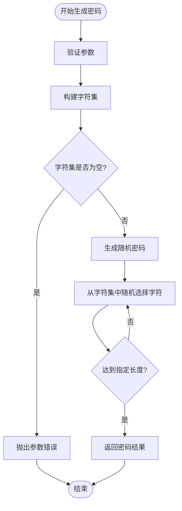
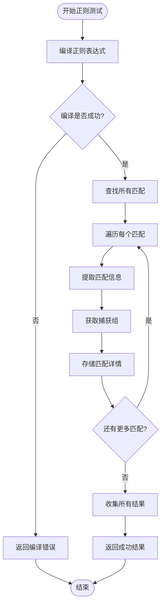
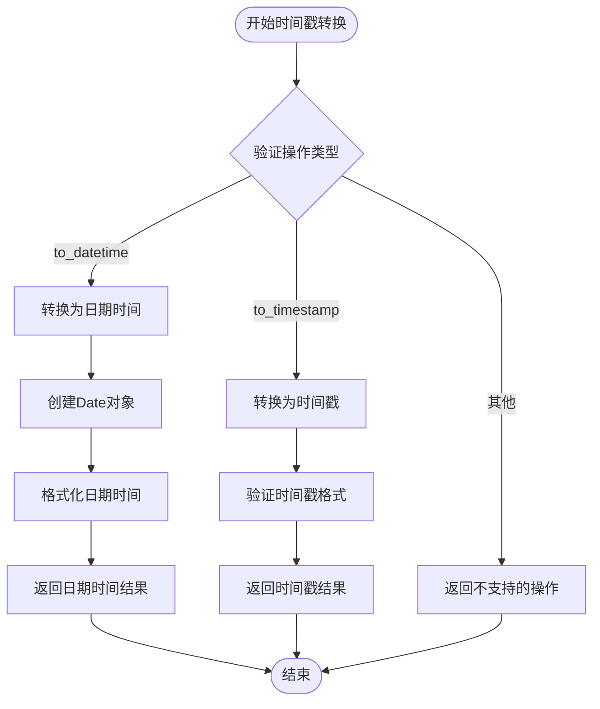
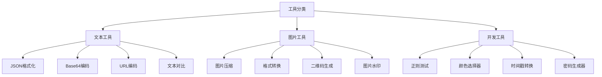

# API端点详细文档

<cite>
**本文档引用的文件**
- [app.py](file://backend/app.py)
- [text.py](file://backend/routers/text.py)
- [password.py](file://backend/routers/password.py)
- [regex.py](file://backend/routers/regex.py)
- [timestamp.py](file://backend/routers/timestamp.py)
- [misc.py](file://backend/routers/misc.py)
- [schemas.py](file://backend/schemas.py)
- [api.ts](file://ZYTool/src/services/api.ts)
- [frontendTools.ts](file://ZYTool/src/services/frontendTools.ts)
</cite>

## 目录
1. [简介](#简介)
2. [项目架构概览](#项目架构概览)
3. [CORS配置与跨域支持](#cors配置与跨域支持)
4. [路由模块化设计](#路由模块化设计)
5. [文本处理API](#文本处理api)
6. [密码生成API](#密码生成api)
7. [正则表达式测试API](#正则表达式测试api)
8. [时间戳转换API](#时间戳转换api)
9. [辅助接口API](#辅助接口api)
10. [前端调用方式](#前端调用方式)
11. [错误处理与状态码](#错误处理与状态码)
12. [总结](#总结)

## 简介

ZYTool是一个基于FastAPI构建的多功能在线工具平台，提供了丰富的文本处理、密码生成、正则表达式测试和时间戳转换等功能。该系统采用模块化的路由设计，支持前后端分离的架构模式，并通过CORS配置实现了跨域请求支持。

## 项目架构概览



**图表来源**
- [app.py](file://backend/app.py#L1-L33)
- [text.py](file://backend/routers/text.py#L1-L76)
- [password.py](file://backend/routers/password.py#L1-L41)
- [regex.py](file://backend/routers/regex.py#L1-L36)
- [timestamp.py](file://backend/routers/timestamp.py#L1-L36)
- [misc.py](file://backend/routers/misc.py#L1-L54)

**章节来源**
- [app.py](file://backend/app.py#L1-L33)

## CORS配置与跨域支持

系统通过FastAPI的CORSMiddleware组件实现了完整的跨域资源共享(CORS)支持，允许前端开发环境进行跨域请求。

### CORS配置详情

| 配置项 | 值 | 说明 |
|--------|-----|------|
| 允许的源 | `["http://localhost:5173", "http://localhost:3000"]` | 支持Vue开发服务器和React开发服务器 |
| 允许凭证 | `true` | 允许携带认证信息(cookie、Authorization头) |
| 允许的方法 | `["*"]` | 支持所有HTTP方法 |
| 允许的头部 | `["*"]` | 支持所有请求头部 |

### 跨域请求流程



**图表来源**
- [app.py](file://backend/app.py#L13-L20)

**章节来源**
- [app.py](file://backend/app.py#L13-L20)

## 路由模块化设计

系统采用模块化的路由设计，每个功能模块都有独立的路由文件，便于维护和扩展。

### 模块化路由注册机制



**图表来源**
- [app.py](file://backend/app.py#L22-L27)

### 各模块特性

| 模块 | 前缀 | 标签 | 主要功能 |
|------|------|------|----------|
| 文本处理 | `/api/text` | `text` | JSON格式化、Base64编解码、URL编解码、文本对比 |
| 密码生成 | `/api/password` | `password` | 安全密码生成 |
| 正则测试 | `/api/regex` | `regex` | 正则表达式测试 |
| 时间戳 | `/api/timestamp` | `timestamp` | 时间戳转换 |
| 辅助功能 | 无 | `misc` | 健康检查、工具分类 |

**章节来源**
- [app.py](file://backend/app.py#L4-L8)
- [app.py](file://backend/app.py#L22-L27)

## 文本处理API

文本处理模块提供了多种文本操作功能，包括JSON格式化、Base64编解码、URL编解码和文本对比。

### 文本处理端点

#### JSON格式化/Base64编解码/URL编解码

**端点**: `POST /api/text/process`

**请求体结构**:
```typescript
interface TextProcessRequest {
    text: string;           // 待处理的文本
    action: 'json_format' | 'base64_encode' | 'base64_decode' | 'url_encode' | 'url_decode';
}
```

**响应格式**:
```typescript
interface TextProcessResponse {
    result: string;         // 处理结果
    success: boolean;       // 是否成功
}
```

**支持的操作**:

| 操作类型 | 功能描述 | 示例 |
|----------|----------|------|
| `json_format` | 格式化JSON文本 | 将紧凑的JSON格式化为易读的缩进格式 |
| `base64_encode` | Base64编码 | 将文本编码为Base64字符串 |
| `base64_decode` | Base64解码 | 将Base64字符串解码为原始文本 |
| `url_encode` | URL编码 | 对特殊字符进行URL编码 |
| `url_decode` | URL解码 | 解码URL编码的字符串 |

**错误处理**:
- JSON格式化失败时返回具体错误信息
- Base64解码失败时返回解码错误
- URL解码失败时返回解码错误

#### 文本对比

**端点**: `POST /api/text/compare`

**请求体结构**:
```typescript
interface TextCompareRequest {
    text1: string;          // 第一个文本
    text2: string;          // 第二个文本
}
```

**响应格式**:
```typescript
interface TextCompareResponse {
    differences: Array<{
        line: number;           // 行号
        text1: string;          // 文本1的内容
        text2: string;          // 文本2的内容
        type: 'modified' | 'added' | 'removed';  // 差异类型
    }>;
    summary: {
        total_lines: number;    // 总行数
        different_lines: number;// 不同行数
        identical: boolean;     // 是否完全相同
    };
}
```

**对比算法流程**:



**图表来源**
- [text.py](file://backend/routers/text.py#L45-L76)

**章节来源**
- [text.py](file://backend/routers/text.py#L13-L76)
- [schemas.py](file://backend/schemas.py#L4-L12)

## 密码生成API

密码生成模块提供了安全的随机密码生成功能，支持自定义密码长度和字符集组合。

### 密码生成端点

**端点**: `POST /api/password/generate`

**请求体结构**:
```typescript
interface PasswordGenerateRequest {
    length?: number;                    // 密码长度，默认12
    include_symbols?: boolean;          // 包含符号，默认true
    include_numbers?: boolean;          // 包含数字，默认true
    include_uppercase?: boolean;        // 包含大写字母，默认true
    include_lowercase?: boolean;        // 包含小写字母，默认true
}
```

**响应格式**:
```typescript
interface PasswordGenerateResponse {
    password: string;                   // 生成的密码
    length: number;                     // 密码长度
    character_types: {
        lowercase: boolean;             // 是否包含小写字母
        uppercase: boolean;             // 是否包含大写字母
        numbers: boolean;               // 是否包含数字
        symbols: boolean;               // 是否包含符号
    };
}
```

### 密码生成算法



**图表来源**
- [password.py](file://backend/routers/password.py#L11-L40)

**字符集组合规则**:

| 字符类型 | 字符范围 | 默认包含 |
|----------|----------|----------|
| 小写字母 | `a-z` | ✓ |
| 大写字母 | `A-Z` | ✓ |
| 数字 | `0-9` | ✓ |
| 符号 | `!@#$%^&*()_+-=[]{}|;:,.<>?` | ✓ |

**章节来源**
- [password.py](file://backend/routers/password.py#L11-L40)
- [schemas.py](file://backend/schemas.py#L14-L19)

## 正则表达式测试API

正则测试模块提供了强大的正则表达式匹配和测试功能，支持复杂的模式匹配场景。

### 正则测试端点

**端点**: `POST /api/regex/test`

**请求体结构**:
```typescript
interface RegexTestRequest {
    pattern: string;                    // 正则表达式模式
    text: string;                       // 待匹配的文本
}
```

**响应格式**:
```typescript
interface RegexTestResponse {
    matches: string[];                  // 所有匹配结果
    match_details: Array<{
        match: string;                  // 匹配的完整文本
        start: number;                  // 匹配开始位置
        end: number;                    // 匹配结束位置
        groups: string[];               // 捕获组内容
    }>;
    success: boolean;                   // 是否成功
    error?: string;                     // 错误信息（失败时）
}
```

### 正则测试处理流程



**图表来源**
- [regex.py](file://backend/routers/regex.py#L10-L35)

**正则测试功能特性**:

| 功能 | 描述 | 使用场景 |
|------|------|----------|
| 全局匹配 | 查找文本中所有匹配项 | 文本分析、内容检测 |
| 位置信息 | 提供匹配的起始和结束位置 | 高亮显示、精确定位 |
| 捕获组 | 提取括号内的匹配内容 | 数据提取、格式解析 |
| 错误处理 | 正则表达式语法错误检测 | 开发调试、用户提示 |

**章节来源**
- [regex.py](file://backend/routers/regex.py#L10-L35)
- [schemas.py](file://backend/schemas.py#L22-L24)

## 时间戳转换API

时间戳转换模块提供了灵活的时间格式转换功能，支持Unix时间戳与人类可读日期时间之间的相互转换。

### 时间戳转换端点

**端点**: `POST /api/timestamp/convert`

**请求体结构**:
```typescript
interface TimestampConvertRequest {
    timestamp: number;                  // 时间戳
    action: 'to_datetime' | 'to_timestamp';  // 转换方向
}
```

**响应格式**:
```typescript
interface TimestampConvertResponse {
    datetime: string;                   // 日期时间字符串 (YYYY-MM-DD HH:MM:SS)
    timestamp: number;                  // 原始时间戳
    action: string;                     // 执行的操作
    error?: string;                     // 错误信息（失败时）
    success?: boolean;                  // 是否成功（失败时）
}
```

### 时间戳转换处理流程



**图表来源**
- [timestamp.py](file://backend/routers/timestamp.py#L10-L35)

**支持的转换类型**:

| 操作类型 | 输入格式 | 输出格式 | 说明 |
|----------|----------|----------|------|
| `to_datetime` | Unix时间戳 | `YYYY-MM-DD HH:MM:SS` | 将时间戳转换为可读日期时间 |
| `to_timestamp` | 日期时间字符串 | Unix时间戳 | 将日期时间转换为时间戳 |

**时间戳精度说明**:

- Unix时间戳单位：秒（整数）
- 日期时间格式：`YYYY-MM-DD HH:MM:SS`
- 支持的时间范围：1970年1月1日 至 2038年1月19日

**章节来源**
- [timestamp.py](file://backend/routers/timestamp.py#L10-L35)
- [schemas.py](file://backend/schemas.py#L27-L29)

## 辅助接口API

辅助接口模块提供了系统基本信息查询和健康检查功能，主要用于系统监控和前端导航。

### 工具分类接口

**端点**: `GET /api/categories`

**响应格式**:
```typescript
interface CategoriesResponse {
    categories: Array<{
        id: number;
        name: string;
        description: string;
        tools: Array<{
            id: number;
            name: string;
            icon: string;
            description: string;
        }>;
    }>;
}
```

**分类结构**:



**图表来源**
- [misc.py](file://backend/routers/misc.py#L7-L47)

### 健康检查接口

**端点**: `GET /api/health`

**响应格式**:
```typescript
interface HealthCheckResponse {
    status: string;                     // 健康状态
    message: string;                    // 健康检查消息
}
```

**健康检查响应**:
```json
{
    "status": "healthy",
    "message": "ZYTool API is running"
}
```

**章节来源**
- [misc.py](file://backend/routers/misc.py#L7-L54)

## 前端调用方式

系统提供了两种调用方式：通过后端API和前端本地处理。

### 后端API调用

使用Axios客户端进行后端API调用：

```typescript
// 基础API配置
const api = axios.create({
    baseURL: 'http://localhost:8000/api',
    timeout: 10000,
    headers: {'Content-Type': 'application/json'}
});

// 文本处理调用示例
const processText = async (request: TextProcessRequest) => {
    try {
        const response = await api.post('/text/process', request);
        return response.data;
    } catch (error) {
        console.error('文本处理失败:', error);
        throw error;
    }
};
```

### curl命令示例

#### 文本处理
```bash
# JSON格式化
curl -X POST "http://localhost:8000/api/text/process" \
  -H "Content-Type: application/json" \
  -d '{
    "text": "{\"key\":\"value\"}",
    "action": "json_format"
  }'

# Base64编码
curl -X POST "http://localhost:8000/api/text/process" \
  -H "Content-Type: application/json" \
  -d '{
    "text": "Hello World",
    "action": "base64_encode"
  }'

# 文本对比
curl -X POST "http://localhost:8000/api/text/compare" \
  -H "Content-Type: application/json" \
  -d '{
    "text1": "line1\nline2",
    "text2": "line1\nline3"
  }'
```

#### 密码生成
```bash
# 生成密码
curl -X POST "http://localhost:8000/api/password/generate" \
  -H "Content-Type: application/json" \
  -d '{
    "length": 16,
    "include_symbols": true,
    "include_numbers": true,
    "include_uppercase": true,
    "include_lowercase": true
  }'
```

#### 正则测试
```bash
# 正则测试
curl -X POST "http://localhost:8000/api/regex/test" \
  -H "Content-Type: application/json" \
  -d '{
    "pattern": "\\d+",
    "text": "abc123def456"
  }'
```

#### 时间戳转换
```bash
# 时间戳转日期时间
curl -X POST "http://localhost:8000/api/timestamp/convert" \
  -H "Content-Type: application/json" \
  -d '{
    "timestamp": 1640995200,
    "action": "to_datetime"
  }'
```

#### 辅助接口
```bash
# 获取工具分类
curl -X GET "http://localhost:8000/api/categories"

# 健康检查
curl -X GET "http://localhost:8000/api/health"
```

### 前端工具库调用

对于一些简单的文本处理功能，前端提供了本地处理能力：

```typescript
// 前端工具调用示例
import { formatJSON, base64Encode, urlEncode } from './frontendTools';

// JSON格式化（前端处理）
const jsonResult = formatJSON('{"key":"value"}');

// Base64编码（前端处理）
const base64Result = base64Encode('Hello World');
```

**章节来源**
- [api.ts](file://ZYTool/src/services/api.ts#L1-L178)
- [frontendTools.ts](file://ZYTool/src/services/frontendTools.ts#L1-L185)

## 错误处理与状态码

系统实现了完善的错误处理机制，确保API调用的稳定性和用户体验。

### HTTP状态码规范

| 状态码 | 场景 | 描述 |
|--------|------|------|
| 200 | 成功 | 请求处理成功 |
| 400 | 客户端错误 | 参数错误、格式错误 |
| 404 | 资源不存在 | 路径不存在 |
| 500 | 服务器错误 | 内部处理异常 |

### 错误响应格式

```typescript
interface ErrorResponse {
    result?: string;                    // 错误信息（文本处理模块）
    error?: string;                     // 错误信息（通用）
    success: boolean;                   // 始终为false
}
```

### 特定模块错误处理

#### 文本处理模块错误
```json
{
    "result": "JSON decode error: Expecting ',' delimiter",
    "success": false
}
```

#### 正则测试模块错误
```json
{
    "error": "unbalanced parenthesis",
    "success": false
}
```

#### 时间戳转换模块错误
```json
{
    "error": "Invalid timestamp",
    "success": false
}
```

#### 密码生成模块错误
```json
{
    "detail": "至少需要选择一种字符类型"
}
```

## 总结

ZYTool的API系统具有以下特点：

### 架构优势
1. **模块化设计**: 每个功能模块独立路由，便于维护和扩展
2. **类型安全**: 使用Pydantic模型确保数据验证和类型安全
3. **跨域支持**: 完整的CORS配置支持前端开发需求
4. **错误处理**: 统一的错误响应格式和状态码管理

### 功能完整性
1. **文本处理**: 支持JSON、Base64、URL等多种编码格式
2. **密码安全**: 基于secrets模块的安全密码生成
3. **正则测试**: 强大的正则表达式匹配和测试功能
4. **时间转换**: 灵活的时间戳与日期时间转换
5. **系统监控**: 健康检查和工具分类信息

### 开发体验
1. **统一接口**: 标准化的请求响应格式
2. **详细文档**: 完整的API文档和示例
3. **错误提示**: 清晰的错误信息和处理建议
4. **前后端分离**: 支持多种调用方式和部署模式

该API系统为用户提供了一个功能丰富、性能稳定、易于使用的在线工具平台，满足了日常开发和文本处理的各种需求。