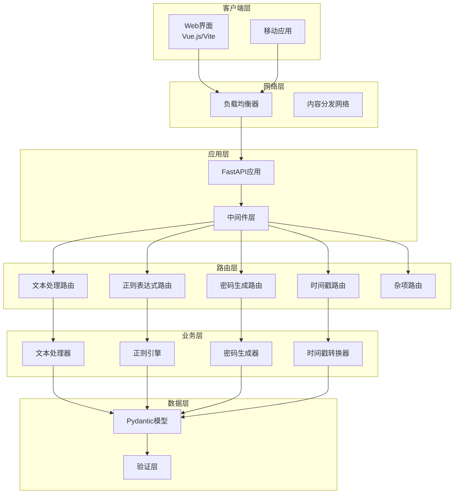
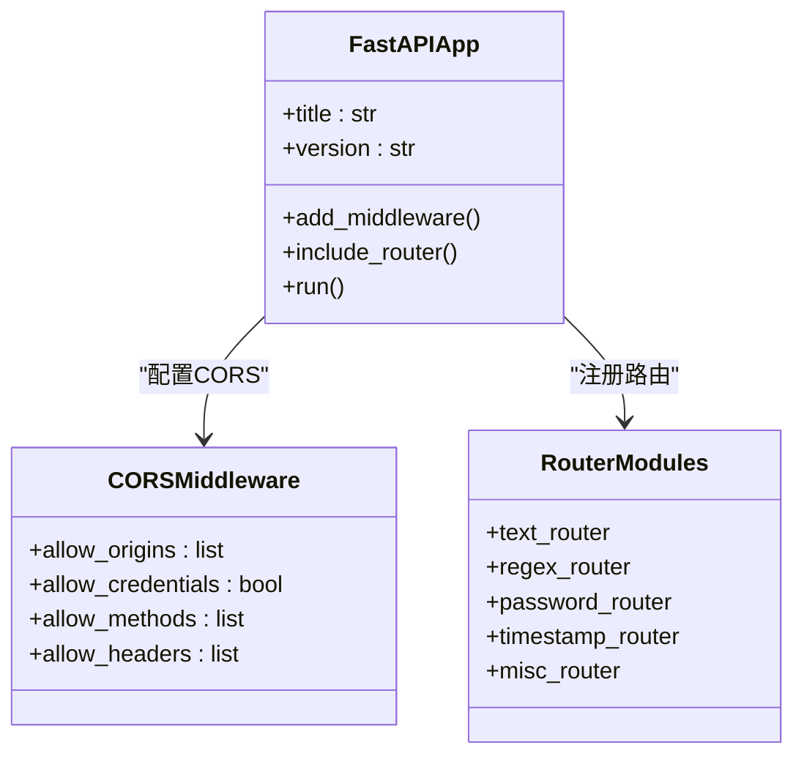
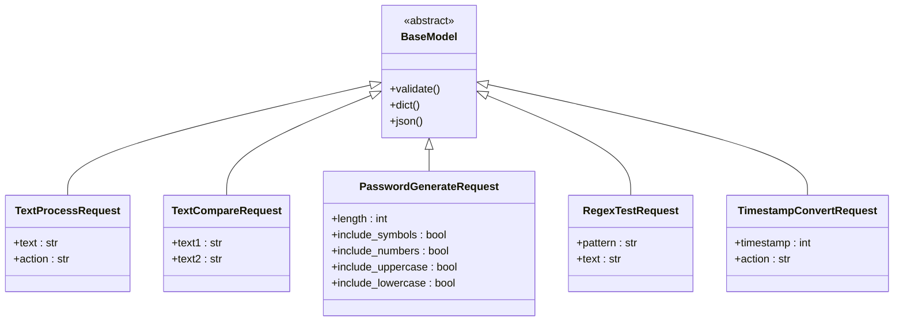
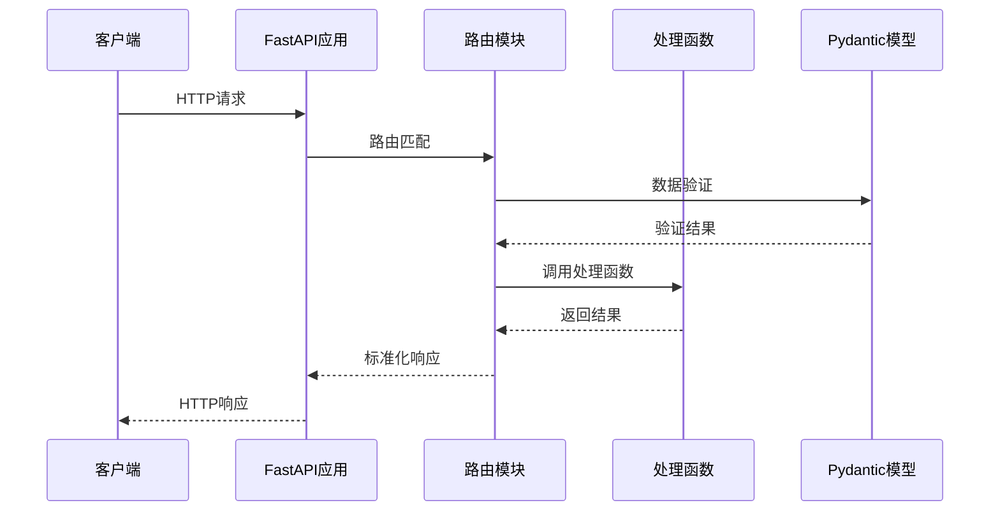
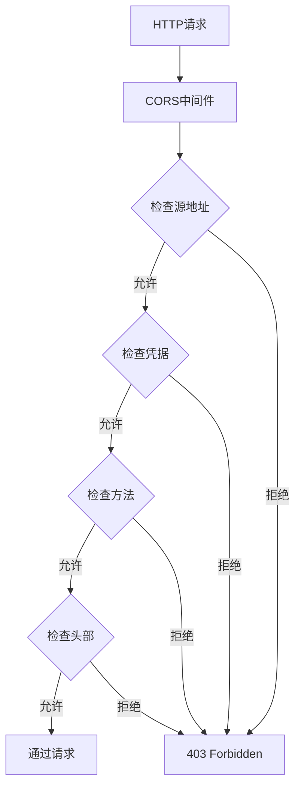
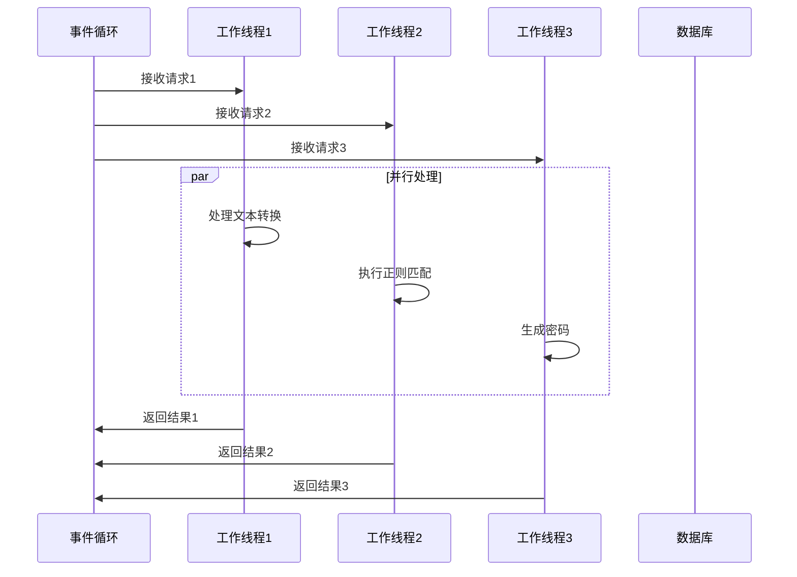
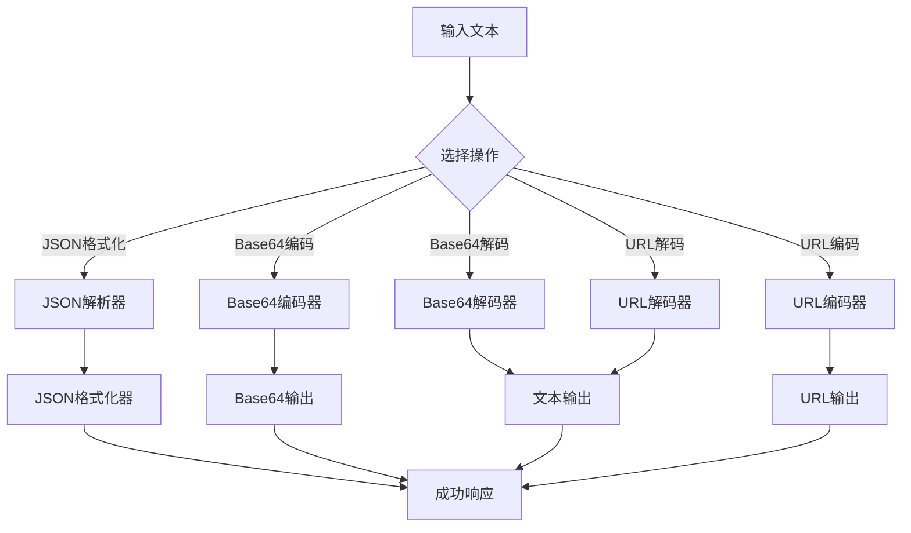
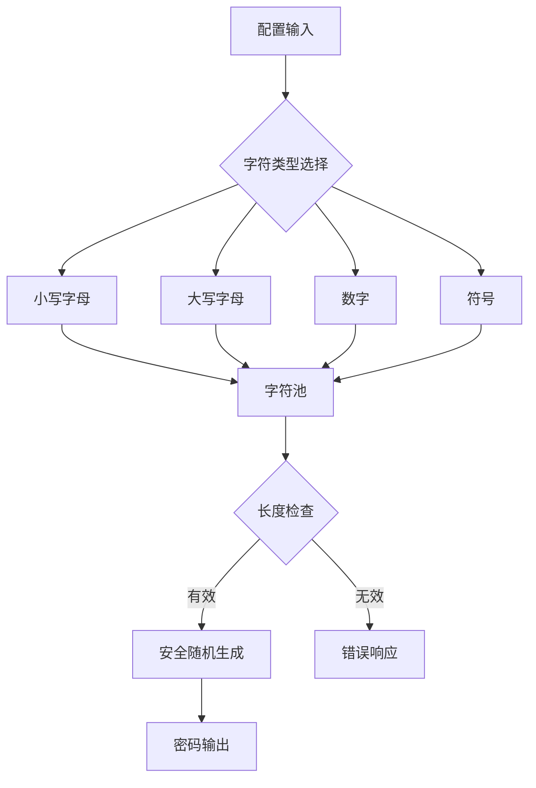
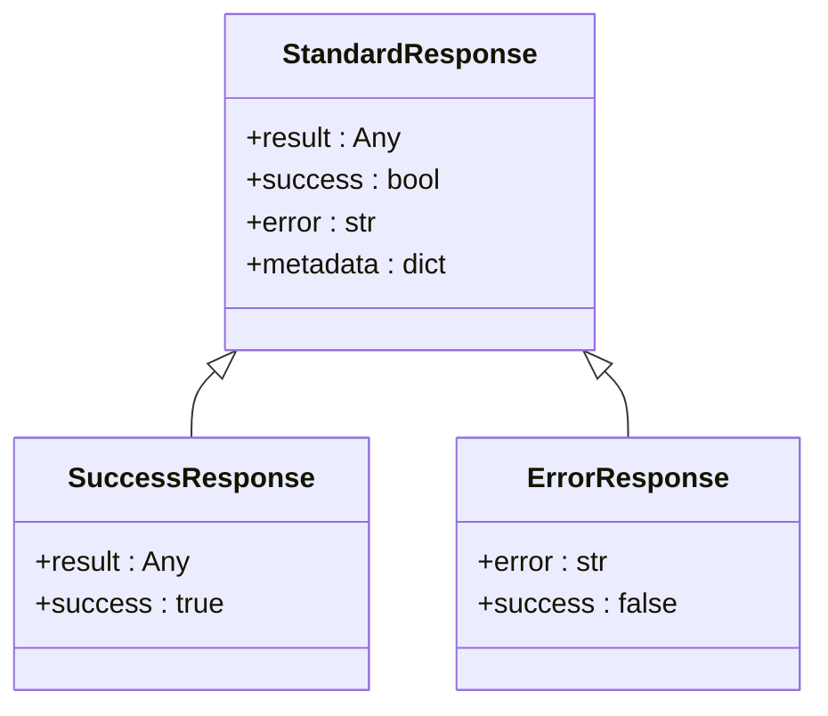

# 后端架构

<cite>
**本文档引用的文件**
- [app.py](file://backend/app.py)
- [schemas.py](file://backend/schemas.py)
- [routers/misc.py](file://backend/routers/misc.py)
- [routers/text.py](file://backend/routers/text.py)
- [routers/password.py](file://backend/routers/password.py)
- [routers/regex.py](file://backend/routers/regex.py)
- [routers/timestamp.py](file://backend/routers/timestamp.py)
- [requirements.txt](file://backend/requirements.txt)
</cite>

## 目录
1. [项目概述](#项目概述)
2. [系统架构](#系统架构)
3. [核心组件分析](#核心组件分析)
4. [FastAPI函数式路由设计](#fastapi函数式路由设计)
5. [Pydantic模型与数据验证](#pydantic模型与数据验证)
6. [CORS配置与跨域处理](#cors配置与跨域处理)
7. [并发请求处理机制](#并发请求处理机制)
8. [业务逻辑实现](#业务逻辑实现)
9. [标准化响应处理](#标准化响应处理)
10. [性能优化考虑](#性能优化考虑)
11. [总结](#总结)

## 项目概述

ZYTool后端采用现代Python Web框架FastAPI构建，提供RESTful API服务。该架构遵循模块化设计原则，通过清晰的分层结构实现了高效的API开发和维护。

### 技术栈特点
- **FastAPI**: 现代异步Web框架，提供高性能和自动文档生成功能
- **Pydantic**: 类型安全的数据验证和设置管理
- **Uvicorn**: ASGI服务器，支持高并发请求处理
- **CORS**: 跨域资源共享支持，便于前后端分离开发

## 系统架构

**图表来源**
- [app.py](file://backend/app.py#L11-L32)
- [routers/text.py](file://backend/routers/text.py#L10-L11)
- [routers/regex.py](file://backend/routers/regex.py#L7-L8)
- [routers/password.py](file://backend/routers/password.py#L8-L9)
- [routers/timestamp.py](file://backend/routers/timestamp.py#L7-L8)
- [routers/misc.py](file://backend/routers/misc.py#L4-L5)

## 核心组件分析

### 应用入口点 (app.py)

app.py作为整个FastAPI应用的主入口，负责应用初始化、中间件配置和路由注册。

**图表来源**
- [app.py](file://backend/app.py#L11-L32)

**章节来源**
- [app.py](file://backend/app.py#L1-L33)

### 数据模型层 (schemas.py)

schemas.py定义了所有API请求和响应的数据结构，使用Pydantic确保类型安全和自动验证。

**图表来源**
- [schemas.py](file://backend/schemas.py#L4-L30)

**章节来源**
- [schemas.py](file://backend/schemas.py#L1-L32)

## FastAPI函数式路由设计

### 路由模块组织

每个功能模块都独立封装在自己的路由文件中，采用函数式编程风格：

**图表来源**
- [routers/text.py](file://backend/routers/text.py#L13-L42)
- [routers/password.py](file://backend/routers/password.py#L11-L38)
- [routers/regex.py](file://backend/routers/regex.py#L10-L33)
- [routers/timestamp.py](file://backend/routers/timestamp.py#L10-L33)

### 路由装饰器模式

每个路由都使用FastAPI的装饰器模式，提供清晰的API定义：

- **@router.post()**: 处理POST请求
- **@router.get()**: 处理GET请求  
- **@router.put()**: 处理PUT请求（未在当前代码中使用）
- **@router.delete()**: 处理DELETE请求（未在当前代码中使用）

**章节来源**
- [routers/text.py](file://backend/routers/text.py#L13-L76)
- [routers/password.py](file://backend/routers/password.py#L11-L41)
- [routers/regex.py](file://backend/routers/regex.py#L10-L36)
- [routers/timestamp.py](file://backend/routers/timestamp.py#L10-L36)
- [routers/misc.py](file://backend/routers/misc.py#L7-L54)

## Pydantic模型与数据验证

### 类型安全的数据结构

Pydantic模型提供了强类型的API数据结构，确保数据的一致性和完整性：

| 模型名称 | 主要字段 | 验证规则 | 默认值 |
|---------|---------|---------|--------|
| TextProcessRequest | text, action | action枚举验证 | 无 |
| TextCompareRequest | text1, text2 | 字符串验证 | 无 |
| PasswordGenerateRequest | length, include_* | 布尔标志组合验证 | length=12 |
| RegexTestRequest | pattern, text | 正则表达式语法验证 | 无 |
| TimestampConvertRequest | timestamp, action | 时间戳范围验证 | 无 |

### 自动文档生成

FastAPI利用Pydantic模型自动生成API文档，包括：
- 参数类型和描述
- 示例请求和响应
- 错误状态码说明
- 数据验证规则展示

**章节来源**
- [schemas.py](file://backend/schemas.py#L4-L30)

## CORS配置与跨域处理

### 中间件配置策略

app.py中的CORS配置采用了宽松但安全的策略：

**图表来源**
- [app.py](file://backend/app.py#L14-L20)

### 配置参数详解

- **allow_origins**: 允许的前端开发服务器地址
- **allow_credentials**: 支持携带认证信息
- **allow_methods**: 允许所有HTTP方法
- **allow_headers**: 允许所有请求头

**章节来源**
- [app.py](file://backend/app.py#L13-L20)

## 并发请求处理机制

### 异步处理架构

FastAPI基于Starlette构建，天然支持异步请求处理：

### Uvicorn服务器配置

生产环境使用Uvicorn作为ASGI服务器，支持：
- 多进程并发处理
- 异步IO操作
- 内存高效管理
- 自动重载功能（开发环境）

**章节来源**
- [app.py](file://backend/app.py#L30-L32)
- [requirements.txt](file://backend/requirements.txt#L2)

## 业务逻辑实现

### 文本处理功能

文本处理模块实现了多种编码转换和格式化功能：

**图表来源**
- [routers/text.py](file://backend/routers/text.py#L13-L42)

### 密码生成算法

密码生成器使用安全的随机数生成器：

**图表来源**
- [routers/password.py](file://backend/routers/password.py#L11-L38)

### 正则表达式测试

正则引擎提供了详细的匹配信息：

| 匹配信息 | 描述 | 数据类型 |
|---------|------|---------|
| match | 匹配的完整文本 | str |
| start | 匹配开始位置 | int |
| end | 匹配结束位置 | int |
| groups | 分组捕获内容 | tuple |

**章节来源**
- [routers/text.py](file://backend/routers/text.py#L13-L76)
- [routers/password.py](file://backend/routers/password.py#L11-L41)
- [routers/regex.py](file://backend/routers/regex.py#L10-L36)
- [routers/timestamp.py](file://backend/routers/timestamp.py#L10-L36)

## 标准化响应处理

### 统一响应格式

所有API端点都返回标准化的响应格式：

### 错误处理机制

系统实现了多层次的错误处理：

1. **Pydantic验证错误**: 自动返回422状态码
2. **业务逻辑异常**: 使用HTTPException抛出
3. **系统级异常**: 捕获并返回通用错误信息

**章节来源**
- [routers/text.py](file://backend/routers/text.py#L38-L42)
- [routers/password.py](file://backend/routers/password.py#L24-L25)
- [routers/regex.py](file://backend/routers/regex.py#L32-L33)
- [routers/timestamp.py](file://backend/routers/timestamp.py#L29-L33)

## 性能优化考虑

### 异步编程优势

- **非阻塞IO**: 处理大量并发请求时性能优异
- **内存效率**: 减少线程切换开销
- **CPU利用率**: 更好地利用多核处理器

### 缓存策略

虽然当前实现没有显式的缓存，但可以考虑以下优化：
- 频繁使用的正则表达式编译结果缓存
- 密码生成器的字符集预计算
- 文本处理结果的临时缓存

### 资源管理

- **连接池**: 数据库连接的复用
- **内存管理**: 及时释放大型对象
- **垃圾回收**: Python自动管理内存

## 总结

ZYTool后端架构展现了现代Python Web开发的最佳实践：

### 架构优势
- **模块化设计**: 清晰的功能分离和职责划分
- **类型安全**: Pydantic确保数据验证和类型安全
- **异步处理**: 高效的并发请求处理能力
- **自动文档**: 自动生成API文档，提升开发效率
- **CORS支持**: 便于前后端分离开发

### 技术特色
- **FastAPI框架**: 现代化的Web框架，兼具性能和易用性
- **函数式路由**: 简洁优雅的API定义方式
- **依赖注入**: 虽然当前未使用，但框架支持灵活的依赖管理
- **标准化响应**: 统一的错误处理和响应格式

### 扩展性
该架构为未来的功能扩展提供了良好的基础，可以轻松添加新的路由模块和业务逻辑，同时保持代码的可维护性和可测试性。