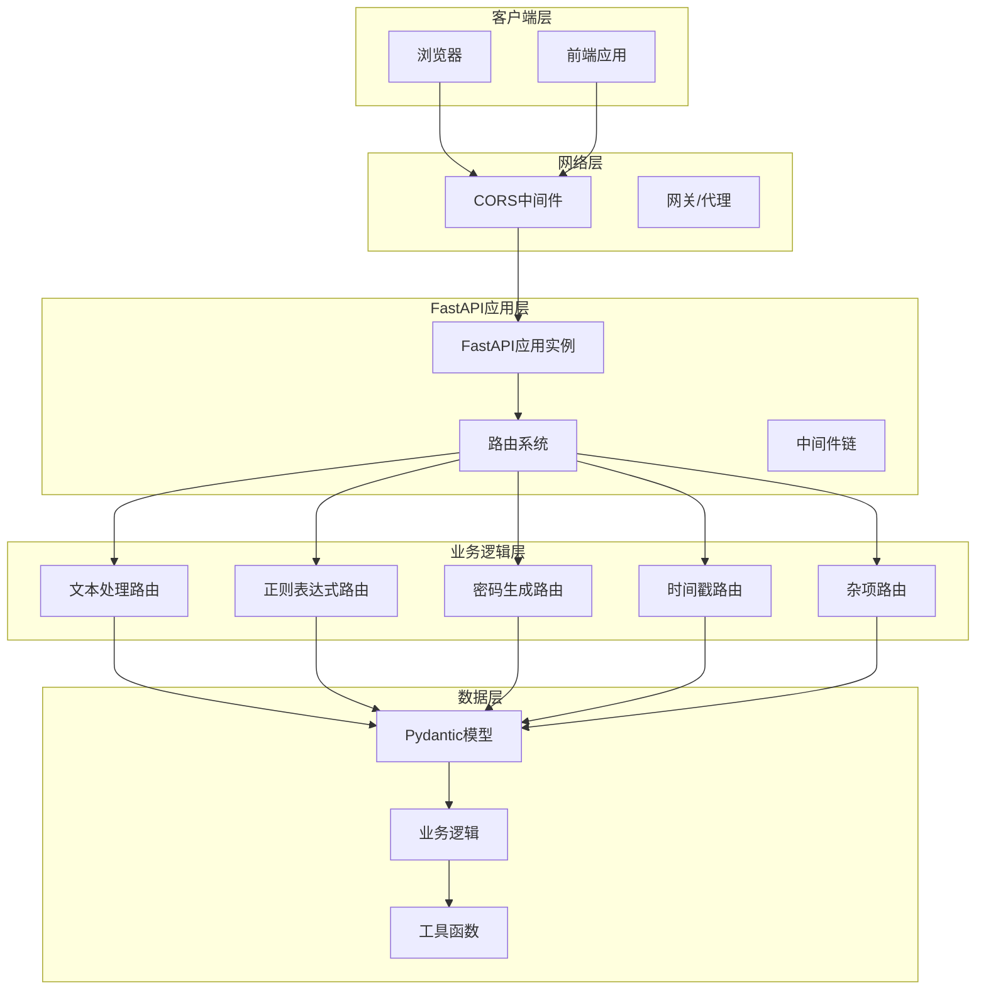
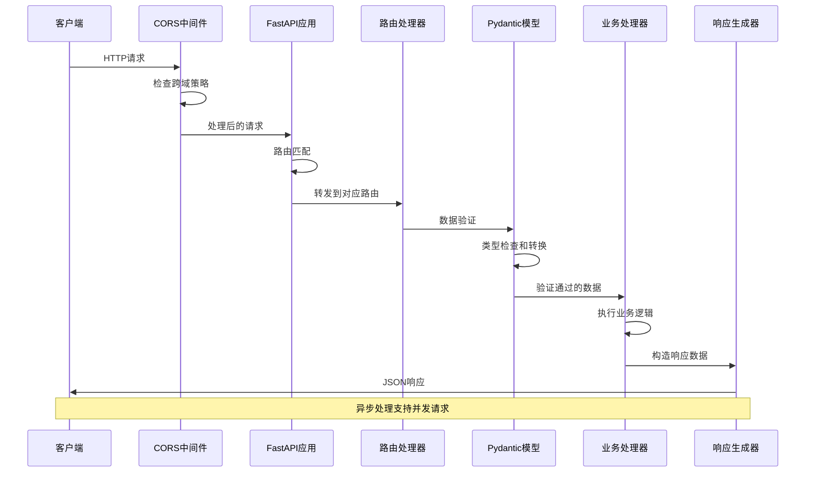
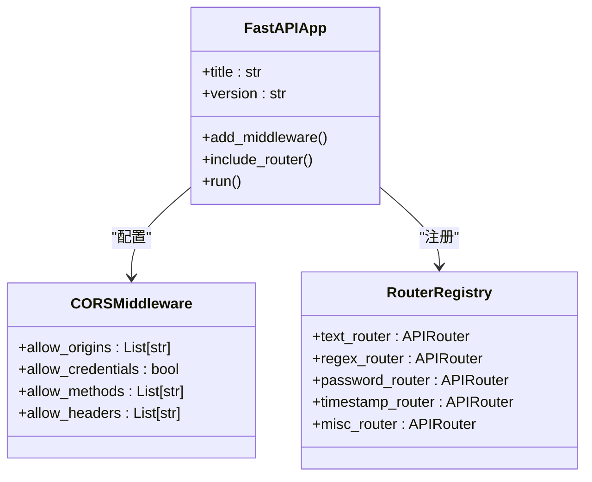
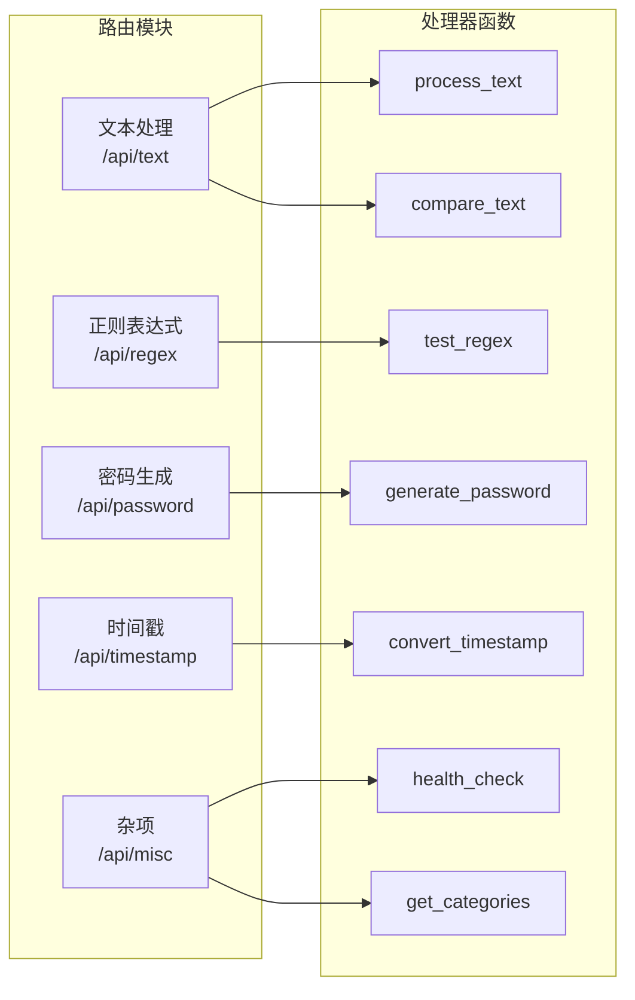
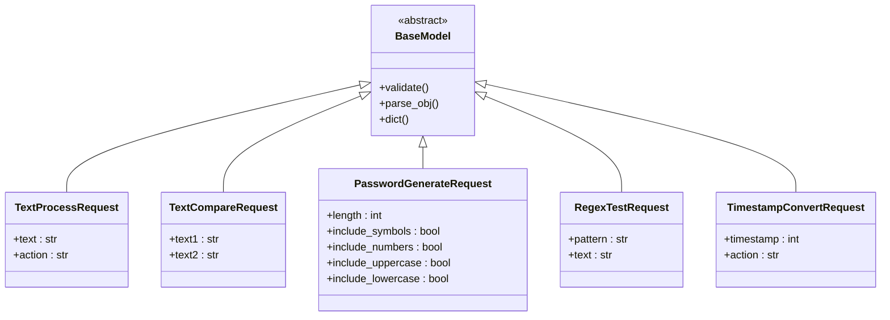
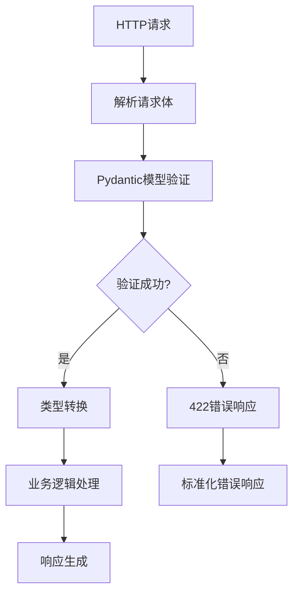
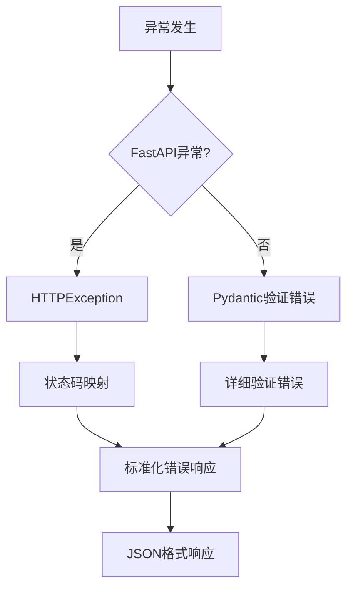
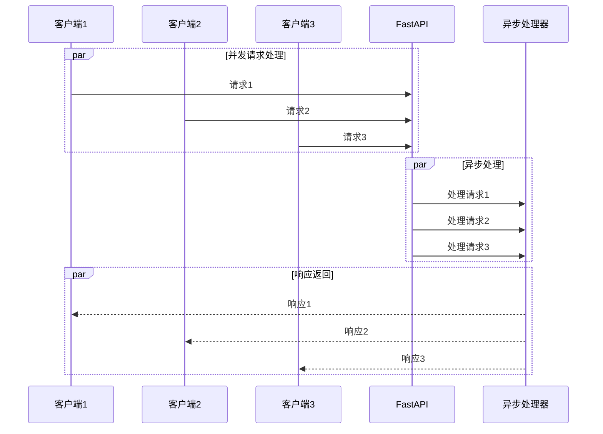
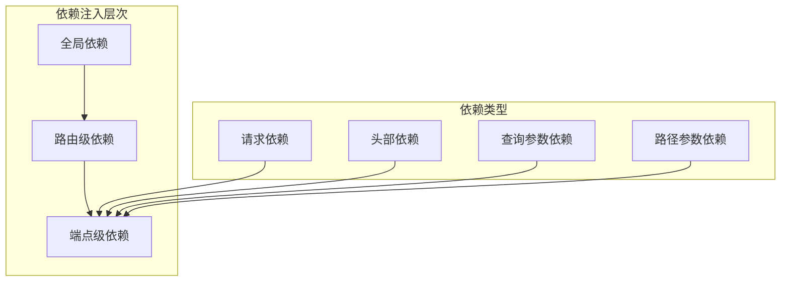

# 后端请求处理流程技术文档

<cite>
**本文档中引用的文件**
- [app.py](file://backend/app.py)
- [text.py](file://backend/routers/text.py)
- [schemas.py](file://backend/schemas.py)
- [regex.py](file://backend/routers/regex.py)
- [password.py](file://backend/routers/password.py)
- [timestamp.py](file://backend/routers/timestamp.py)
- [misc.py](file://backend/routers/misc.py)
- [requirements.txt](file://backend/requirements.txt)
</cite>

## 目录
1. [项目概述](#项目概述)
2. [系统架构](#系统架构)
3. [请求处理生命周期](#请求处理生命周期)
4. [核心组件分析](#核心组件分析)
5. [数据验证与模型](#数据验证与模型)
6. [异常处理机制](#异常处理机制)
7. [异步处理与性能优化](#异步处理与性能优化)
8. [依赖注入系统](#依赖注入系统)
9. [性能优化建议](#性能优化建议)
10. [总结](#总结)

## 项目概述

ZYTool后端采用FastAPI框架构建，提供RESTful API服务。该系统专注于文本处理工具，包括JSON格式化、Base64编解码、URL编解码、文本对比、正则表达式测试、密码生成和时间戳转换等功能。

### 技术栈
- **Web框架**: FastAPI 0.104.1
- **ASGI服务器**: Uvicorn 0.24.0
- **数据验证**: Pydantic
- **跨域支持**: CORS中间件
- **部署**: 生产环境使用Uvicorn

**章节来源**
- [requirements.txt](file://backend/requirements.txt#L1-L4)
- [app.py](file://backend/app.py#L1-L33)

## 系统架构

**图表来源**
- [app.py](file://backend/app.py#L11-L32)
- [text.py](file://backend/routers/text.py#L10-L11)

## 请求处理生命周期

### 完整处理流程

**图表来源**
- [app.py](file://backend/app.py#L14-L20)
- [text.py](file://backend/routers/text.py#L13-L42)

### 文本处理请求示例

以下是一个典型的文本处理请求的完整生命周期：

1. **请求接收**: 客户端发送POST请求到`/api/text/process`
2. **CORS处理**: CORS中间件验证请求源并设置响应头
3. **路由匹配**: FastAPI根据路径和方法匹配到`process_text`处理器
4. **数据验证**: Pydantic模型验证请求体结构和类型
5. **业务逻辑执行**: 根据action参数执行相应的文本处理操作
6. **响应构造**: 返回标准化的JSON响应

**章节来源**
- [app.py](file://backend/app.py#L14-L20)
- [text.py](file://backend/routers/text.py#L13-L42)

## 核心组件分析

### FastAPI应用实例

FastAPI应用实例是整个系统的入口点，负责配置中间件、注册路由和启动服务器。

**图表来源**
- [app.py](file://backend/app.py#L11-L28)

### 路由系统设计

系统采用模块化的路由设计，每个功能模块都有独立的路由处理器：

**图表来源**
- [text.py](file://backend/routers/text.py#L10-L11)
- [regex.py](file://backend/routers/regex.py#L7-L8)
- [password.py](file://backend/routers/password.py#L8-L9)
- [timestamp.py](file://backend/routers/timestamp.py#L7-L8)
- [misc.py](file://backend/routers/misc.py#L4-L5)

**章节来源**
- [app.py](file://backend/app.py#L22-L27)
- [text.py](file://backend/routers/text.py#L10-L11)

## 数据验证与模型

### Pydantic模型架构

系统使用Pydantic模型进行数据验证和序列化，确保请求数据的完整性和类型安全性。

**图表来源**
- [schemas.py](file://backend/schemas.py#L4-L29)

### 数据验证流程

**图表来源**
- [text.py](file://backend/routers/text.py#L14-L15)
- [schemas.py](file://backend/schemas.py#L4-L7)

**章节来源**
- [schemas.py](file://backend/schemas.py#L1-L32)
- [text.py](file://backend/routers/text.py#L14-L15)

## 异常处理机制

### 自动异常处理

FastAPI提供了内置的异常处理机制，能够自动处理常见的错误情况：

**图表来源**
- [text.py](file://backend/routers/text.py#L38-L42)
- [password.py](file://backend/routers/password.py#L24-L25)
- [timestamp.py](file://backend/routers/timestamp.py#L29-L33)

### 手动异常处理

对于特定的业务逻辑错误，系统提供了手动异常处理：

| 异常类型 | 状态码 | 处理方式 | 示例场景 |
|---------|--------|----------|----------|
| HTTPException | 400 | 手动抛出 | 不支持的操作类型 |
| Pydantic验证错误 | 422 | 自动捕获 | 字段类型不匹配 |
| 正则表达式错误 | 400 | 手动处理 | 正则语法错误 |
| 通用异常 | 500 | 自动捕获 | 未预期的运行时错误 |

**章节来源**
- [text.py](file://backend/routers/text.py#L38-L42)
- [password.py](file://backend/routers/password.py#L24-L25)
- [regex.py](file://backend/routers/regex.py#L32-L33)
- [timestamp.py](file://backend/routers/timestamp.py#L29-L33)

## 异步处理与性能优化

### 异步架构优势

FastAPI基于Starlette构建，天然支持异步处理，能够高效处理并发请求：

**图表来源**
- [text.py](file://backend/routers/text.py#L14-L42)
- [regex.py](file://backend/routers/regex.py#L11-L33)

### 性能优化策略

1. **异步I/O操作**: 使用异步数据库访问和外部API调用
2. **连接池管理**: 利用Uvicorn的连接池处理并发请求
3. **内存优化**: 及时释放不需要的对象和缓存
4. **算法优化**: 选择高效的字符串处理和正则表达式算法

**章节来源**
- [text.py](file://backend/routers/text.py#L14-L42)
- [regex.py](file://backend/routers/regex.py#L11-L33)

## 依赖注入系统

### FastAPI依赖注入特性

虽然当前项目没有显式的依赖注入，但FastAPI框架本身提供了强大的依赖注入系统：

### 代码结构简化

依赖注入系统简化了代码结构，减少了重复代码：

- **认证和授权**: 统一的用户身份验证
- **日志记录**: 自动的日志记录和追踪
- **配置管理**: 集中的配置访问
- **资源管理**: 自动的资源清理和释放

## 性能优化建议

### 避免阻塞操作

1. **使用异步库**: 对于I/O密集型操作，使用异步版本的库
2. **避免同步数据库操作**: 使用异步ORM如SQLAlchemy Async
3. **合理使用缓存**: 缓存频繁访问的数据和计算结果
4. **连接池优化**: 配置合适的数据库连接池大小

### 监控和调试

1. **性能监控**: 使用指标收集和性能分析工具
2. **错误追踪**: 实现全面的错误追踪和日志记录
3. **负载测试**: 定期进行负载测试和压力测试
4. **资源使用监控**: 监控CPU、内存和网络使用情况

### 扩展性考虑

1. **水平扩展**: 设计可水平扩展的架构
2. **微服务拆分**: 将大型服务拆分为更小的微服务
3. **CDN集成**: 对静态资源使用CDN加速
4. **数据库优化**: 实施数据库索引和查询优化

## 总结

ZYTool后端系统展现了现代Python Web开发的最佳实践：

### 核心优势

1. **现代化架构**: 基于FastAPI的异步架构，支持高并发处理
2. **强类型验证**: 使用Pydantic实现类型安全的数据验证
3. **自动文档**: 自动生成API文档，提高开发效率
4. **优雅的异常处理**: 提供清晰的错误信息和状态码
5. **模块化设计**: 清晰的路由分离和功能组织

### 技术亮点

- **CORS中间件**: 安全的跨域资源共享配置
- **异步处理**: 支持高并发请求处理
- **标准化响应**: 统一的响应格式和错误处理
- **灵活的验证**: 结构化的数据验证和转换

### 发展方向

该系统为未来的功能扩展和性能优化奠定了良好的基础，可以继续引入更多先进的Web开发技术和最佳实践。