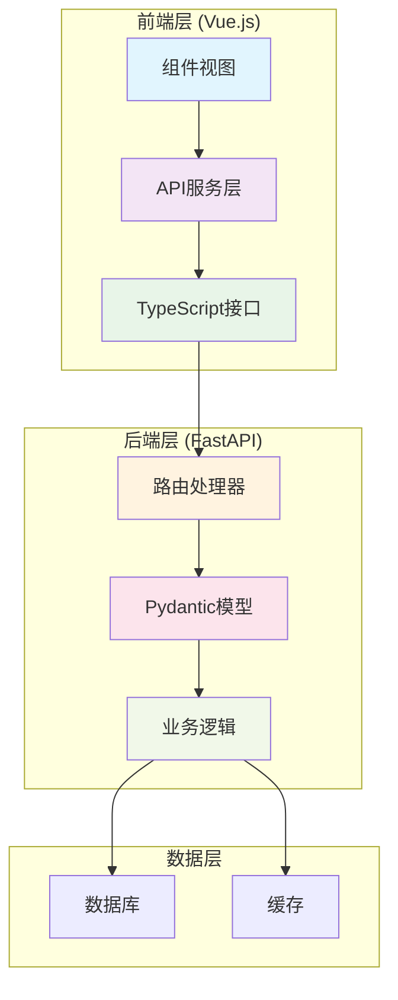
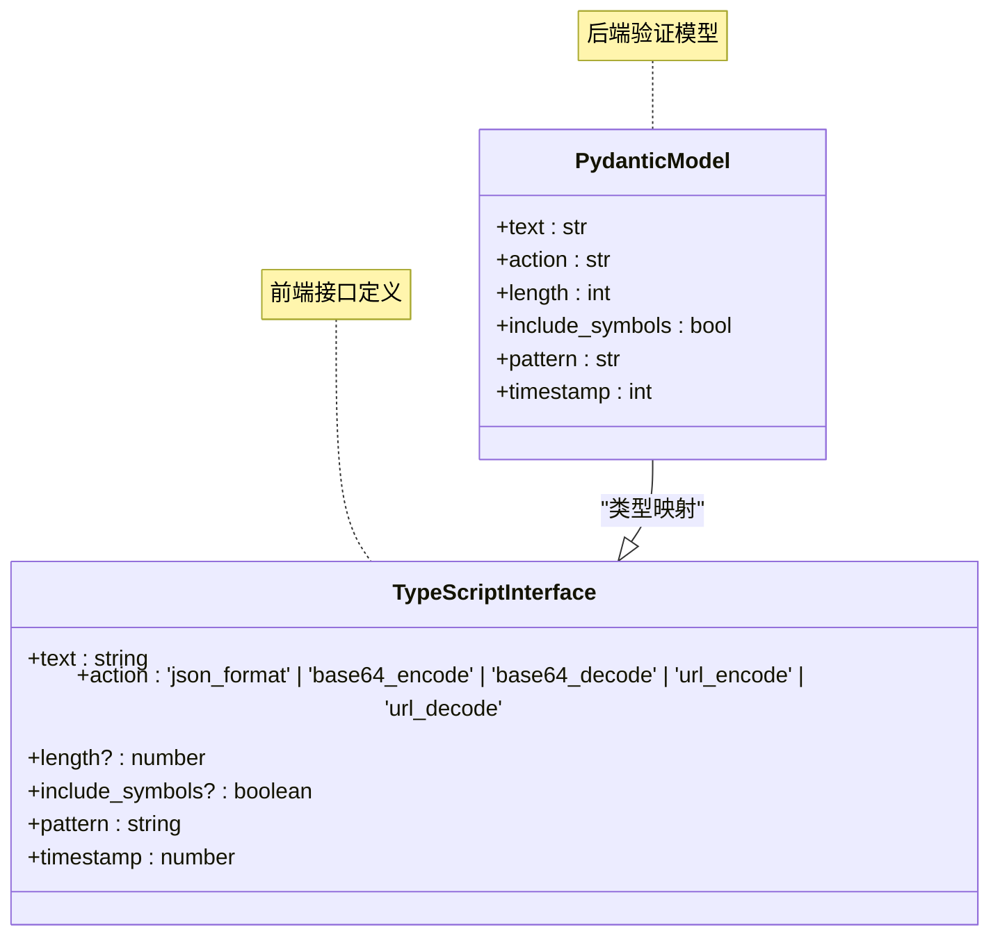
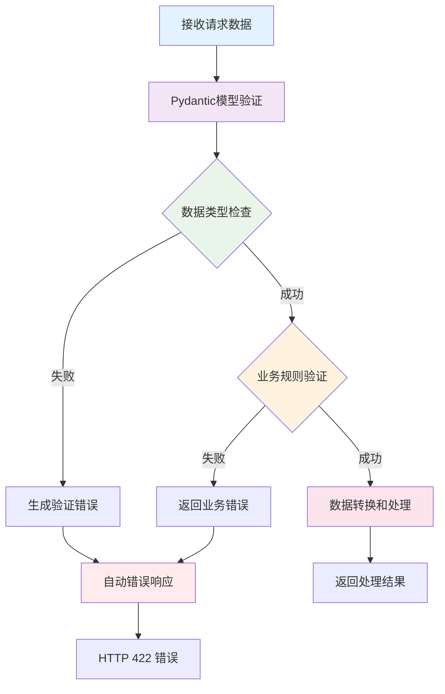
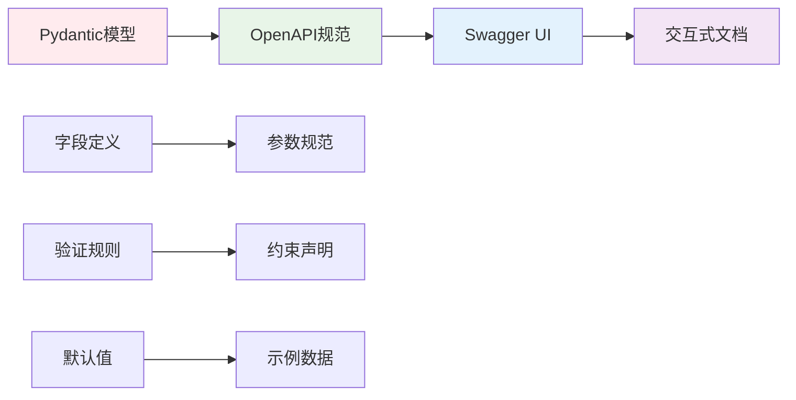

# 数据模型

<cite>
**本文档中引用的文件**
- [schemas.py](file://backend/schemas.py)
- [app.py](file://backend/app.py)
- [text.py](file://backend/routers/text.py)
- [password.py](file://backend/routers/password.py)
- [regex.py](file://backend/routers/regex.py)
- [timestamp.py](file://backend/routers/timestamp.py)
- [api.ts](file://ZYTool/src/services/api.ts)
- [requirements.txt](file://backend/requirements.txt)
</cite>

## 目录
1. [简介](#简介)
2. [项目架构概览](#项目架构概览)
3. [核心数据模型](#核心数据模型)
4. [模型与前端接口映射](#模型与前端接口映射)
5. [Pydantic验证机制](#pydantic验证机制)
6. [OpenAPI文档生成](#openapi文档生成)
7. [实际使用示例](#实际使用示例)
8. [模型扩展指南](#模型扩展指南)
9. [最佳实践](#最佳实践)
10. [总结](#总结)

## 简介

ZYTool是一个基于FastAPI和Vue.js构建的全栈工具集合应用，其中Pydantic数据模型扮演着至关重要的角色。本文档深入分析了项目中定义的数据模型，展示了如何通过Pydantic实现类型安全、自动验证和OpenAPI文档生成，确保前后端数据交互的一致性和可靠性。

## 项目架构概览

ZYTool采用分层架构设计，将数据模型、API路由和前端服务有机结合：



**图表来源**
- [app.py](file://backend/app.py#L1-L33)
- [api.ts](file://ZYTool/src/services/api.ts#L1-L178)

**章节来源**
- [app.py](file://backend/app.py#L1-L33)
- [api.ts](file://ZYTool/src/services/api.ts#L1-L178)

## 核心数据模型

项目中的数据模型全部定义在`schemas.py`文件中，每个模型都继承自Pydantic的`BaseModel`类，提供了强大的数据验证和序列化功能。

### TextProcessRequest 模型

文本处理请求模型，支持多种文本操作：

| 字段名 | 数据类型 | 默认值 | 业务含义 | 枚举值 |
|--------|----------|--------|----------|--------|
| text | str | 必填 | 待处理的原始文本内容 | - |
| action | str | 必填 | 指定要执行的文本处理操作 | "json_format", "base64_encode", "base64_decode", "url_encode", "url_decode" |

**业务场景**：
- JSON格式化：将非标准格式的JSON字符串转换为标准格式
- Base64编解码：支持Base64编码和解码操作
- URL编解码：处理URL特殊字符的编码和解码

### TextCompareRequest 模型

文本对比请求模型，用于比较两段文本的差异：

| 字段名 | 数据类型 | 默认值 | 业务含义 |
|--------|----------|--------|----------|
| text1 | str | 必填 | 第一个待比较的文本内容 |
| text2 | str | 必填 | 第二个待比较的文本内容 |

**对比算法**：
- 按行分割文本进行逐行对比
- 支持三种差异类型：修改、添加、删除
- 返回详细的差异位置和内容信息

### PasswordGenerateRequest 模型

密码生成请求模型，提供灵活的密码生成配置：

| 字段名 | 数据类型 | 默认值 | 业务含义 |
|--------|----------|--------|----------|
| length | int | 12 | 生成密码的长度 |
| include_symbols | bool | True | 是否包含特殊符号 |
| include_numbers | bool | True | 是否包含数字字符 |
| include_uppercase | bool | True | 是否包含大写字母 |
| include_lowercase | bool | True | 是否包含小写字母 |

**安全特性**：
- 使用`secrets`模块生成加密安全的随机数
- 至少选择一种字符类型才能生成密码
- 支持自定义密码长度范围

### RegexTestRequest 模型

正则表达式测试请求模型：

| 字段名 | 数据类型 | 默认值 | 业务含义 |
|--------|----------|--------|----------|
| pattern | str | 必填 | 正则表达式模式 |
| text | str | 必填 | 要匹配的目标文本 |

**测试功能**：
- 支持所有Python正则表达式语法
- 提供详细的匹配结果信息
- 包含位置和捕获组信息

### TimestampConvertRequest 模型

时间戳转换请求模型：

| 字段名 | 数据类型 | 默认值 | 业务含义 | 枚举值 |
|--------|----------|--------|----------|--------|
| timestamp | int | 必填 | 输入的时间戳值 | - |
| action | str | 必填 | 指定转换方向 | "to_datetime" 或 "to_timestamp" |

**转换能力**：
- 将Unix时间戳转换为可读日期时间格式
- 支持从日期时间格式转换回时间戳
- 处理各种时间格式的兼容性

**章节来源**
- [schemas.py](file://backend/schemas.py#L1-L32)

## 模型与前端接口映射

Pydantic模型与前端TypeScript接口保持严格的一致性，实现了真正的类型安全：



**图表来源**
- [schemas.py](file://backend/schemas.py#L4-L30)
- [api.ts](file://ZYTool/src/services/api.ts#L52-L78)

### 映射关系分析

| 后端模型 | 前端接口 | 类型一致性 | 可选字段 |
|----------|----------|------------|----------|
| TextProcessRequest | TextProcessRequest | 完全一致 | 无 |
| TextCompareRequest | TextCompareRequest | 完全一致 | 无 |
| PasswordGenerateRequest | PasswordGenerateRequest | 基本一致 | length, include_* |
| RegexTestRequest | RegexTestRequest | 完全一致 | 无 |
| TimestampConvertRequest | TimestampConvertRequest | 完全一致 | 无 |

**类型安全保证**：
- 编译时类型检查
- 运行时数据验证
- 自动错误提示生成

**章节来源**
- [schemas.py](file://backend/schemas.py#L4-L30)
- [api.ts](file://ZYTool/src/services/api.ts#L52-L78)

## Pydantic验证机制

Pydantic提供了强大的数据验证功能，确保输入数据的完整性和正确性：

### 验证流程



### 具体验证规则

#### 1. 类型验证
- 字符串字段自动进行长度限制
- 数字字段验证范围和精度
- 布尔字段确保真值判断

#### 2. 枚举验证
- `action`字段必须是预定义的枚举值
- 自动提供可用选项列表

#### 3. 业务验证
- 密码生成器要求至少选择一种字符类型
- 时间戳转换器验证操作类型

### 错误响应格式

当验证失败时，Pydantic会自动生成标准化的错误响应：

```json
{
  "detail": [
    {
      "loc": ["body", "field_name"],
      "msg": "字段验证失败的具体描述",
      "type": "错误类型"
    }
  ]
}
```

**章节来源**
- [text.py](file://backend/routers/text.py#L13-L42)
- [password.py](file://backend/routers/password.py#L11-L38)
- [regex.py](file://backend/routers/regex.py#L10-L33)
- [timestamp.py](file://backend/routers/timestamp.py#L10-L33)

## OpenAPI文档生成

FastAPI结合Pydantic模型自动生成完整的API文档，提供交互式的API测试界面：

### 文档特性

| 特性 | 描述 | 实现方式 |
|------|------|----------|
| 自动文档生成 | 基于Pydantic模型自动生成API规范 | OpenAPI 3.0标准 |
| 交互式测试 | 在浏览器中直接测试API | Swagger UI集成 |
| 类型信息显示 | 显示字段类型和约束条件 | Pydantic元数据 |
| 示例数据 | 自动生成请求和响应示例 | 模型默认值 |

### 文档结构



### 访问文档

项目启动后可通过以下地址访问API文档：
- 主文档：`http://localhost:8000/docs`
- Redoc文档：`http://localhost:8000/redoc`

**章节来源**
- [app.py](file://backend/app.py#L11-L11)

## 实际使用示例

### 合法请求示例

#### 文本处理请求
```typescript
// 请求示例
const textProcessRequest: TextProcessRequest = {
  text: '{"name":"test","value":123}',
  action: "json_format"
}

// 对应的Pydantic验证
TextProcessRequest(
  text='{"name":"test","value":123}', 
  action='json_format'
)
```

#### 密码生成请求
```typescript
// 请求示例
const passwordRequest: PasswordGenerateRequest = {
  length: 16,
  include_symbols: true,
  include_numbers: true,
  include_uppercase: true,
  include_lowercase: true
}

// Pydantic验证通过
PasswordGenerateRequest(
  length=16,
  include_symbols=True,
  include_numbers=True,
  include_uppercase=True,
  include_lowercase=True
)
```

### 非法请求示例

#### 缺少必填字段
```typescript
// 错误示例：缺少action字段
const invalidRequest: TextProcessRequest = {
  text: "test"
}

// Pydantic验证失败
ValidationError: 1 validation error for TextProcessRequest
action
  field required (type=value_error.missing)
```

#### 类型错误
```typescript
// 错误示例：action字段类型错误
const invalidRequest: TextProcessRequest = {
  text: "test",
  action: 123  // 应该是字符串
}

// Pydantic验证失败
ValidationError: 1 validation error for TextProcessRequest
action
  str type expected (type=type_error.str)
```

#### 业务规则违反
```typescript
// 错误示例：密码生成器没有选择任何字符类型
const invalidRequest: PasswordGenerateRequest = {
  length: 8,
  include_symbols: false,
  include_numbers: false,
  include_uppercase: false,
  include_lowercase: false
}

// 后端业务验证失败
HTTPException: 400, detail="至少需要选择一种字符类型"
```

### 响应示例

#### 成功响应
```json
{
  "result": "{\"name\": \"test\", \"value\": 123}",
  "success": true
}
```

#### 错误响应
```json
{
  "detail": [
    {
      "loc": ["body", "action"],
      "msg": "不支持的操作类型",
      "type": "value_error"
    }
  ]
}
```

**章节来源**
- [text.py](file://backend/routers/text.py#L13-L42)
- [password.py](file://backend/routers/password.py#L11-L38)

## 模型扩展指南

随着项目功能的发展，可能需要对现有模型进行扩展。以下是推荐的扩展方式：

### 添加新字段

#### 扩展现有模型
```python
# 方式一：继承扩展
class ExtendedPasswordGenerateRequest(PasswordGenerateRequest):
    complexity_level: int = Field(default=1, ge=1, le=5)
    include_custom_chars: str = ""

# 方式二：直接修改原模型（不推荐）
class PasswordGenerateRequest(BaseModel):
    length: int = 12
    include_symbols: bool = True
    include_numbers: bool = True
    include_uppercase: bool = True
    include_lowercase: bool = True
    # 新增字段
    complexity_level: int = Field(default=1, ge=1, le=5)
```

#### 更新前端接口
```typescript
// 扩展后的TypeScript接口
export interface PasswordGenerateRequest {
    length?: number
    include_symbols?: boolean
    include_numbers?: boolean
    include_uppercase?: boolean
    include_lowercase?: boolean
    complexity_level?: number  // 新增字段
    include_custom_chars?: string
}
```

### 创建嵌套结构

```python
# 嵌套模型示例
class AdvancedTextProcessRequest(BaseModel):
    text: str
    options: dict = {}
    metadata: dict = {}

class NestedPasswordConfig(BaseModel):
    length: int = Field(default=12, ge=8, le=64)
    character_sets: dict = {
        "symbols": True,
        "numbers": True,
        "uppercase": True,
        "lowercase": True
    }

class PasswordGenerationRequest(BaseModel):
    config: NestedPasswordConfig
    output_format: str = "simple"
```

### 添加自定义验证

```python
from pydantic import validator

class CustomPasswordRequest(BaseModel):
    length: int = 12
    include_symbols: bool = True
    custom_pattern: str = ""
    
    @validator('custom_pattern')
    def validate_custom_pattern(cls, v):
        if v and not re.match(r'^[a-zA-Z0-9]+$', v):
            raise ValueError('自定义模式只能包含字母和数字')
        return v
```

### 版本控制策略

```python
# 版本化的模型设计
class PasswordGenerateRequestV1(BaseModel):
    length: int = 12
    include_symbols: bool = True

class PasswordGenerateRequestV2(BaseModel):
    length: int = 12
    include_symbols: bool = True
    include_numbers: bool = True
    include_uppercase: bool = True
    include_lowercase: bool = True
    # 新增字段
    complexity_level: int = Field(default=1, ge=1, le=5)
```

**章节来源**
- [schemas.py](file://backend/schemas.py#L1-L32)

## 最佳实践

### 1. 字段命名规范
- 使用snake_case命名法
- 保持字段名称简洁明了
- 避免使用保留字作为字段名

### 2. 类型注解完整性
```python
# 推荐：完整的类型注解
class ExampleRequest(BaseModel):
    name: str = Field(..., min_length=1, max_length=100)
    age: int = Field(default=18, ge=0, le=120)
    tags: List[str] = []

# 不推荐：简化的类型注解
class BadExample(BaseModel):
    name: str
    age: int
```

### 3. 默认值设置
```python
# 推荐：合理的默认值
class ConfigurableRequest(BaseModel):
    timeout: int = Field(default=30, ge=1, le=300)
    retries: int = Field(default=3, ge=0, le=10)
    debug: bool = False

# 不推荐：过于严格的默认值
class StrictDefaults(BaseModel):
    timeout: int = 1  # 太短的超时时间
    retries: int = 0  # 不允许重试
```

### 4. 错误消息定制
```python
from pydantic import Field, validator

class ValidatedRequest(BaseModel):
    email: str = Field(..., description="用户邮箱地址")
    
    @validator('email')
    def validate_email(cls, v):
        if '@' not in v:
            raise ValueError('请输入有效的邮箱地址')
        return v
```

### 5. 性能优化
- 避免在模型中进行复杂的计算
- 使用`@validator`进行必要的验证
- 合理使用`Field`的配置选项

### 6. 文档和注释
```python
class WellDocumentedRequest(BaseModel):
    """
    密码生成请求模型
    
    该模型用于生成符合安全要求的密码
    """
    
    length: int = Field(
        default=12, 
        ge=8,  # 最小长度8位
        le=64,  # 最大长度64位
        description="密码长度"
    )
    
    include_symbols: bool = Field(
        default=True,
        description="是否包含特殊符号"
    )
```

## 总结

ZYTool项目中的Pydantic数据模型设计体现了现代Web应用的最佳实践：

### 核心优势

1. **类型安全**：通过Pydantic和TypeScript的双重验证，确保前后端数据类型的完全一致性
2. **自动验证**：内置的验证机制减少了手动编写验证逻辑的工作量
3. **文档自动生成**：OpenAPI文档的自动生成大大提高了API的可维护性
4. **错误处理**：统一的错误响应格式提供了良好的用户体验
5. **扩展性**：清晰的模型结构便于功能扩展和版本演进

### 技术价值

- **开发效率**：减少了重复的输入验证工作
- **代码质量**：统一的验证逻辑提高了代码的可靠性和可维护性
- **用户体验**：即时的错误反馈帮助用户快速修正输入
- **团队协作**：明确的接口定义促进了前后端开发的高效协作

### 未来发展方向

随着项目功能的不断丰富，可以考虑：
- 引入更复杂的嵌套模型结构
- 实现模型间的继承和组合
- 添加更多的自定义验证规则
- 优化大型模型的性能表现

通过合理运用Pydantic数据模型，ZYTool项目建立了一个坚实的数据层基础，为整个应用的稳定运行提供了重要保障。