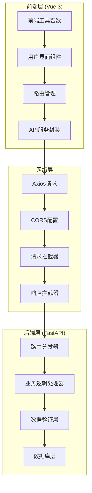
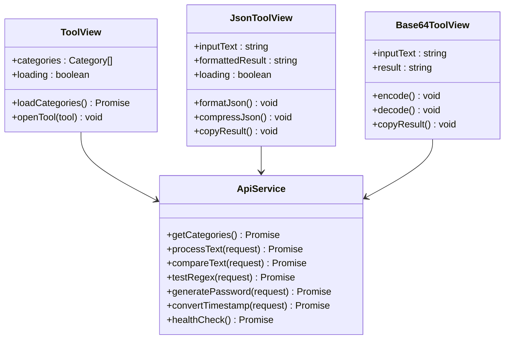
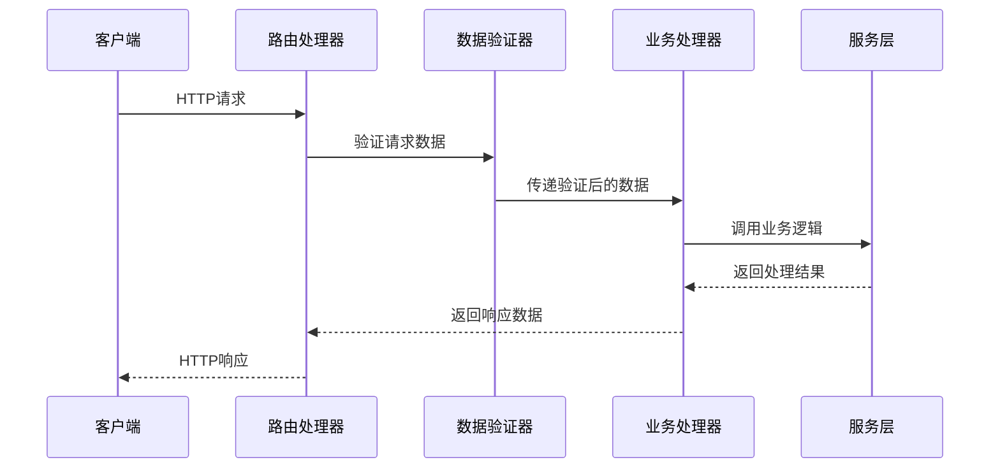
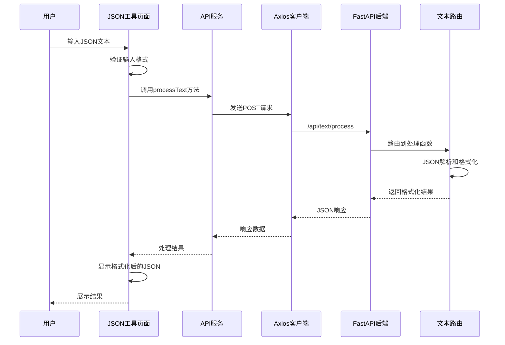
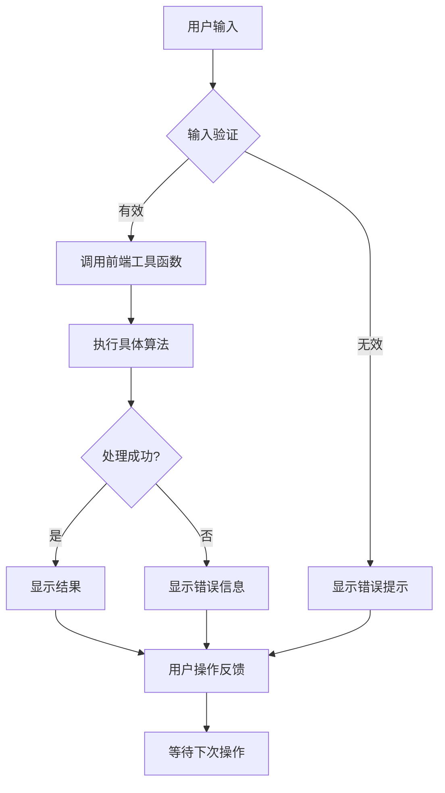
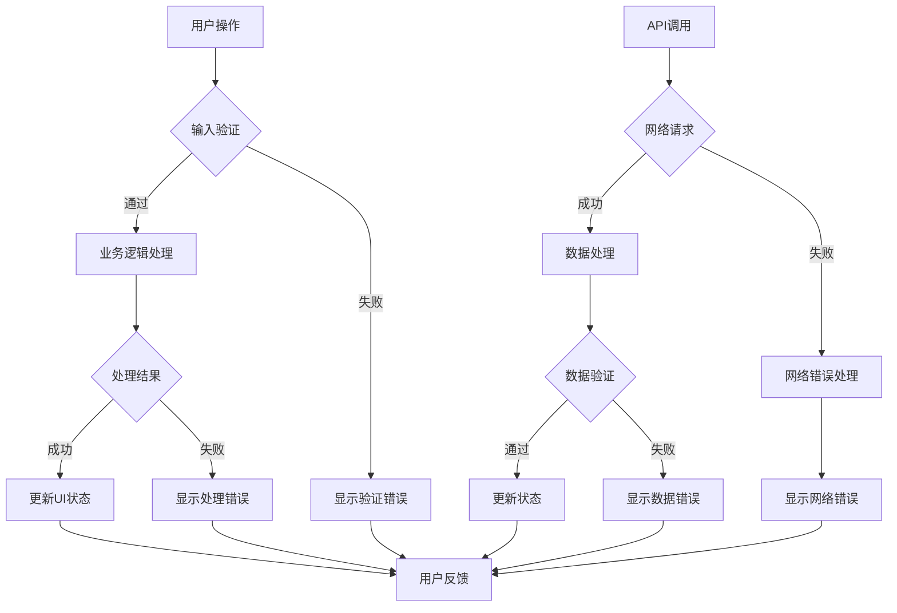

# 层间数据流

<cite>
**本文档中引用的文件**
- [ZYTool/src/main.ts](file://ZYTool/src/main.ts)
- [ZYTool/src/App.vue](file://ZYTool/src/App.vue)
- [ZYTool/src/services/api.ts](file://ZYTool/src/services/api.ts)
- [ZYTool/src/views/JsonToolView.vue](file://ZYTool/src/views/JsonToolView.vue)
- [ZYTool/src/views/Base64ToolView.vue](file://ZYTool/src/views/Base64ToolView.vue)
- [ZYTool/src/views/ToolView.vue](file://ZYTool/src/views/ToolView.vue)
- [ZYTool/src/router/index.ts](file://ZYTool/src/router/index.ts)
- [ZYTool/src/services/frontendTools.ts](file://ZYTool/src/services/frontendTools.ts)
- [backend/app.py](file://backend/app.py)
- [backend/routers/text.py](file://backend/routers/text.py)
- [backend/routers/misc.py](file://backend/routers/misc.py)
- [backend/schemas.py](file://backend/schemas.py)
</cite>

## 目录
1. [项目概述](#项目概述)
2. [系统架构概览](#系统架构概览)
3. [前端层数据流分析](#前端层数据流分析)
4. [后端层数据流分析](#后端层数据流分析)
5. [完整数据流生命周期](#完整数据流生命周期)
6. [关键交互场景分析](#关键交互场景分析)
7. [异常处理机制](#异常处理机制)
8. [性能优化策略](#性能优化策略)
9. [总结](#总结)

## 项目概述

ZYTool是一个前后端分离的在线工具集合平台，提供多种实用工具，包括JSON格式化、Base64编码解码、URL编码解码、正则表达式测试、密码生成器等功能。该项目采用现代化的技术栈，前端使用Vue 3 + TypeScript + Ant Design Vue，后端使用FastAPI框架。

## 系统架构概览

系统采用典型的三层架构设计，包含前端用户界面层、API服务层和后端业务逻辑层。

**图表来源**
- [ZYTool/src/main.ts](file://ZYTool/src/main.ts#L1-L12)
- [ZYTool/src/services/api.ts](file://ZYTool/src/services/api.ts#L1-L178)
- [backend/app.py](file://backend/app.py#L1-L33)

## 前端层数据流分析

### 用户界面组件层

前端采用Vue 3 Composition API模式，每个工具页面都是独立的组件，负责用户交互和状态管理。

**图表来源**
- [ZYTool/src/views/ToolView.vue](file://ZYTool/src/views/ToolView.vue#L42-L141)
- [ZYTool/src/views/JsonToolView.vue](file://ZYTool/src/views/JsonToolView.vue#L90-L200)
- [ZYTool/src/views/Base64ToolView.vue](file://ZYTool/src/views/Base64ToolView.vue#L63-L141)

### 路由导航系统

前端使用Vue Router进行页面导航，支持动态路由和参数传递。

**章节来源**
- [ZYTool/src/router/index.ts](file://ZYTool/src/router/index.ts#L1-L59)

### API服务封装层

API服务层使用Axios进行HTTP请求封装，提供统一的接口调用方式。

**章节来源**
- [ZYTool/src/services/api.ts](file://ZYTool/src/services/api.ts#L1-L178)

## 后端层数据流分析

### FastAPI应用架构

后端采用FastAPI框架，提供RESTful API服务，支持异步处理和自动文档生成功能。

**图表来源**
- [backend/app.py](file://backend/app.py#L1-L33)
- [backend/routers/text.py](file://backend/routers/text.py#L1-L76)

### 数据验证层

后端使用Pydantic模型进行数据验证，确保请求数据的完整性和正确性。

**章节来源**
- [backend/schemas.py](file://backend/schemas.py#L1-L32)

### 路由分发机制

系统采用模块化的路由设计，不同功能模块对应不同的路由文件。

**章节来源**
- [backend/routers/text.py](file://backend/routers/text.py#L1-L76)
- [backend/routers/misc.py](file://backend/routers/misc.py#L1-L54)

## 完整数据流生命周期

### JSON格式化工具的完整数据流

以下展示了JSON格式化工具从用户输入到结果输出的完整数据流生命周期。

**图表来源**
- [ZYTool/src/views/JsonToolView.vue](file://ZYTool/src/views/JsonToolView.vue#L101-L122)
- [ZYTool/src/services/api.ts](file://ZYTool/src/services/api.ts#L106-L110)
- [backend/routers/text.py](file://backend/routers/text.py#L13-L42)

### 前端工具处理流程

对于不需要后端处理的工具，数据在前端本地完成处理。

**图表来源**
- [ZYTool/src/services/frontendTools.ts](file://ZYTool/src/services/frontendTools.ts#L6-L185)
- [ZYTool/src/views/Base64ToolView.vue](file://ZYTool/src/views/Base64ToolView.vue#L71-L103)

## 关键交互场景分析

### 场景一：JSON格式化处理

JSON格式化是典型的前端处理场景，数据完全在浏览器中处理，无需上传到服务器。

**处理流程特点：**
- 实时验证和格式化
- 本地存储处理结果
- 支持压缩和格式化两种模式
- 提供复制和清空功能

**章节来源**
- [ZYTool/src/views/JsonToolView.vue](file://ZYTool/src/views/JsonToolView.vue#L101-L146)

### 场景二：Base64编码处理

Base64编码解码同样在前端完成，支持Unicode字符处理。

**技术实现要点：**
- 使用TextEncoder和TextDecoder处理Unicode
- 支持二进制数据的安全传输
- 提供编码和解码双向功能

**章节来源**
- [ZYTool/src/views/Base64ToolView.vue](file://ZYTool/src/views/Base64ToolView.vue#L71-L103)
- [ZYTool/src/services/frontendTools.ts](file://ZYTool/src/services/frontendTools.ts#L34-L80)

### 场景三：后端API调用

对于复杂的文本处理任务，需要通过API调用后端服务。

**API调用特点：**
- 统一的错误处理机制
- 请求和响应拦截器
- 超时控制和重试机制
- 类型安全的接口定义

**章节来源**
- [ZYTool/src/services/api.ts](file://ZYTool/src/services/api.ts#L13-L34)
- [ZYTool/src/services/api.ts](file://ZYTool/src/services/api.ts#L106-L175)

## 异常处理机制

### 前端异常处理

前端采用多层次的异常处理策略：

**章节来源**
- [ZYTool/src/views/JsonToolView.vue](file://ZYTool/src/views/JsonToolView.vue#L101-L146)
- [ZYTool/src/views/Base64ToolView.vue](file://ZYTool/src/views/Base64ToolView.vue#L71-L103)

### 后端异常处理

后端采用结构化的异常处理机制：

**章节来源**
- [backend/routers/text.py](file://backend/routers/text.py#L41-L42)

## 性能优化策略

### 前端性能优化

1. **组件懒加载**：按需加载工具页面组件
2. **请求缓存**：对静态数据进行缓存
3. **防抖和节流**：减少不必要的API调用
4. **虚拟滚动**：处理大量数据时的性能优化

### 网络层优化

1. **请求拦截器**：统一的日志记录和错误处理
2. **超时控制**：设置合理的请求超时时间
3. **CORS配置**：支持跨域请求的安全配置

### 后端性能优化

1. **异步处理**：使用FastAPI的异步特性
2. **数据验证**：提前验证请求数据
3. **连接池**：优化数据库连接管理

## 总结

ZYTool项目展现了现代Web应用的典型架构模式，通过清晰的分层设计实现了高效的层间数据流：

1. **前端层**：负责用户交互和本地数据处理，提供流畅的用户体验
2. **API层**：提供统一的服务接口，封装网络通信细节
3. **后端层**：处理复杂的业务逻辑，保证数据安全和一致性

系统采用了多种优化策略：
- 前端工具优先处理，减少服务器负载
- 统一的错误处理机制，提升用户体验
- 结构化的数据流设计，便于维护和扩展
- 完善的异常处理，保证系统稳定性

这种架构设计不仅满足了当前的功能需求，也为未来的功能扩展提供了良好的基础。