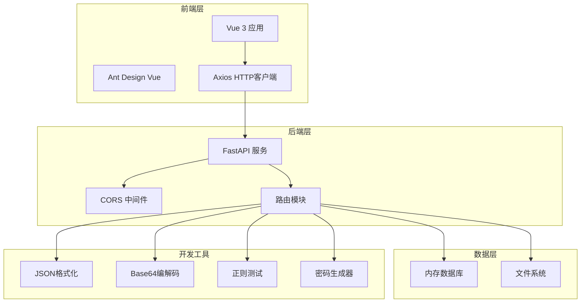
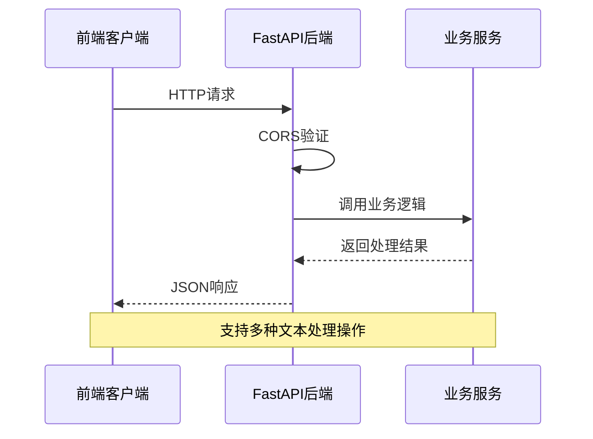

# 快速入门指南

<cite>
**本文档引用的文件**
- [README.md](file://README.md)
- [backend/requirements.txt](file://backend/requirements.txt)
- [ZYTool/package.json](file://ZYTool/package.json)
- [backend/app.py](file://backend/app.py)
- [ZYTool/vite.config.ts](file://ZYTool/vite.config.ts)
- [backend/routers/misc.py](file://backend/routers/misc.py)
- [ZYTool/src/services/api.ts](file://ZYTool/src/services/api.ts)
- [ZYTool/src/main.ts](file://ZYTool/src/main.ts)
- [ZYTool/src/App.vue](file://ZYTool/src/App.vue)
</cite>

## 目录
1. [项目简介](#项目简介)
2. [系统要求](#系统要求)
3. [环境准备](#环境准备)
4. [后端服务搭建](#后端服务搭建)
5. [前端开发环境](#前端开发环境)
6. [项目启动流程](#项目启动流程)
7. [验证安装成功](#验证安装成功)
8. [常见问题排查](#常见问题排查)
9. [项目架构概览](#项目架构概览)
10. [下一步学习](#下一步学习)

## 项目简介

ZYTool 是一个功能丰富的在线工具集合平台，采用现代化的前后端分离架构。项目包含：
- **FastAPI 后端服务**：提供 RESTful API 接口
- **Vue 3 + TypeScript 前端**：响应式用户界面
- **Ant Design Vue 组件库**：美观的UI组件
- **多种实用工具**：文本处理、图片工具、开发辅助工具等

### 主要功能模块
- ✅ 文本处理工具（JSON格式化、Base64编解码、URL编解码）
- ✅ 图片处理工具（压缩、格式转换、二维码生成）
- ✅ 开发辅助工具（正则测试、颜色选择器、时间戳转换、密码生成）

## 系统要求

### 后端环境要求
- **Python 版本**：3.8 或更高版本
- **包管理器**：pip（随Python自带）
- **操作系统**：Windows、macOS、Linux

### 前端环境要求
- **Node.js 版本**：16.0 或更高版本
- **包管理器**：npm（随Node.js自带）
- **构建工具**：Vite 7.x
- **框架**：Vue 3.5+

## 环境准备

### 安装 Python 环境

#### Windows 系统
1. 访问 [Python官网](https://www.python.org/downloads/) 下载最新稳定版
2. 运行安装程序，确保勾选 "Add Python to PATH"
3. 打开命令提示符验证安装：
```bash
python --version
pip --version
```

#### macOS 系统
1. 使用 Homebrew 安装：
```bash
brew install python
```
2. 验证安装：
```bash
python3 --version
pip3 --version
```

#### Linux 系统
1. Ubuntu/Debian：
```bash
sudo apt update
sudo apt install python3 python3-pip
```
2. CentOS/RHEL：
```bash
sudo yum install python3 python3-pip
```
3. 验证安装：
```bash
python3 --version
pip3 --version
```

### 安装 Node.js 环境

#### Windows/macOS 系统
1. 访问 [Node.js官网](https://nodejs.org/) 下载 LTS 版本
2. 运行安装程序
3. 验证安装：
```bash
node --version
npm --version
```

#### Linux 系统
1. 使用 nvm（推荐）：
```bash
curl -o- https://raw.githubusercontent.com/nvm-sh/nvm/v0.39.0/install.sh | bash
source ~/.bashrc
nvm install --lts
```
2. 验证安装：
```bash
node --version
npm --version
```

## 后端服务搭建

### 进入后端目录
```bash
cd backend
```

### 安装 Python 依赖
项目使用 pip 管理 Python 依赖，主要包含以下核心包：
- **FastAPI**：高性能Web框架
- **Uvicorn**：ASGI服务器
- **python-multipart**：表单数据处理

执行安装命令：
```bash
pip install -r requirements.txt
```

### 启动后端服务
```bash
python app.py
```

### 验证后端服务
打开浏览器访问：[http://localhost:8000](http://localhost:8000)

应该能看到 FastAPI 自动生成的 API 文档页面。

## 前端开发环境

### 进入前端目录
```bash
cd ZYTool
```

### 安装前端依赖
```bash
npm install
```

此命令会安装以下核心依赖：
- **Vue 3.5**：渐进式JavaScript框架
- **Ant Design Vue 4.2**：企业级UI组件库
- **Axios 1.12**：HTTP客户端
- **TypeScript 5.9**：JavaScript超集语言
- **Vite 7.1**：现代化前端构建工具

### 启动开发服务器
```bash
npm run dev
```

开发服务器将在 [http://localhost:5173](http://localhost:5173) 启动。

## 项目启动流程

### 完整启动步骤

#### 方法一：手动分别启动（推荐用于开发）
1. **终端1**：启动后端服务
```bash
cd backend
python app.py
```

2. **终端2**：启动前端开发服务器
```bash
cd ZYTool
npm run dev
```

#### 方法二：使用脚本启动（适用于简单场景）
1. 确保两个终端窗口都处于项目根目录
2. 分别运行上述两个命令

### 启动顺序说明
- **先启动后端**：因为前端需要连接到后端API
- **后启动前端**：前端监听本地端口，等待后端就绪

## 验证安装成功

### 1. 后端服务验证
打开浏览器访问以下地址：

| URL | 预期结果 |
|-----|----------|
| [http://localhost:8000](http://localhost:8000) | FastAPI文档页面 |
| [http://localhost:8000/api/health](http://localhost:8000/api/health) | `{"status": "healthy", "message": "ZYTool API is running"}` |

### 2. 前端应用验证
访问 [http://localhost:5173](http://localhost:5173)，应该看到：
- 页面标题显示 "ZYTool"
- 导航栏正常显示
- 工具分类列表加载成功

### 3. API 交互验证
通过浏览器或Postman测试以下接口：

| 接口路径 | 请求方法 | 预期响应 |
|----------|----------|----------|
| `/api/categories` | GET | 工具分类列表 |
| `/api/text/process` | POST | 文本处理结果 |

### 4. 跨域配置验证
前端应该能够正常访问后端API，不会出现跨域错误。

## 常见问题排查

### 后端问题

#### 1. 端口被占用
**问题现象**：启动后端时出现 `Port 8000 is already in use` 错误

**解决方案**：
```bash
# 查找占用端口的进程
lsof -i :8000  # macOS/Linux
netstat -ano | findstr :8000  # Windows

# 杀死占用进程
kill -9 <PID>  # macOS/Linux
taskkill /PID <PID> /F  # Windows
```

#### 2. 依赖安装失败
**问题现象**：pip install 失败或报错

**解决方案**：
```bash
# 清理pip缓存
pip cache purge

# 使用国内镜像源
pip install -r requirements.txt -i https://pypi.tuna.tsinghua.edu.cn/simple/

# 升级pip
pip install --upgrade pip
```

### 前端问题

#### 1. 端口冲突
**问题现象**：npm run dev 提示端口已被使用

**解决方案**：
编辑 `ZYTool/vite.config.ts` 文件，修改端口号：
```typescript
export default defineConfig({
  plugins: [vue()],
  server: {
    port: 5174,  // 修改为其他可用端口
  },
})
```

#### 2. 依赖安装失败
**问题现象**：npm install 失败

**解决方案**：
```bash
# 清理npm缓存
npm cache clean --force

# 删除node_modules重新安装
rm -rf node_modules package-lock.json
npm install

# 使用淘宝镜像
npm install --registry=https://registry.npmmirror.com
```

### 通用问题

#### 1. CORS 跨域问题
**问题现象**：前端无法访问后端API，出现跨域错误

**解决方案**：
检查后端 CORS 配置，确保允许前端地址：
```python
app.add_middleware(
    CORSMiddleware,
    allow_origins=["http://localhost:5173", "http://localhost:3000"],
    allow_credentials=True,
    allow_methods=["*"],
    allow_headers=["*"],
)
```

#### 2. 网络连接问题
**问题现象**：前后端通信失败

**解决方案**：
1. 检查防火墙设置
2. 确认网络连接正常
3. 验证代理设置（如有）

## 项目架构概览

### 整体架构图



**架构图来源**
- [backend/app.py](file://backend/app.py#L1-L33)
- [ZYTool/src/services/api.ts](file://ZYTool/src/services/api.ts#L1-L178)

### 技术栈详解

| 层级 | 技术 | 版本 | 用途 |
|------|------|------|------|
| 前端框架 | Vue 3 | 3.5+ | 用户界面渲染 |
| 状态管理 | Vue Router | 4.6+ | 路由导航 |
| UI组件库 | Ant Design Vue | 4.2+ | 企业级UI组件 |
| HTTP客户端 | Axios | 1.12+ | API请求处理 |
| 类型系统 | TypeScript | 5.9+ | 类型安全保障 |
| 构建工具 | Vite | 7.1+ | 前端构建优化 |
| 后端框架 | FastAPI | 0.104+ | API服务开发 |
| Web服务器 | Uvicorn | 0.24+ | ASGI服务器 |

### API 接口规范



**序列图来源**
- [ZYTool/src/services/api.ts](file://ZYTool/src/services/api.ts#L100-L177)
- [backend/routers/text.py](file://backend/routers/text.py#L13-L39)

## 下一步学习

### 1. 深入了解项目结构
- 学习 Vue 3 Composition API 的使用
- 理解 FastAPI 路由和中间件机制
- 掌握 TypeScript 类型定义

### 2. 功能扩展
- 添加新的工具模块
- 扩展 API 接口功能
- 优化用户界面体验

### 3. 部署上线
- 学习生产环境部署配置
- 设置反向代理服务器
- 配置域名和SSL证书

### 4. 测试与维护
- 编写单元测试和集成测试
- 设置持续集成流程
- 监控应用性能和错误

通过本指南，您已经成功搭建了 ZYTool 项目的开发环境。现在可以开始探索项目功能，或者根据自己的需求进行功能扩展和定制开发。

**节来源**
- [README.md](file://README.md#L1-L117)
- [backend/app.py](file://backend/app.py#L1-L33)
- [ZYTool/src/services/api.ts](file://ZYTool/src/services/api.ts#L1-L178)