# 技术栈

<cite>
**本文档中引用的文件**
- [package.json](file://ZYTool/package.json)
- [vite.config.ts](file://ZYTool/vite.config.ts)
- [tsconfig.json](file://ZYTool/tsconfig.json)
- [tsconfig.app.json](file://ZYTool/tsconfig.app.json)
- [main.ts](file://ZYTool/src/main.ts)
- [App.vue](file://ZYTool/src/App.vue)
- [api.ts](file://ZYTool/src/services/api.ts)
- [frontendTools.ts](file://ZYTool/src/services/frontendTools.ts)
- [router/index.ts](file://ZYTool/src/router/index.ts)
- [requirements.txt](file://backend/requirements.txt)
- [app.py](file://backend/app.py)
- [schemas.py](file://backend/schemas.py)
- [text.py](file://backend/routers/text.py)
</cite>

## 目录
1. [项目概述](#项目概述)
2. [前端技术栈](#前端技术栈)
3. [后端技术栈](#后端技术栈)
4. [架构设计](#架构设计)
5. [技术选型优势](#技术选型优势)
6. [版本兼容性](#版本兼容性)
7. [总结](#总结)

## 项目概述

100_Code项目是一个现代化的在线工具集合平台，采用前后端分离架构，提供了丰富的文本处理、编码解码、时间戳转换等实用工具。项目通过精心选择的技术栈，实现了高性能、可维护性和良好的用户体验。

## 前端技术栈

### Vue 3 框架

Vue 3是项目的核心前端框架，提供了响应式的数据绑定和组件化的开发模式。

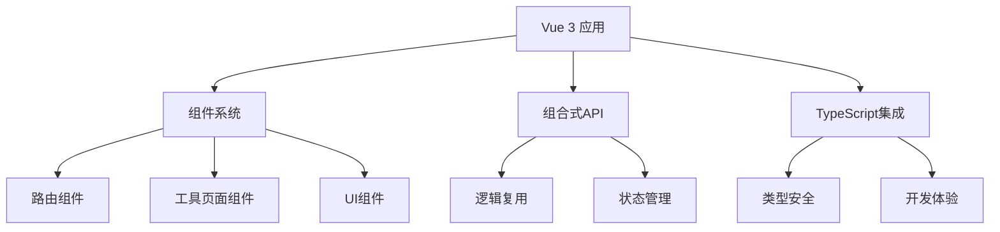

**图表来源**
- [main.ts](file://ZYTool/src/main.ts#L1-L12)
- [App.vue](file://ZYTool/src/App.vue#L1-L124)

**核心特性：**
- 使用Vue 3 `<script setup>`语法糖，简化组件开发
- 组合式API提供更好的逻辑复用和代码组织
- 响应式系统确保数据变化时界面自动更新

**节来源**
- [package.json](file://ZYTool/package.json#L15-L15)
- [main.ts](file://ZYTool/src/main.ts#L1-L12)

### Vite 构建工具

Vite作为现代前端构建工具，提供了快速的开发服务器和高效的生产构建。

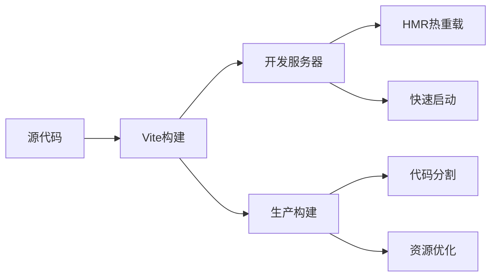

**图表来源**
- [vite.config.ts](file://ZYTool/vite.config.ts#L1-L8)

**配置特点：**
- 基于ES模块的快速冷启动
- 内置HMR（热模块替换），提升开发体验
- 生产环境下的代码分割和资源优化

**节来源**
- [package.json](file://ZYTool/package.json#L23-L23)
- [vite.config.ts](file://ZYTool/vite.config.ts#L1-L8)

### TypeScript 类型系统

TypeScript为项目提供了强大的类型安全保障和优秀的开发体验。

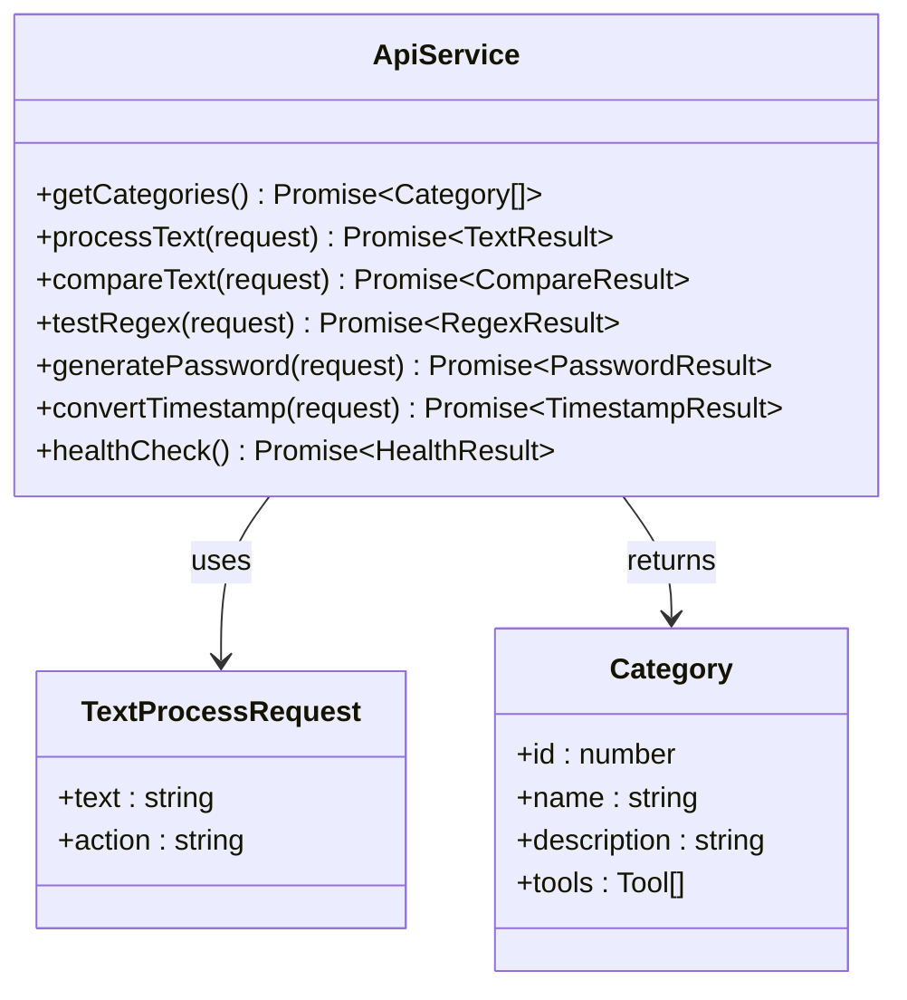

**图表来源**
- [api.ts](file://ZYTool/src/services/api.ts#L36-L177)
- [frontendTools.ts](file://ZYTool/src/services/frontendTools.ts#L1-L185)

**类型系统优势：**
- 编译时类型检查，减少运行时错误
- 完整的IDE支持，提供智能提示和重构能力
- 接口定义确保API调用的一致性

**节来源**
- [package.json](file://ZYTool/package.json#L22-L22)
- [tsconfig.app.json](file://ZYTool/tsconfig.app.json#L1-L17)

### Ant Design Vue UI组件库

Ant Design Vue提供了丰富的企业级UI组件，确保界面的一致性和专业性。

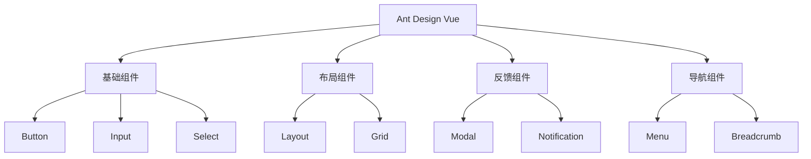

**图表来源**
- [main.ts](file://ZYTool/src/main.ts#L5-L6)
- [App.vue](file://ZYTool/src/App.vue#L8-L21)

**集成方式：**
- 全局注册Ant Design Vue组件库
- 使用reset.css重置默认样式
- 提供统一的主题定制方案

**节来源**
- [package.json](file://ZYTool/package.json#L12-L13)
- [main.ts](file://ZYTool/src/main.ts#L5-L6)

### Axios HTTP客户端

Axios提供了强大的HTTP通信能力，支持请求和响应拦截器。

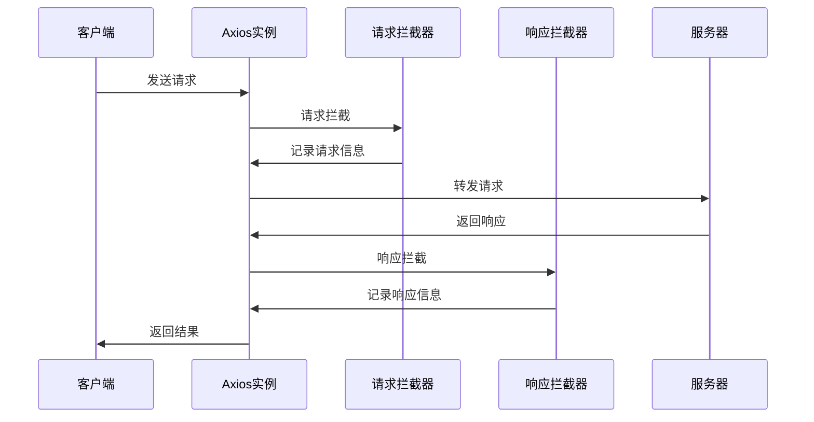

**图表来源**
- [api.ts](file://ZYTool/src/services/api.ts#L13-L33)

**功能特性：**
- 支持Promise API
- 自动转换JSON数据
- 请求和响应拦截器
- 取消请求功能
- 超时控制

**节来源**
- [package.json](file://ZYTool/package.json#L14-L14)
- [api.ts](file://ZYTool/src/services/api.ts#L1-L178)

## 后端技术栈

### FastAPI 框架

FastAPI是现代Python Web框架，提供了高性能和自动化的API文档生成功能。

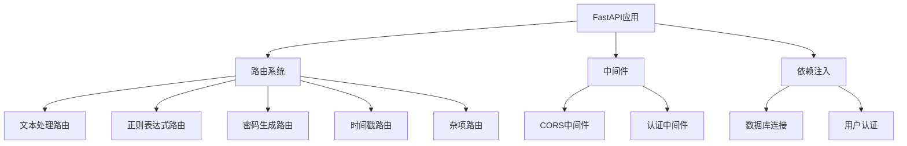

**图表来源**
- [app.py](file://backend/app.py#L1-L33)
- [text.py](file://backend/routers/text.py#L1-L76)

**核心优势：**
- 基于Python 3.7+类型提示的自动数据验证
- 自动生成交互式API文档（Swagger UI）
- 异步支持，提供高性能
- 开发速度快，部署简单

**节来源**
- [requirements.txt](file://backend/requirements.txt#L1-L1)
- [app.py](file://backend/app.py#L1-L33)

### Uvicorn ASGI服务器

Uvicorn作为ASGI服务器，提供了高性能的异步Web服务器支持。

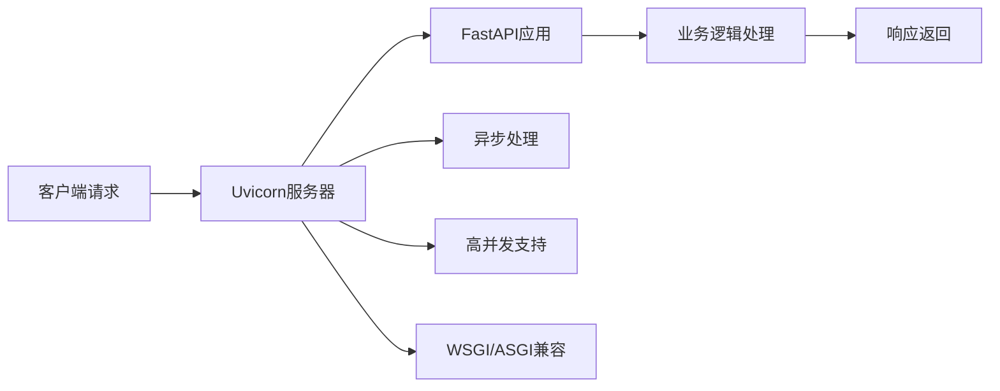

**图表来源**
- [app.py](file://backend/app.py#L30-L33)

**配置特点：**
- 默认监听所有网络接口（0.0.0.0）
- 标准端口8000
- 支持异步请求处理
- 内置健康检查支持

**节来源**
- [requirements.txt](file://backend/requirements.txt#L2-L2)
- [app.py](file://backend/app.py#L30-L33)

### Pydantic 数据验证

Pydantic提供了强大的数据验证和序列化功能，确保API数据的完整性和一致性。

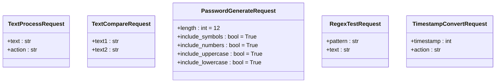

**图表来源**
- [schemas.py](file://backend/schemas.py#L1-L32)

**验证机制：**
- 基于Python类型注解的自动验证
- 自动生成错误信息
- 支持嵌套对象验证
- 自动类型转换

**节来源**
- [schemas.py](file://backend/schemas.py#L1-L32)

## 架构设计

### 前后端分离架构

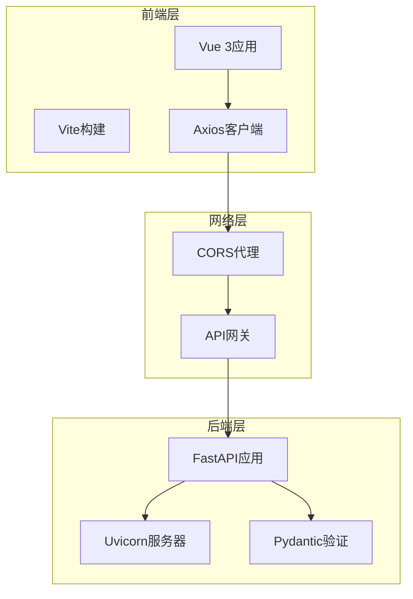

**图表来源**
- [app.py](file://backend/app.py#L14-L20)
- [api.ts](file://ZYTool/src/services/api.ts#L4-L9)

### 数据流设计

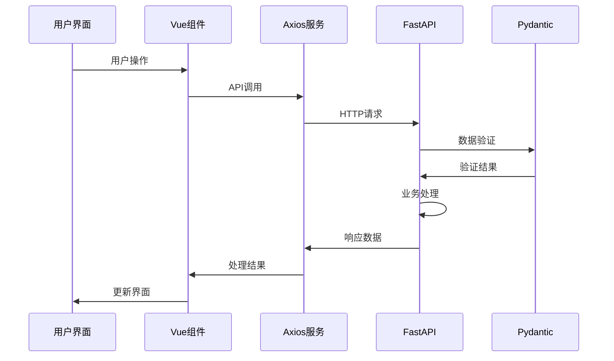

**图表来源**
- [api.ts](file://ZYTool/src/services/api.ts#L100-L177)
- [text.py](file://backend/routers/text.py#L13-L42)

## 技术选型优势

### 前端技术优势

| 技术 | 优势 | 性能影响 |
|------|------|----------|
| Vue 3 | 响应式系统、组合式API、更好的性能 | 渐进式加载，按需编译 |
| Vite | 快速开发、热重载、生产优化 | 减少构建时间，提升开发效率 |
| TypeScript | 类型安全、智能提示、代码质量 | 编译时错误检查，提高稳定性 |
| Ant Design Vue | 企业级设计、组件丰富、主题定制 | 统一的UI体验，减少开发成本 |

### 后端技术优势

| 技术 | 优势 | 性能影响 |
|------|------|----------|
| FastAPI | 高性能、自动文档、类型安全 | 异步处理，低延迟响应 |
| Uvicorn | ASGI标准、异步支持、高并发 | 支持大量并发连接 |
| Pydantic | 数据验证、序列化、类型推断 | 自动验证，减少错误处理 |

### 整体架构优势

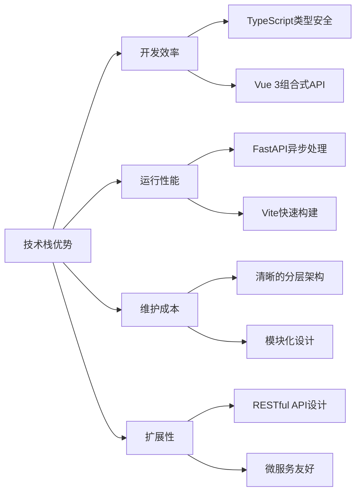

## 版本兼容性

### 前端版本信息

| 依赖项 | 版本 | 兼容性要求 |
|--------|------|------------|
| Vue 3 | ^3.5.22 | ES2020+环境 |
| Vite | ^7.1.7 | Node.js 18+ |
| TypeScript | ~5.9.3 | VS Code 1.67+ |
| Ant Design Vue | ^4.2.6 | Vue 3.2+ |
| Axios | ^1.12.2 | 浏览器/Node.js |

### 后端版本信息

| 依赖项 | 版本 | 兼容性要求 |
|--------|------|------------|
| FastAPI | 0.104.1 | Python 3.7+ |
| Uvicorn | 0.24.0 | Python 3.7+ |
| python-multipart | 0.0.6 | Python 3.7+ |
| Pydantic | 内置 | FastAPI自带 |

### 环境要求

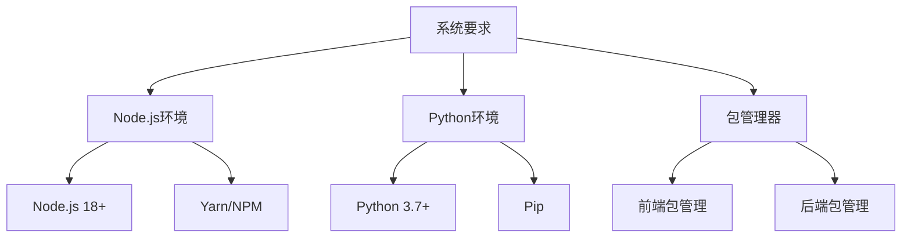

**节来源**
- [package.json](file://ZYTool/package.json#L1-L27)
- [requirements.txt](file://backend/requirements.txt#L1-L4)

## 总结

100_Code项目通过精心选择的技术栈，实现了以下目标：

### 技术先进性
- 采用最新的前端技术（Vue 3、TypeScript、Vite）
- 使用现代的后端框架（FastAPI、Pydantic）
- 实现了前后端分离的最佳实践

### 性能优化
- 前端使用Vite实现快速开发和构建
- 后端采用FastAPI提供高性能API服务
- 异步处理确保高并发场景下的稳定性

### 开发体验
- TypeScript提供完整的类型安全
- Vue 3组合式API提升开发效率
- 自动化工具链减少配置复杂度

### 可维护性
- 清晰的架构分层
- 模块化的设计原则
- 完善的错误处理机制

这种技术栈的选择不仅满足了当前的功能需求，也为未来的功能扩展和性能优化奠定了坚实的基础。项目的技术架构体现了现代Web开发的最佳实践，为用户提供稳定、高效、易用的在线工具服务。