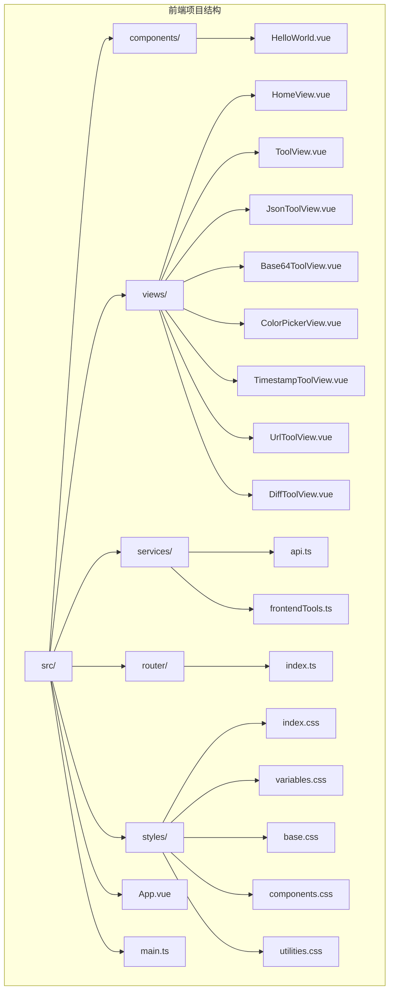
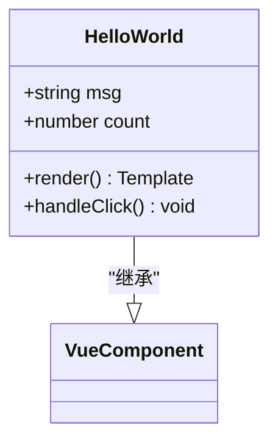
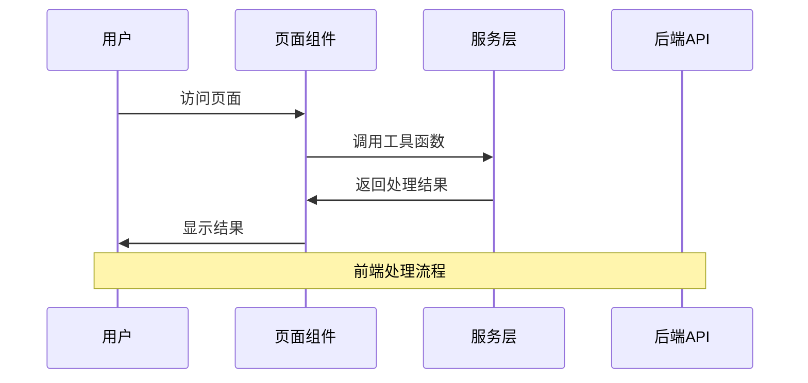
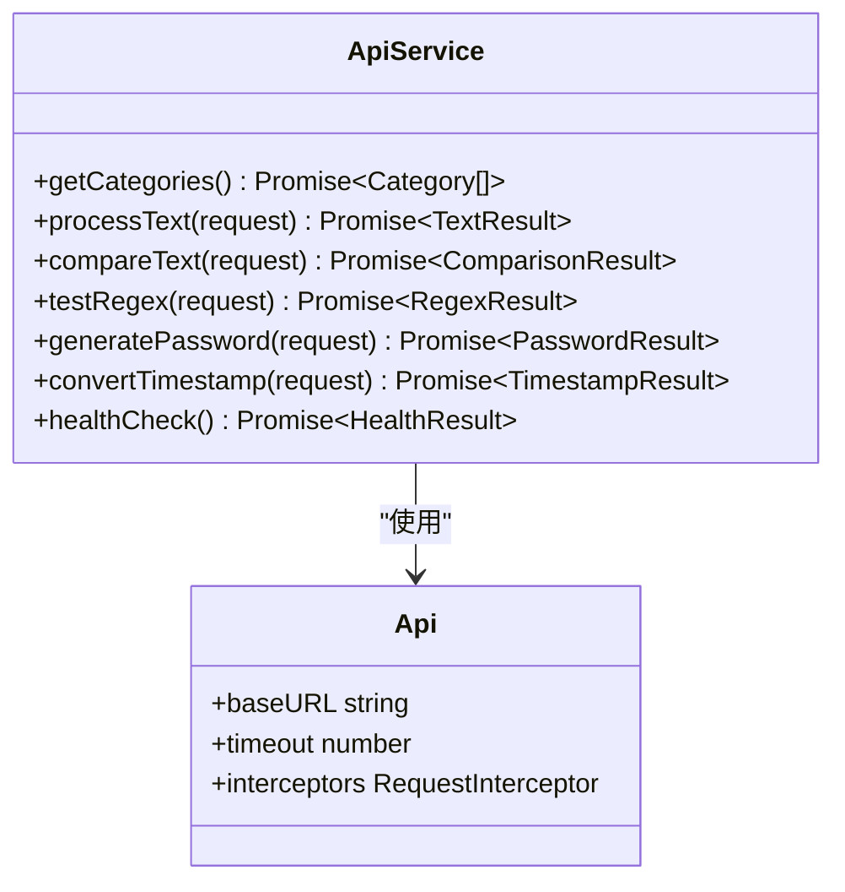
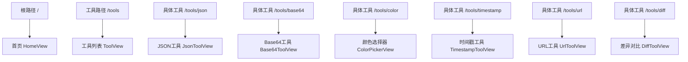
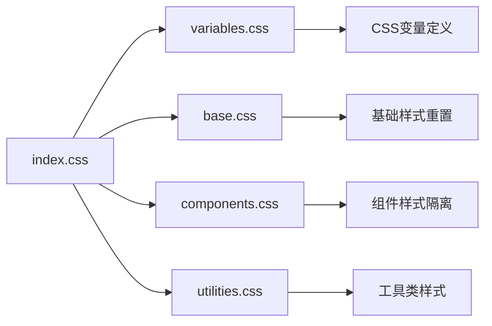
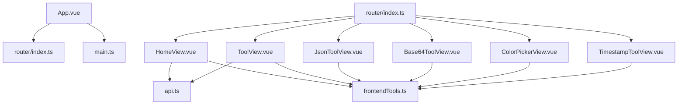
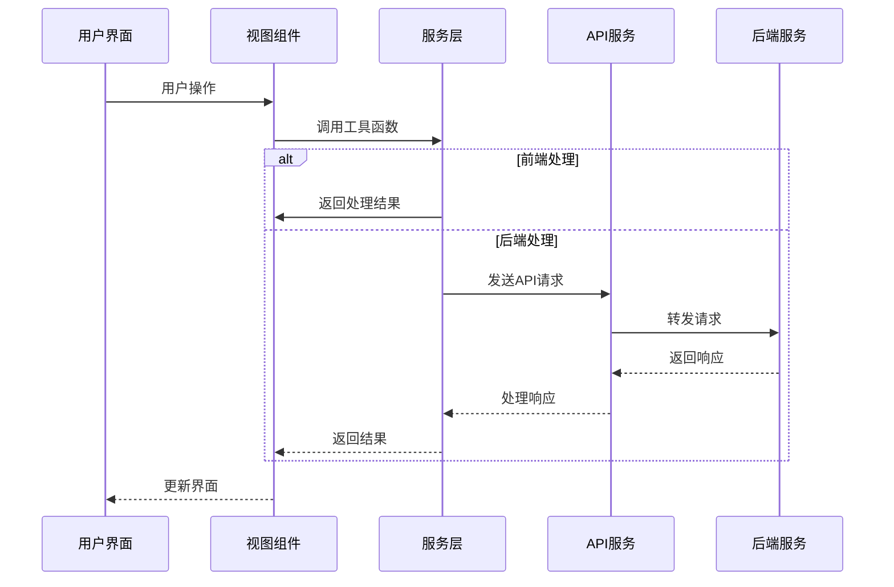

# ZYTool前端目录结构深度解析

<cite>
**本文档引用的文件**
- [main.ts](file://ZYTool/src/main.ts)
- [App.vue](file://ZYTool/src/App.vue)
- [router/index.ts](file://ZYTool/src/router/index.ts)
- [services/api.ts](file://ZYTool/src/services/api.ts)
- [services/frontendTools.ts](file://ZYTool/src/services/frontendTools.ts)
- [views/HomeView.vue](file://ZYTool/src/views/HomeView.vue)
- [views/ToolView.vue](file://ZYTool/src/views/ToolView.vue)
- [views/JsonToolView.vue](file://ZYTool/src/views/JsonToolView.vue)
- [views/Base64ToolView.vue](file://ZYTool/src/views/Base64ToolView.vue)
- [views/ColorPickerView.vue](file://ZYTool/src/views/ColorPickerView.vue)
- [views/TimestampToolView.vue](file://ZYTool/src/views/TimestampToolView.vue)
- [components/HelloWorld.vue](file://ZYTool/src/components/HelloWorld.vue)
- [styles/index.css](file://ZYTool/src/styles/index.css)
- [package.json](file://ZYTool/package.json)
</cite>

## 目录结构概览

ZYTool采用现代化的Vue 3 + TypeScript架构，遵循清晰的目录组织原则，将不同类型的组件和功能模块分离，便于维护和扩展。



**图表来源**
- [main.ts](file://ZYTool/src/main.ts#L1-L12)
- [App.vue](file://ZYTool/src/App.vue#L1-L124)
- [router/index.ts](file://ZYTool/src/router/index.ts#L1-L59)

## 核心目录详解

### 1. components/ - 可复用UI组件库

`components/`目录存放通用的可复用UI组件，这些组件可以在多个页面中重复使用。

**核心特性：**
- **单一职责原则**：每个组件专注于特定功能
- **可复用性**：组件设计考虑跨页面使用
- **类型安全**：使用TypeScript确保类型安全

**示例组件分析：**



**图表来源**
- [components/HelloWorld.vue](file://ZYTool/src/components/HelloWorld.vue#L1-L42)

**主要用途：**
- 基础UI元素（按钮、输入框、卡片等）
- 通用交互组件
- 可配置的复合组件

**节来源**
- [components/HelloWorld.vue](file://ZYTool/src/components/HelloWorld.vue#L1-L42)

### 2. views/ - 页面级组件

`views/`目录包含完整的页面组件，每个文件代表一个独立的页面，负责页面的整体布局和业务逻辑。

**页面分类与特点：**

| 页面类型 | 文件名 | 处理方式 | 特点 |
|---------|--------|----------|------|
| 首页 | HomeView.vue | 混合处理（前端+后端） | 展示工具分类，动态加载 |
| 工具列表 | ToolView.vue | 混合处理（前端+后端） | 分类展示所有可用工具 |
| JSON工具 | JsonToolView.vue | 前端处理 | 浏览器本地JSON格式化 |
| Base64工具 | Base64ToolView.vue | 前端处理 | 浏览器本地编码解码 |
| 颜色选择器 | ColorPickerView.vue | 前端处理 | RGB/HEX颜色转换 |
| 时间戳工具 | TimestampToolView.vue | 前端处理 | 时间戳与日期互转 |

**页面架构模式：**



**图表来源**
- [views/JsonToolView.vue](file://ZYTool/src/views/JsonToolView.vue#L90-L123)
- [views/Base64ToolView.vue](file://ZYTool/src/views/Base64ToolView.vue#L64-L103)

**节来源**
- [views/HomeView.vue](file://ZYTool/src/views/HomeView.vue#L1-L396)
- [views/ToolView.vue](file://ZYTool/src/views/ToolView.vue#L1-L280)
- [views/JsonToolView.vue](file://ZYTool/src/views/JsonToolView.vue#L1-L431)

### 3. services/ - 业务逻辑层

`services/`目录封装了应用的核心业务逻辑，分为API调用和前端工具函数两部分。

#### 3.1 api.ts - 后端API集成

**核心功能：**
- **HTTP客户端配置**：基于axios的API客户端
- **请求/响应拦截器**：统一的日志记录和错误处理
- **类型安全接口**：完整的TypeScript类型定义
- **RESTful API封装**：标准化的API调用方法

**API服务架构：**



**图表来源**
- [services/api.ts](file://ZYTool/src/services/api.ts#L99-L175)

**节来源**
- [services/api.ts](file://ZYTool/src/services/api.ts#L1-L178)

#### 3.2 frontendTools.ts - 前端工具函数

**核心功能：**
- **纯前端处理**：无需后端支持的工具函数
- **类型安全实现**：完整的错误处理机制
- **Unicode支持**：处理国际化字符集
- **性能优化**：高效的算法实现

**工具函数分类：**

| 功能类别 | 函数名 | 处理方式 | 应用场景 |
|---------|--------|----------|----------|
| JSON处理 | formatJSON, minifyJSON | 浏览器原生API | 数据格式化 |
| Base64编码 | base64Encode, base64Decode | TextEncoder/Decoder | 字符串编解码 |
| URL处理 | urlEncode, urlDecode | 内置函数 | URL安全处理 |
| 时间转换 | timestampToDatetime, datetimeToTimestamp | Date对象 | 时间戳转换 |
| 颜色转换 | rgbToHex, hexToRgb | 数学计算 | 颜色代码转换 |

**节来源**
- [services/frontendTools.ts](file://ZYTool/src/services/frontendTools.ts#L1-L185)

### 4. router/ - 路由管理

`router/`目录定义了应用的前端路由规则，采用Vue Router 4的现代路由系统。

**路由配置特点：**
- **命名路由**：清晰的路由标识
- **嵌套路由**：支持复杂的页面结构
- **懒加载**：按需加载组件，优化性能
- **导航守卫**：可扩展的路由控制

**路由结构：**



**图表来源**
- [router/index.ts](file://ZYTool/src/router/index.ts#L12-L55)

**节来源**
- [router/index.ts](file://ZYTool/src/router/index.ts#L1-L59)

### 5. styles/ - 样式系统

`styles/`目录采用模块化的样式管理策略，支持主题定制和响应式设计。

**样式架构层次：**



**图表来源**
- [styles/index.css](file://ZYTool/src/styles/index.css#L1-L8)

**节来源**
- [styles/index.css](file://ZYTool/src/styles/index.css#L1-L8)

## 开发者指南：添加新工具页面

### 步骤1：创建工具页面组件

**文件位置：** `src/views/NewToolView.vue`

**基本模板结构：**
```typescript
<template>
    <div class="tool-page">
        <div class="container">
            <!-- 页面标题 -->
            <div class="page-header">
                <a-typography-title :level="2">新工具名称（前端处理）</a-typography-title>
                <a-typography-paragraph>简短描述，说明工具用途</a-typography-paragraph>
            </div>
            
            <!-- 工具内容 -->
            <a-row :gutter="24">
                <a-col :xs="24" :lg="12">
                    <a-card title="输入区域" :bordered="false">
                        <!-- 输入控件 -->
                    </a-card>
                </a-col>
                <a-col :xs="24" :lg="12">
                    <a-card title="输出结果" :bordered="false">
                        <!-- 输出区域 -->
                    </a-card>
                </a-col>
            </a-row>
        </div>
    </div>
</template>

<script setup lang="ts">
// 导入必要的依赖
import { ref } from 'vue'
import { message } from 'ant-design-vue'

// 响应式数据
const inputText = ref('')
const result = ref('')

// 工具函数
const processTool = () => {
    // 实现工具逻辑
}

// 复制功能
const copyResult = () => {
    // 实现复制逻辑
}
</script>

<style scoped>
/* 添加自定义样式 */
</style>
```

### 步骤2：更新路由配置

**修改文件：** `src/router/index.ts`

**添加路由规则：**
```typescript
import NewToolView from '../views/NewToolView.vue'

const router = createRouter({
    // ... 其他路由配置
    routes: [
        // ... 现有路由
        {
            path: '/tools/newtool',
            name: 'new-tool',
            component: NewToolView
        }
    ]
})
```

### 步骤3：更新工具分类

**修改文件：** `src/views/ToolView.vue` 或 `src/views/HomeView.vue`

**添加工具条目：**
```typescript
// 在工具数组中添加新工具
tools: [
    // ... 现有工具
    { id: 13, name: '新工具名称', icon: '🔧', description: '工具描述', type: 'frontend' }
]
```

### 步骤4：更新路由映射

**修改文件：** `src/views/ToolView.vue`

**添加路由映射：**
```typescript
const routeMap: Record<string, string> = {
    // ... 现有映射
    '新工具名称': '/tools/newtool'
}
```

### 最佳实践建议

1. **组件命名规范**：使用`*ToolView.vue`格式
2. **样式作用域**：始终使用`scoped`样式
3. **类型安全**：使用TypeScript定义所有类型
4. **错误处理**：完善的用户反馈机制
5. **性能优化**：合理使用计算属性和响应式数据
6. **可访问性**：遵循Web可访问性标准

## 目录间引用关系

### 组件依赖图



**图表来源**
- [main.ts](file://ZYTool/src/main.ts#L1-L12)
- [App.vue](file://ZYTool/src/App.vue#L1-L124)
- [router/index.ts](file://ZYTool/src/router/index.ts#L1-L59)

### 数据流架构



**图表来源**
- [views/JsonToolView.vue](file://ZYTool/src/views/JsonToolView.vue#L90-L123)
- [services/api.ts](file://ZYTool/src/services/api.ts#L107-L110)

## 总结

ZYTool的前端目录结构体现了现代Web应用的最佳实践：

1. **清晰的职责分离**：components、views、services各司其职
2. **模块化设计**：便于维护和扩展
3. **类型安全**：TypeScript提供完整的类型检查
4. **用户体验优先**：前端处理减少网络延迟
5. **可扩展性**：标准化的开发流程

这种架构设计使得开发者能够快速添加新工具，同时保持代码质量和一致性。通过遵循既定的开发模式和最佳实践，可以确保项目的长期可维护性和可扩展性。