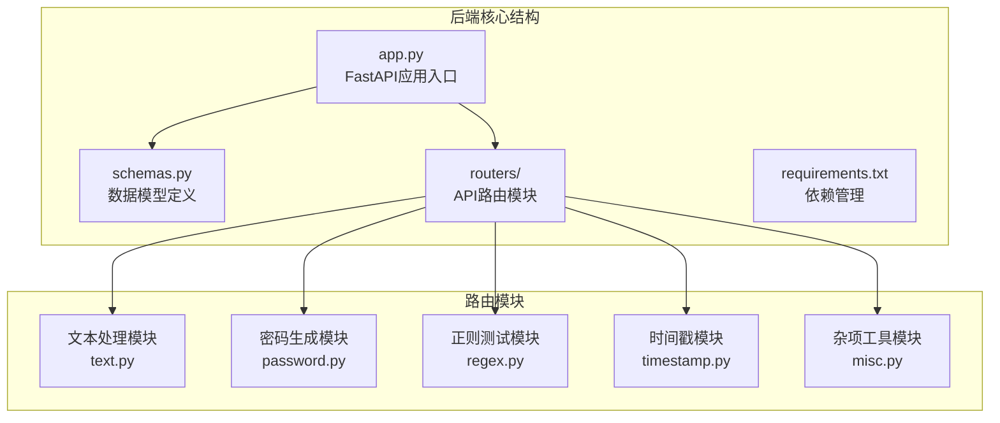
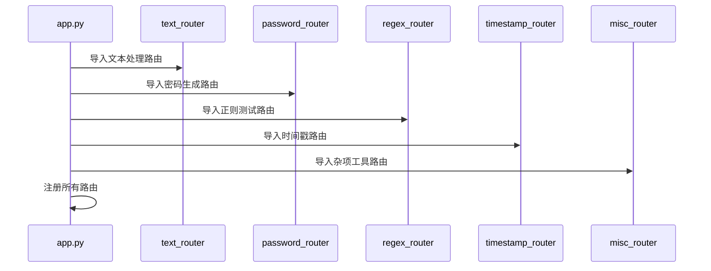
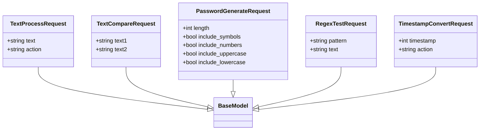
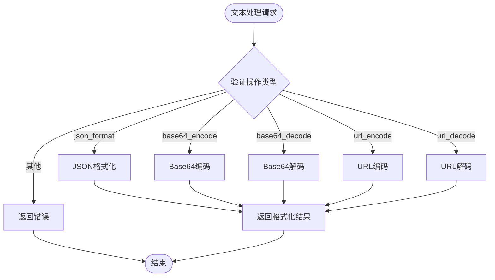
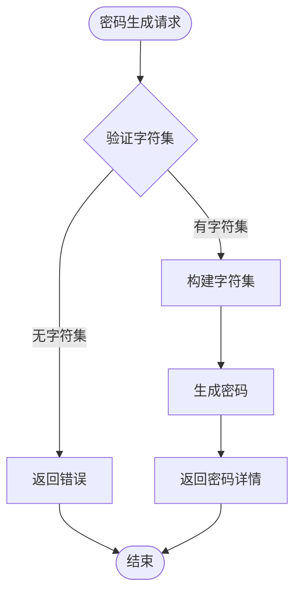

# 后端目录结构详细解析

<cite>
**本文档引用的文件**
- [app.py](file://backend/app.py)
- [schemas.py](file://backend/schemas.py)
- [requirements.txt](file://backend/requirements.txt)
- [text.py](file://backend/routers/text.py)
- [password.py](file://backend/routers/password.py)
- [regex.py](file://backend/routers/regex.py)
- [timestamp.py](file://backend/routers/timestamp.py)
- [misc.py](file://backend/routers/misc.py)
</cite>

## 目录结构概览

后端项目采用模块化的FastAPI架构设计，整体结构清晰，职责分明：



**图表来源**
- [app.py](file://backend/app.py#L1-L33)
- [schemas.py](file://backend/schemas.py#L1-L32)
- [text.py](file://backend/routers/text.py#L1-L76)
- [password.py](file://backend/routers/password.py#L1-L41)

## 核心组件分析

### 1. 应用入口：app.py

app.py是整个FastAPI应用的核心入口点，负责应用初始化、中间件配置和路由注册。

#### 主要功能特性

**FastAPI实例创建**
- 应用名称：ZYTool API
- 版本号：1.0.0
- 提供完整的API文档界面

**CORS跨域配置**
- 支持Vue开发服务器（端口5173）和React开发服务器（端口3000）
- 允许凭据传输
- 支持所有HTTP方法和请求头

**模块化路由注册**
通过导入各个功能模块的路由器，实现清晰的API组织结构：



**图表来源**
- [app.py](file://backend/app.py#L4-L8)
- [app.py](file://backend/app.py#L23-L27)

**本地开发启动**
内置Uvicorn服务器，支持直接运行：
- 主机：0.0.0.0
- 端口：8000

**节来源**
- [app.py](file://backend/app.py#L1-L33)

### 2. 数据模型：schemas.py

schemas.py使用Pydantic定义了所有API请求的数据模型，确保类型安全和请求验证。

#### 核心数据模型

**文本处理模型 (TextProcessRequest)**
- 文本内容（text: str）
- 操作类型（action: str）
  - json_format：JSON格式化
  - base64_encode：Base64编码
  - base64_decode：Base64解码
  - url_encode：URL编码
  - url_decode：URL解码

**文本对比模型 (TextCompareRequest)**
- 文本1（text1: str）
- 文本2（text2: str）

**密码生成模型 (PasswordGenerateRequest)**
- 密码长度（length: int，默认12）
- 字符类型选项：
  - 包含小写字母（include_lowercase: bool，默认True）
  - 包含大写字母（include_uppercase: bool，默认True）
  - 包含数字（include_numbers: bool，默认True）
  - 包含符号（include_symbols: bool，默认True）

**正则测试模型 (RegexTestRequest)**
- 正则表达式模式（pattern: str）
- 测试文本（text: str）

**时间戳转换模型 (TimestampConvertRequest)**
- 时间戳值（timestamp: int）
- 转换操作（action: str）
  - to_datetime：时间戳转日期时间
  - to_timestamp：日期时间转时间戳



**图表来源**
- [schemas.py](file://backend/schemas.py#L4-L30)

**节来源**
- [schemas.py](file://backend/schemas.py#L1-L32)

### 3. 依赖管理：requirements.txt

项目依赖简洁高效，专注于核心功能：

| 依赖包 | 版本 | 用途 |
|--------|------|------|
| fastapi | 0.104.1 | Web框架核心 |
| uvicorn[standard] | 0.24.0 | ASGI服务器 |
| python-multipart | 0.0.6 | 处理multipart表单数据 |

**节来源**
- [requirements.txt](file://backend/requirements.txt#L1-L4)

## 路由模块详解

### 文本处理模块 (text.py)

提供全面的文本处理功能，支持多种编码解码和格式化操作。

#### 功能特性

**文本处理接口 (/api/text/process)**
- JSON格式化：美化输出JSON数据
- Base64编解码：支持标准Base64编码
- URL编解码：支持URL参数编码解码

**文本对比接口 (/api/text/compare)**
- 行级差异检测
- 详细差异报告
- 统计信息返回



**图表来源**
- [text.py](file://backend/routers/text.py#L13-L42)

**节来源**
- [text.py](file://backend/routers/text.py#L1-L76)

### 密码生成模块 (password.py)

提供安全密码生成功能，支持灵活的字符集配置。

#### 核心特性

**密码生成接口 (/api/password/generate)**
- 基于secrets模块的安全随机数生成
- 可配置的字符集组合
- 详细的密码特征报告



**图表来源**
- [password.py](file://backend/routers/password.py#L11-L38)

**节来源**
- [password.py](file://backend/routers/password.py#L1-L41)

### 正则测试模块 (regex.py)

提供强大的正则表达式测试功能。

#### 功能特点

**正则测试接口 (/api/regex/test)**
- 支持复杂正则表达式语法
- 详细匹配结果分析
- 位置信息和分组提取

**节来源**
- [regex.py](file://backend/routers/regex.py#L1-L36)

### 时间戳模块 (timestamp.py)

提供时间戳与日期时间之间的双向转换。

#### 核心功能

**时间戳转换接口 (/api/timestamp/convert)**
- 时间戳转日期时间
- 日期时间转时间戳
- 格式化输出

**节来源**
- [timestamp.py](file://backend/routers/timestamp.py#L1-L36)

### 杂项工具模块 (misc.py)

提供系统级功能和工具分类信息。

#### 接口功能

**工具分类接口 (/api/categories)**
- 返回完整的工具分类结构
- 包含每个分类下的具体工具
- 支持前端导航展示

**健康检查接口 (/api/health)**
- 系统状态监控
- 快速服务可用性检查

**节来源**
- [misc.py](file://backend/routers/misc.py#L1-L54)

## 架构设计原则

### 模块化设计

1. **单一职责原则**：每个路由器文件专注于特定功能领域
2. **高内聚低耦合**：模块间通过schemas共享数据模型
3. **可扩展性**：新增功能只需添加新路由器文件

### 数据验证机制

1. **Pydantic集成**：自动类型转换和验证
2. **请求响应标准化**：统一的成功/失败响应格式
3. **错误处理**：详细的错误信息和状态码

### API设计规范

1. **RESTful风格**：符合REST架构原则
2. **版本控制**：明确的API版本标识
3. **文档友好**：自动生成API文档

## 扩展新API接口指南

### 添加新功能模块

1. **创建路由器文件**
   ```python
   from fastapi import APIRouter
   
   router = APIRouter(prefix="/api/newtool", tags=["newtool"])
   
   @router.post("/process")
   async def new_function():
       # 实现功能逻辑
       pass
   ```

2. **更新schemas.py**
   ```python
   class NewToolRequest(BaseModel):
       param1: str
       param2: int
   ```

3. **在app.py中注册**
   ```python
   from backend.routers.newtool import router as newtool_router
   app.include_router(newtool_router)
   ```

### 最佳实践建议

1. **保持一致性**：遵循现有命名和结构规范
2. **完善文档**：为每个接口添加详细注释
3. **错误处理**：实现适当的异常处理机制
4. **性能优化**：考虑异步处理和缓存策略

## 总结

该后端架构展现了现代Web应用的最佳实践：

- **清晰的模块化设计**：便于维护和扩展
- **强类型验证**：确保数据完整性
- **RESTful API设计**：符合行业标准
- **完善的错误处理**：提升用户体验
- **良好的可扩展性**：支持快速功能迭代

这种设计模式为开发者提供了坚实的基础，同时保持了足够的灵活性来适应未来的需求变化。