# 样式与资源结构

<cite>
**本文档引用的文件**
- [index.css](file://ZYTool/src/styles/index.css)
- [variables.css](file://ZYTool/src/styles/variables.css)
- [base.css](file://ZYTool/src/styles/base.css)
- [components.css](file://ZYTool/src/styles/components.css)
- [utilities.css](file://ZYTool/src/styles/utilities.css)
- [main.ts](file://ZYTool/src/main.ts)
- [HomeView.vue](file://ZYTool/src/views/HomeView.vue)
- [App.vue](file://ZYTool/src/App.vue)
- [package.json](file://ZYTool/package.json)
</cite>

## 目录
1. [简介](#简介)
2. [项目结构概览](#项目结构概览)
3. [样式文件组织架构](#样式文件组织架构)
4. [核心样式文件详解](#核心样式文件详解)
5. [样式系统集成机制](#样式系统集成机制)
6. [设计变量系统](#设计变量系统)
7. [组件样式定制](#组件样式定制)
8. [实用类样式系统](#实用类样式系统)
9. [响应式设计策略](#响应式设计策略)
10. [最佳实践指南](#最佳实践指南)
11. [总结](#总结)

## 简介

ZYTool项目采用模块化的样式架构设计，通过分层管理的方式构建了一个可维护、可扩展的CSS系统。该系统以设计变量为核心，通过基础样式重置、组件定制和实用类的有机结合，为整个应用提供了统一的设计语言和一致的视觉体验。

## 项目结构概览

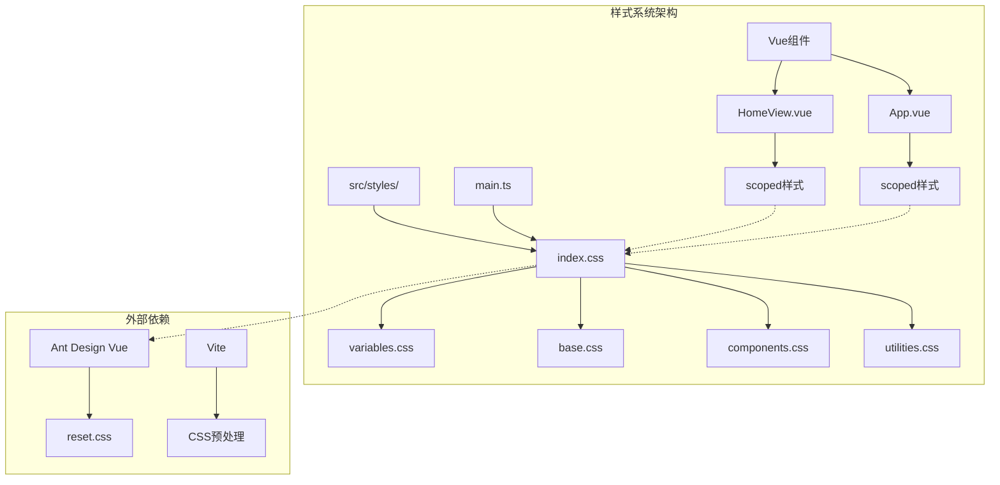

**图表来源**
- [index.css](file://ZYTool/src/styles/index.css#L1-L8)
- [main.ts](file://ZYTool/src/main.ts#L1-L12)

**章节来源**
- [index.css](file://ZYTool/src/styles/index.css#L1-L8)
- [main.ts](file://ZYTool/src/main.ts#L1-L12)

## 样式文件组织架构

ZYTool的样式系统采用五层模块化架构，每层都有明确的职责分工：

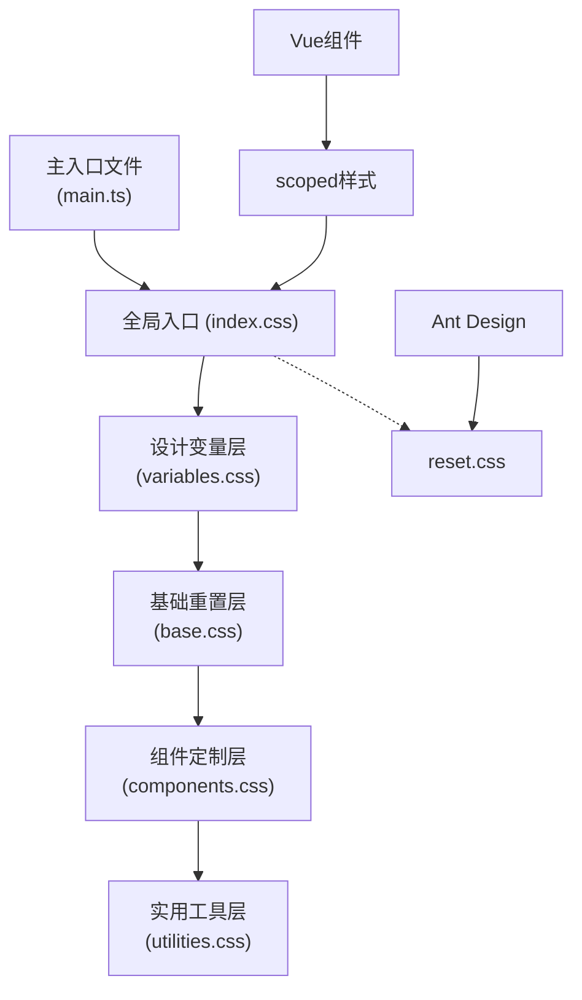

**图表来源**
- [index.css](file://ZYTool/src/styles/index.css#L4-L7)
- [main.ts](file://ZYTool/src/main.ts#L2)

这种分层架构的优势：
- **清晰的职责分离**：每层专注于特定的功能领域
- **可维护性**：修改某一层不会影响其他层
- **可扩展性**：新增样式可以按需添加到相应层级
- **一致性保证**：通过设计变量统一控制视觉元素

**章节来源**
- [index.css](file://ZYTool/src/styles/index.css#L1-L8)

## 核心样式文件详解

### index.css - 全局样式入口

index.css作为整个样式系统的入口文件，负责协调各个子模块的加载顺序：

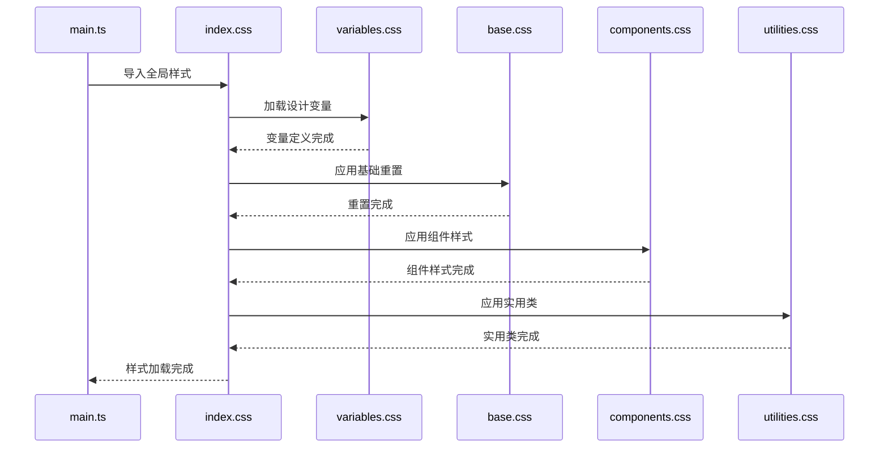

**图表来源**
- [index.css](file://ZYTool/src/styles/index.css#L4-L7)
- [main.ts](file://ZYTool/src/main.ts#L2)

### variables.css - 设计变量系统

variables.css定义了完整的主题变量体系，支持浅色和深色两种模式：

#### 变量分类体系

| 类别 | 变量前缀 | 用途 | 示例 |
|------|----------|------|------|
| 主题色系 | `--primary-*` | 主要交互色彩 | `--primary-color`, `--primary-dark` |
| 背景色系 | `--bg-*` | 层级背景颜色 | `--bg-primary`, `--bg-secondary` |
| 文字色系 | `--text-*` | 文本颜色层级 | `--text-primary`, `--text-secondary` |
| 边框色系 | `--border-*` | 边框和分割线 | `--border-color`, `--border-light` |
| 阴影效果 | `--shadow-*` | 投影和层次感 | `--shadow-sm`, `--shadow-lg` |
| 渐变背景 | `--gradient-*` | 渐变装饰效果 | `--gradient-primary`, `--gradient-bg` |

#### 深色模式适配

系统通过媒体查询自动适配深色模式，确保在不同环境下的一致性体验。

**章节来源**
- [variables.css](file://ZYTool/src/styles/variables.css#L1-L94)

### base.css - 基础样式重置

base.css提供了全面的CSS重置和基础样式定义：

#### 核心重置特性

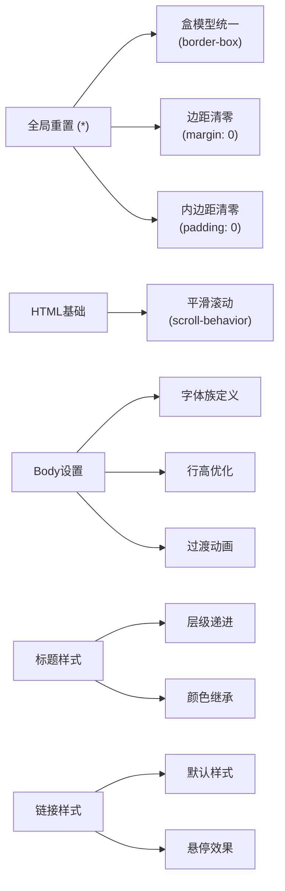

**图表来源**
- [base.css](file://ZYTool/src/styles/base.css#L2-L28)

#### Ant Design深度适配

base.css包含了对Ant Design组件库的深度适配，确保在深色模式下组件的正确显示：

- **Typography组件**：文本排版组件的颜色适配
- **Card组件**：卡片组件的背景和边框适配  
- **Input组件**：输入框的背景、边框和占位符适配
- **其他组件**：Modal、Table、Pagination等组件的深色模式适配

**章节来源**
- [base.css](file://ZYTool/src/styles/base.css#L1-L167)

## 样式系统集成机制

### 全局引入流程

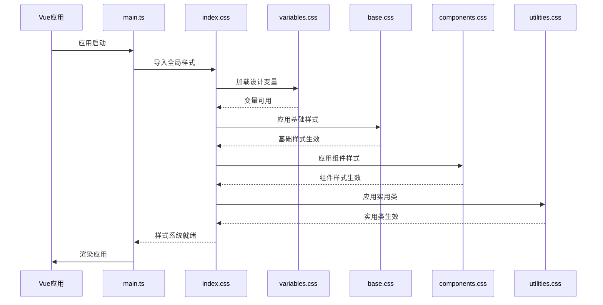

**图表来源**
- [main.ts](file://ZYTool/src/main.ts#L1-L12)
- [index.css](file://ZYTool/src/styles/index.css#L4-L7)

### Vue组件样式集成

每个Vue组件都可以通过scoped样式实现局部样式隔离，同时继承全局样式系统：

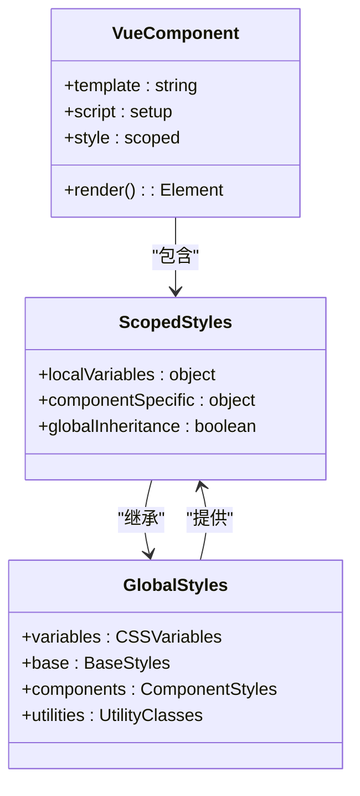

**图表来源**
- [HomeView.vue](file://ZYTool/src/views/HomeView.vue#L157-L396)
- [App.vue](file://ZYTool/src/App.vue#L25-L124)

**章节来源**
- [main.ts](file://ZYTool/src/main.ts#L1-L12)

## 设计变量系统

### 变量命名规范

设计变量采用语义化命名，确保变量含义清晰且易于维护：

#### 命名约定
- **基础命名**：`--{category}-{variant}`
- **颜色系列**：`--primary-{dark|darker|light|lighter}`
- **尺寸系列**：`--border-radius-{sm|md|lg|xl}`
- **状态系列**：`--{element}-{hover|focus|active}`

#### 变量使用模式

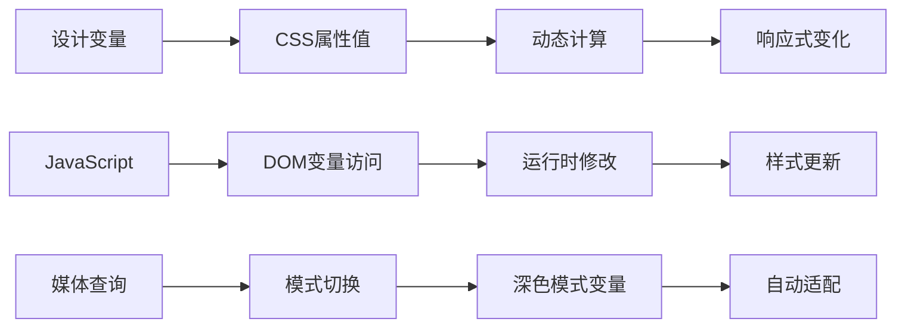

**图表来源**
- [variables.css](file://ZYTool/src/styles/variables.css#L2-L48)

### 响应式设计支持

设计变量系统天然支持响应式设计，通过媒体查询实现不同屏幕尺寸下的样式调整。

**章节来源**
- [variables.css](file://ZYTool/src/styles/variables.css#L1-L94)

## 组件样式定制

### 按钮组件系统

components.css定义了完整的按钮组件样式体系：

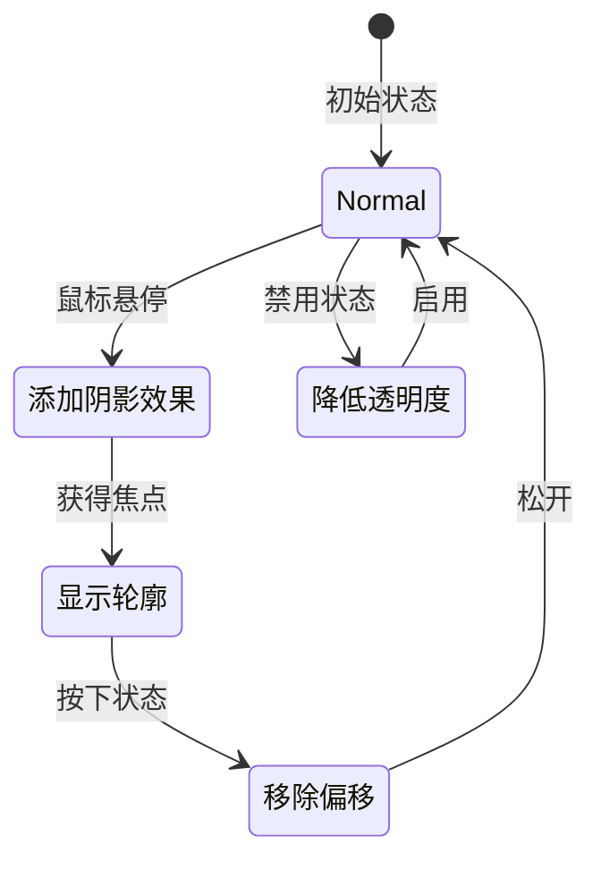

**图表来源**
- [components.css](file://ZYTool/src/styles/components.css#L1-L34)

### 卡片组件系统

卡片组件提供了丰富的交互效果和视觉层次：

#### 卡片特性
- **阴影效果**：基于`--shadow-md`和`--shadow-lg`变量
- **圆角设计**：使用`--border-radius-lg`变量
- **悬停动画**：平滑的位移和阴影变化
- **边框系统**：透明边框在悬停时激活

### 表单控件样式

表单控件采用了统一的设计语言：

#### 输入框特性
- **背景色**：继承`--bg-primary`变量
- **边框颜色**：使用`--border-color`变量
- **聚焦效果**：蓝色主题色边框和阴影
- **占位符**：次级文字颜色

**章节来源**
- [components.css](file://ZYTool/src/styles/components.css#L1-L620)

## 实用类样式系统

### 响应式工具类

utilities.css提供了完整的响应式工具类系统：

#### 断点系统

| 类名 | 断点范围 | 用途 |
|------|----------|------|
| `.hide-mobile` | ≥768px | 在移动端隐藏 |
| `.show-mobile` | <768px | 在移动端显示 |
| `.mt-1/.mt-2/.mt-3/.mt-4` | 全局 | 上外边距 |
| `.mb-1/.mb-2/.mb-3/.mb-4` | 全局 | 下外边距 |
| `.p-1/.p-2/.p-3/.p-4` | 全局 | 内边距 |

#### Flexbox工具类

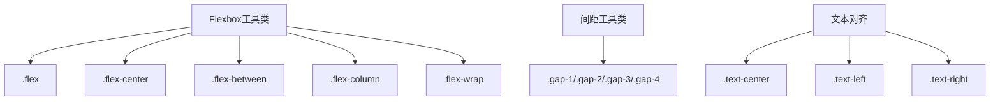

**图表来源**
- [utilities.css](file://ZYTool/src/styles/utilities.css#L100-L207)

### 动画系统

utilities.css内置了多种动画效果：

#### 关键帧动画
- **fadeIn**：淡入动画
- **fadeInUp**：从下方淡入
- **fadeInDown**：从上方淡入
- **spin**：旋转动画

#### 使用示例
- **加载动画**：`.loading`类提供圆形加载指示器
- **工具提示**：`.tooltip`类提供悬停提示功能
- **徽章样式**：`.badge`类提供标记样式

**章节来源**
- [utilities.css](file://ZYTool/src/styles/utilities.css#L1-L207)

## 响应式设计策略

### 移动优先设计

系统采用移动优先的设计策略，确保在小屏幕设备上的良好体验：

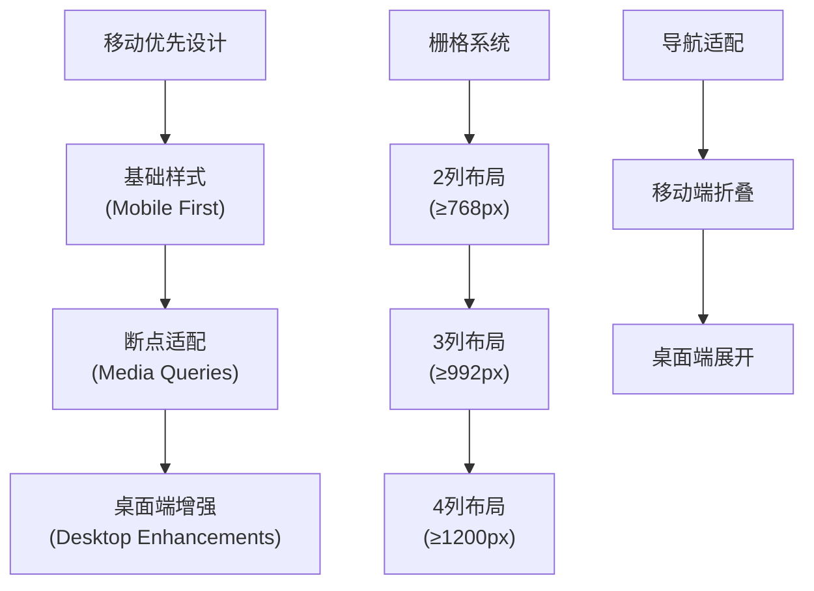

**图表来源**
- [components.css](file://ZYTool/src/styles/components.css#L95-L119)
- [utilities.css](file://ZYTool/src/styles/utilities.css#L100-L117)

### 栅格系统

系统提供了灵活的栅格布局系统：

#### 响应式断点
- **移动端**：1列布局
- **平板端**：2-3列布局  
- **桌面端**：4列布局

#### 栅格特性
- **间隙统一**：使用`1.5rem`的固定间隙
- **居中对齐**：最大宽度限制和自动居中
- **弹性布局**：基于CSS Grid的现代布局

**章节来源**
- [components.css](file://ZYTool/src/styles/components.css#L95-L119)

## 最佳实践指南

### 样式开发规范

#### 1. 变量优先原则
- 优先使用设计变量而非硬编码值
- 保持变量命名的一致性和语义化
- 避免在组件样式中直接修改全局变量

#### 2. 组件样式组织
- 使用语义化的类名
- 遵循BEM命名规范
- 合理使用`:deep()`选择器处理第三方组件

#### 3. 响应式设计
- 采用移动优先的设计方法
- 合理使用媒体查询断点
- 确保关键功能在小屏幕上的可用性

#### 4. 性能优化
- 避免过度嵌套的选择器
- 合理使用CSS变量减少重复代码
- 利用浏览器缓存机制

### 新增样式流程

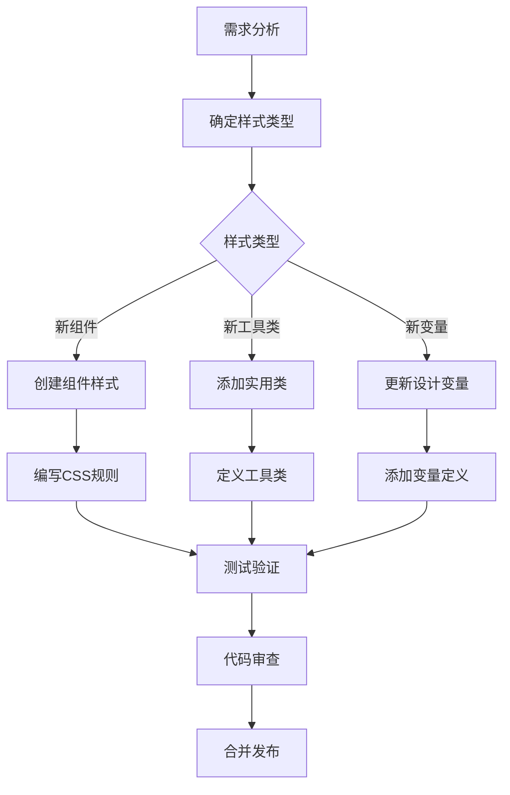

### 调试和维护

#### 调试技巧
- 使用浏览器开发者工具检查CSS变量值
- 利用CSS自定义属性的动态特性进行实时调试
- 通过媒体查询测试响应式效果

#### 维护策略
- 定期审查和清理未使用的样式
- 保持设计变量的版本一致性
- 记录重要的样式变更和原因

## 总结

ZYTool的样式系统通过模块化架构实现了高度的可维护性和可扩展性。五个核心文件各司其职，形成了一个完整的样式生态系统：

1. **variables.css** 提供了统一的设计语言和主题变量
2. **base.css** 确保了基础样式的标准化和一致性  
3. **components.css** 定义了组件级别的样式规范
4. **utilities.css** 提供了灵活的实用工具类
5. **index.css** 协调了整个样式的加载和集成

这种架构不仅保证了当前项目的视觉一致性，也为未来的功能扩展和样式维护奠定了坚实的基础。开发者在遵循现有规范的基础上，可以轻松地添加新的样式元素，而不会破坏现有的系统结构。

通过合理使用设计变量、组件样式和实用类，开发者能够快速构建出符合项目设计语言的用户界面，同时保持代码的整洁性和可维护性。