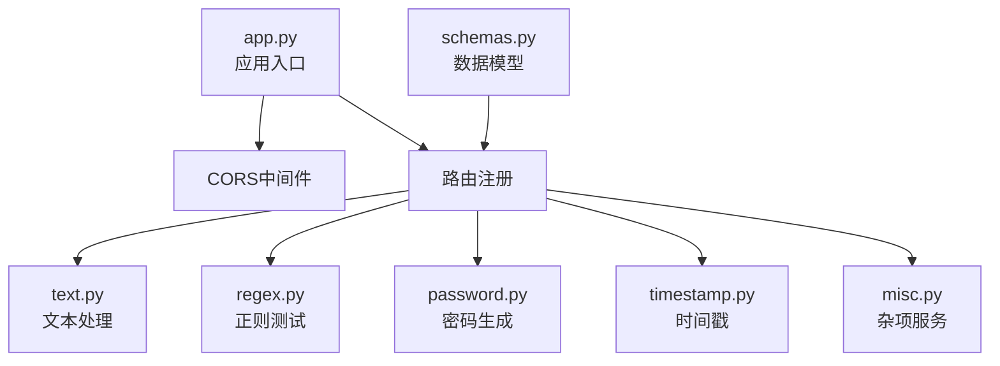
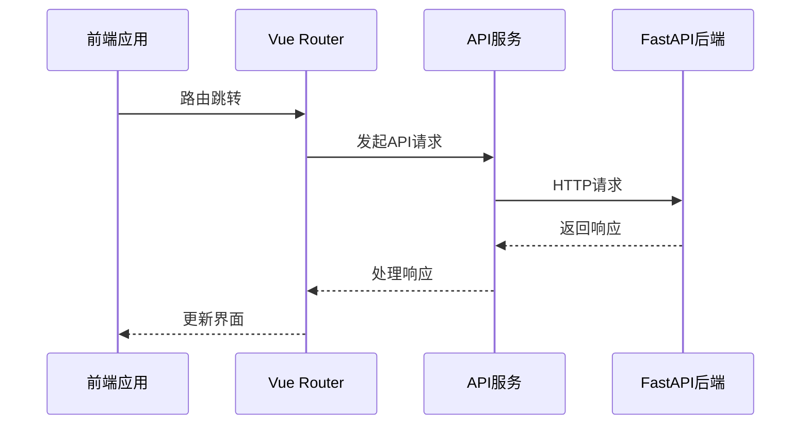

# 100_Code项目目录结构详解

<cite>
**本文档引用的文件**
- [package.json](file://ZYTool/package.json)
- [app.py](file://backend/app.py)
- [schemas.py](file://backend/schemas.py)
- [main.ts](file://ZYTool/src/main.ts)
- [App.vue](file://ZYTool/src/App.vue)
- [index.ts](file://ZYTool/src/router/index.ts)
- [api.ts](file://ZYTool/src/services/api.ts)
- [HomeView.vue](file://ZYTool/src/views/HomeView.vue)
- [ToolView.vue](file://ZYTool/src/views/ToolView.vue)
- [JsonToolView.vue](file://ZYTool/src/views/JsonToolView.vue)
- [Base64ToolView.vue](file://ZYTool/src/views/Base64ToolView.vue)
- [text.py](file://backend/routers/text.py)
- [misc.py](file://backend/routers/misc.py)
- [vite.config.ts](file://ZYTool/vite.config.ts)
- [requirements.txt](file://backend/requirements.txt)
</cite>

## 目录结构概览

100_Code项目采用前后端分离架构，主要分为两个核心模块：

- **ZYTool前端模块**：基于Vue 3 + TypeScript构建的现代化Web界面
- **backend后端模块**：基于FastAPI的RESTful API服务

```mermaid
graph TB
subgraph "前端模块 (ZYTool)"
Frontend[Vue 3 应用]
Views[Views 视图层]
Components[Components 组件层]
Services[Services 服务层]
Router[Router 路由层]
end
subgraph "后端模块 (backend)"
Backend[FastAPI 应用]
Routers[API 路由]
Schemas[数据模型]
end
Frontend < --> Backend
Views --> Components
Views --> Services
Services --> Router
Router --> Backend
```

**图表来源**
- [main.ts](file://ZYTool/src/main.ts#L1-L12)
- [app.py](file://backend/app.py#L1-L33)

## 前端模块 (ZYTool) 架构分析

### 项目配置与依赖

ZYTool基于现代前端技术栈构建，主要依赖包括：
- **Vue 3**：核心框架，提供响应式UI组件
- **TypeScript**：强类型语言，提升代码质量和开发体验
- **Ant Design Vue**：企业级UI组件库
- **Axios**：HTTP客户端，用于API通信
- **Vue Router**：单页应用路由管理

**章节来源**
- [package.json](file://ZYTool/package.json#L1-L27)
- [vite.config.ts](file://ZYTool/vite.config.ts#L1-L8)

### 核心目录结构

#### src/components/ - 组件层
目前包含基础组件，为后续扩展预留空间。

#### src/views/ - 视图层
包含所有页面级别的组件，每个视图对应特定的工具功能：

| 视图文件 | 功能描述 | 技术特点 |
|---------|----------|----------|
| HomeView.vue | 首页展示，工具分类导航 | 分类加载、工具卡片展示 |
| ToolView.vue | 工具集合页面 | 动态工具列表、分类管理 |
| JsonToolView.vue | JSON格式化工具 | 前端处理、实时格式化 |
| Base64ToolView.vue | Base64编码工具 | 前端处理、编码解码 |
| UrlToolView.vue | URL编码工具 | 前端处理、URL操作 |
| ColorPickerView.vue | 颜色选择器 | 前端处理、颜色管理 |
| TimestampToolView.vue | 时间戳转换 | 前端处理、时间计算 |
| DiffToolView.vue | 文本对比工具 | 后端处理、差异分析 |

**章节来源**
- [HomeView.vue](file://ZYTool/src/views/HomeView.vue#L1-L396)
- [ToolView.vue](file://ZYTool/src/views/ToolView.vue#L1-L280)
- [JsonToolView.vue](file://ZYTool/src/views/JsonToolView.vue#L1-L431)
- [Base64ToolView.vue](file://ZYTool/src/views/Base64ToolView.vue#L1-L287)

#### src/services/ - 服务层
提供统一的API和服务抽象：

| 服务文件 | 功能描述 | 主要接口 |
|---------|----------|----------|
| api.ts | HTTP API封装 | 文本处理、工具分类、健康检查 |
| frontendTools.ts | 前端工具函数 | JSON格式化、Base64编解码等 |

**章节来源**
- [api.ts](file://ZYTool/src/services/api.ts#L1-L178)

#### src/router/ - 路由层
配置应用路由系统：

```mermaid
graph LR
Root[/] --> Home[首页]
Root --> Tools[工具集合]
Tools --> Json[JSON工具]
Tools --> Base64[Base64工具]
Tools --> Url[URL工具]
Tools --> Color[颜色选择器]
Tools --> Timestamp[时间戳工具]
Tools --> Diff[文本对比工具]
```

**图表来源**
- [index.ts](file://ZYTool/src/router/index.ts#L1-L59)

#### src/styles/ - 样式层
采用CSS变量和模块化样式设计：
- **base.css**：全局基础样式
- **components.css**：组件样式
- **index.css**：主入口样式
- **utilities.css**：工具类样式
- **variables.css**：CSS变量定义

#### src/ - 应用入口
- **main.ts**：应用入口点，初始化Vue应用
- **App.vue**：根组件，定义应用布局和导航
- **style.css**：全局样式文件

**章节来源**
- [main.ts](file://ZYTool/src/main.ts#L1-L12)
- [App.vue](file://ZYTool/src/App.vue#L1-L124)

## 后端模块 (backend) 架构分析

### 应用架构

backend模块基于FastAPI构建，采用模块化路由设计：



**图表来源**
- [app.py](file://backend/app.py#L1-L33)
- [schemas.py](file://backend/schemas.py#L1-L32)

### 核心模块分析

#### app.py - 应用入口
负责应用初始化、中间件配置和路由注册：

| 配置项 | 值 | 说明 |
|-------|-----|------|
| title | "ZYTool API" | API标题 |
| version | "1.0.0" | 版本号 |
| CORS origins | ["http://localhost:5173", "http://localhost:3000"] | 允许跨域的前端地址 |
| 默认端口 | 8000 | 本地开发端口 |

**章节来源**
- [app.py](file://backend/app.py#L1-L33)

#### schemas.py - 数据模型
定义API请求和响应的数据结构：

| 模型类 | 用途 | 主要字段 |
|-------|------|----------|
| TextProcessRequest | 文本处理请求 | text, action |
| TextCompareRequest | 文本对比请求 | text1, text2 |
| PasswordGenerateRequest | 密码生成请求 | length, include_* |
| RegexTestRequest | 正则测试请求 | pattern, text |
| TimestampConvertRequest | 时间戳转换请求 | timestamp, action |

**章节来源**
- [schemas.py](file://backend/schemas.py#L1-L32)

#### routers/ - 路由模块

##### text.py - 文本处理路由
提供多种文本处理功能：

| 端点 | 方法 | 功能 | 处理方式 |
|------|------|------|----------|
| `/api/text/process` | POST | 文本处理 | 前端处理 |
| `/api/text/compare` | POST | 文本对比 | 后端处理 |

**章节来源**
- [text.py](file://backend/routers/text.py#L1-L76)

##### misc.py - 杂项服务路由
提供工具分类和健康检查：

| 端点 | 方法 | 功能 | 实现方式 |
|------|------|------|----------|
| `/api/categories` | GET | 获取工具分类 | 静态数据返回 |
| `/api/health` | GET | 健康检查 | 状态确认 |

**章节来源**
- [misc.py](file://backend/routers/misc.py#L1-L54)

### 依赖管理

backend模块依赖精简高效：
- **FastAPI 0.104.1**：高性能ASGI框架
- **Uvicorn 0.24.0**：ASGI服务器
- **python-multipart 0.0.6**：表单数据处理

**章节来源**
- [requirements.txt](file://backend/requirements.txt#L1-L4)

## 前后端交互机制

### API通信流程



**图表来源**
- [api.ts](file://ZYTool/src/services/api.ts#L1-L178)
- [index.ts](file://ZYTool/src/router/index.ts#L1-L59)

### 数据流分析

前端通过统一的API服务层与后端通信，支持以下数据流模式：

1. **前端处理流程**：简单算法在浏览器完成
2. **后端处理流程**：复杂计算和数据库操作
3. **混合处理流程**：部分数据在前端预处理，复杂逻辑后端完成

## 开发指导原则

### 新功能添加路径

#### 前端新工具开发
1. 在`src/views/`创建新的工具视图组件
2. 在`src/router/index.ts`添加路由配置
3. 在`src/services/frontendTools.ts`添加工具函数
4. 更新工具分类数据（可选）

#### 后端API开发
1. 在`backend/routers/`创建新的路由模块
2. 在`backend/schemas.py`定义数据模型
3. 在`backend/app.py`注册路由
4. 添加相应的单元测试

### 代码组织最佳实践

1. **模块化设计**：保持功能单一职责
2. **类型安全**：充分利用TypeScript类型系统
3. **错误处理**：完善的异常捕获和用户反馈
4. **性能优化**：合理使用缓存和异步处理

## 总结

100_Code项目展现了现代全栈Web应用的最佳实践：

- **前端**：采用Vue 3 + TypeScript + Vite的现代化技术栈
- **后端**：基于FastAPI的高性能API服务
- **架构**：清晰的分层设计和模块化组织
- **开发**：遵循最佳实践，便于维护和扩展

这种架构设计既保证了开发效率，又确保了应用的可维护性和扩展性，为后续功能开发提供了良好的基础。