# 100_Code项目系统概述

<cite>
**本文档引用的文件**
- [README.md](file://README.md)
- [package.json](file://ZYTool/package.json)
- [app.py](file://backend/app.py)
- [main.ts](file://ZYTool/src/main.ts)
- [App.vue](file://ZYTool/src/App.vue)
- [api.ts](file://ZYTool/src/services/api.ts)
- [HomeView.vue](file://ZYTool/src/views/HomeView.vue)
- [JsonToolView.vue](file://ZYTool/src/views/JsonToolView.vue)
- [Base64ToolView.vue](file://ZYTool/src/views/Base64ToolView.vue)
- [TimestampToolView.vue](file://ZYTool/src/views/TimestampToolView.vue)
- [ColorPickerView.vue](file://ZYTool/src/views/ColorPickerView.vue)
- [frontendTools.ts](file://ZYTool/src/services/frontendTools.ts)
- [text.py](file://backend/routers/text.py)
- [schemas.py](file://backend/schemas.py)
- [requirements.txt](file://backend/requirements.txt)
- [vite.config.ts](file://ZYTool/vite.config.ts)
- [index.ts](file://ZYTool/src/router/index.ts)
</cite>

## 目录
1. [项目简介](#项目简介)
2. [系统架构概览](#系统架构概览)
3. [技术栈分析](#技术栈分析)
4. [前后端分离设计理念](#前后端分离设计理念)
5. [核心功能模块](#核心功能模块)
6. [数据流与交互机制](#数据流与交互机制)
7. [项目启动与部署](#项目启动与部署)
8. [性能优化策略](#性能优化策略)
9. [扩展性设计](#扩展性设计)
10. [总结](#总结)

## 项目简介

100_Code是一个专为全栈开发者打造的在线工具平台，致力于为开发者提供一站式实用工具服务。该项目采用现代化的技术架构，结合Vue 3 + TypeScript前端与FastAPI后端，为用户提供高效、便捷的开发工具体验。

### 核心使命
- **一站式工具集合**：提供JSON格式化、Base64编解码、时间戳转换、正则表达式测试等多种实用工具
- **前后端分离架构**：通过清晰的职责划分，实现高性能和可维护性的平衡
- **用户体验优先**：注重界面美观性和操作流畅性，提供直观易用的工具界面
- **开源协作**：面向开发者社区，促进知识分享和技术交流

### 主要特性
- ✅ FastAPI后端服务，支持异步处理和自动API文档生成
- ✅ Vue 3 + TypeScript前端，提供现代化的开发体验
- ✅ Ant Design Vue组件库，确保界面的一致性和专业性
- ✅ Axios HTTP客户端，简化API调用和错误处理
- ✅ 响应式设计，适配各种设备和屏幕尺寸
- ✅ 错误处理和用户反馈机制，提升用户体验

## 系统架构概览

100_Code项目采用了经典的前后端分离架构模式，通过清晰的边界划分实现了高内聚、低耦合的系统设计。

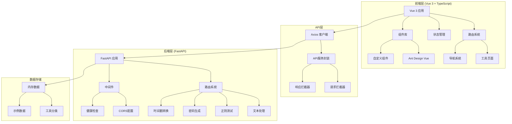

**架构图来源**
- [app.py](file://backend/app.py#L1-L33)
- [main.ts](file://ZYTool/src/main.ts#L1-L12)
- [api.ts](file://ZYTool/src/services/api.ts#L1-L178)

### 架构优势

1. **职责清晰**：前端专注于用户界面和交互逻辑，后端负责业务逻辑和数据处理
2. **技术独立**：前后端可以独立开发、测试和部署，提高开发效率
3. **可扩展性**：模块化设计便于功能扩展和维护
4. **性能优化**：前后端分离有利于缓存策略和资源优化

## 技术栈分析

### 前端技术栈

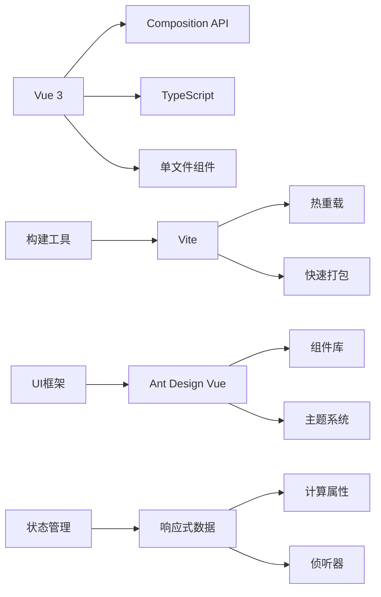

**技术栈图来源**
- [package.json](file://ZYTool/package.json#L1-L27)
- [vite.config.ts](file://ZYTool/vite.config.ts#L1-L8)

#### Vue 3 + TypeScript组合的优势

1. **类型安全**：TypeScript提供强大的类型系统，减少运行时错误
2. **现代API**：Vue 3的Composition API提供更灵活的状态管理方式
3. **性能优化**：虚拟DOM和细粒度更新机制确保良好的性能表现
4. **开发体验**：完善的IDE支持和智能提示

### 后端技术栈

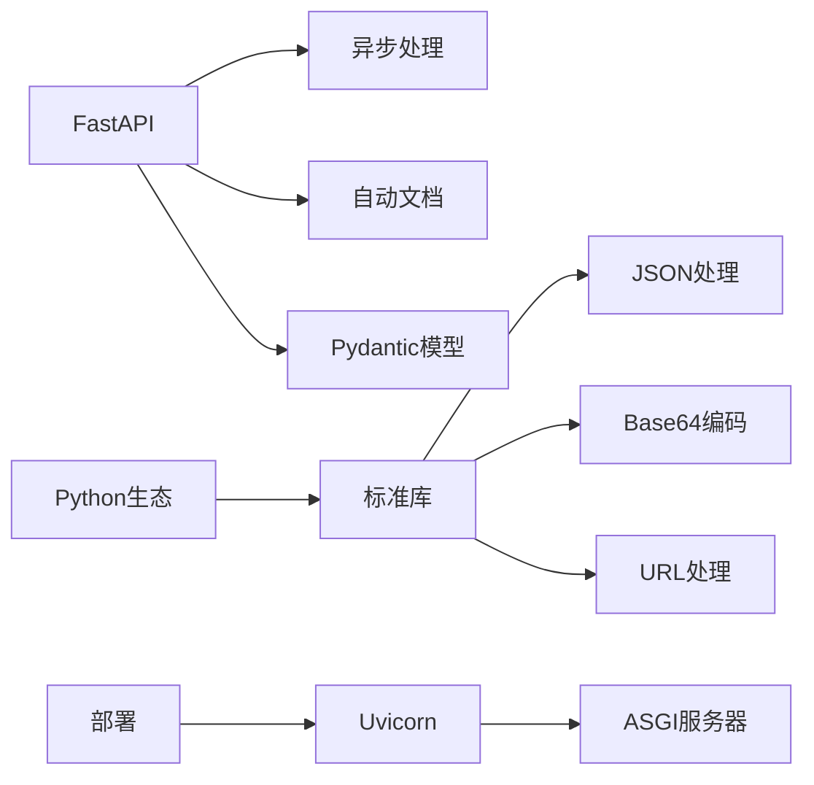

**技术栈图来源**
- [requirements.txt](file://backend/requirements.txt#L1-L4)
- [app.py](file://backend/app.py#L1-L33)

#### FastAPI的选择理由

1. **高性能**：基于Starlette和Pydantic，提供卓越的性能表现
2. **自动文档**：内置Swagger UI和ReDoc，自动生成API文档
3. **类型安全**：与Pydantic集成，提供强类型的API定义
4. **易于测试**：异步支持使得单元测试更加简单

## 前后端分离设计理念

100_Code项目严格遵循前后端分离的设计原则，通过明确的职责划分实现系统的优雅架构。

### 分离原则

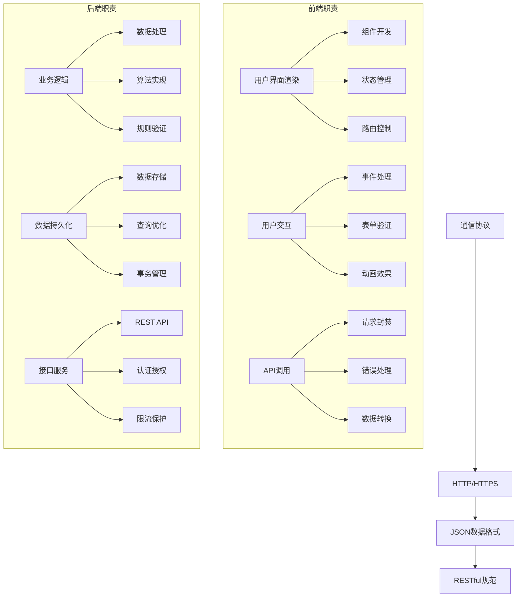

**分离图来源**
- [api.ts](file://ZYTool/src/services/api.ts#L1-L178)
- [text.py](file://backend/routers/text.py#L1-L76)

### 设计优势

1. **开发效率**：前后端团队可以并行开发，缩短交付周期
2. **技术选型灵活性**：前端可以选择最适合的框架，后端专注于业务逻辑
3. **部署独立性**：前端静态资源可以使用CDN加速，后端服务可以水平扩展
4. **维护便利性**：模块化设计便于问题定位和功能升级

## 核心功能模块

100_Code项目提供了丰富的工具集合，按照处理位置分为前端工具和后端工具两大类别。

### 工具分类体系

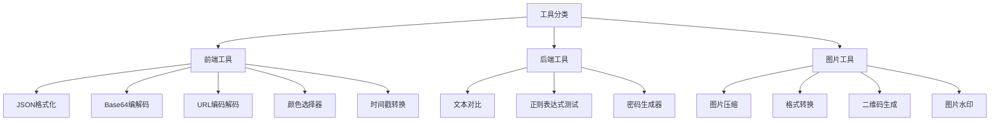

**分类图来源**
- [HomeView.vue](file://ZYTool/src/views/HomeView.vue#L67-L114)

### 前端工具实现

前端工具利用浏览器原生API和JavaScript特性，在客户端完成数据处理，无需向后端发送请求。

#### JSON格式化工具

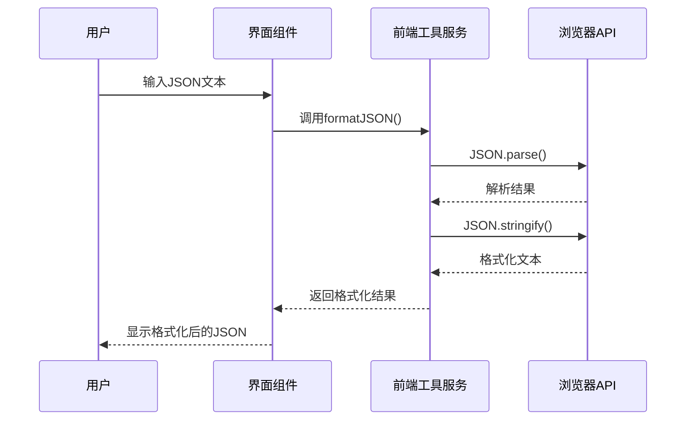

**序列图来源**
- [JsonToolView.vue](file://ZYTool/src/views/JsonToolView.vue#L100-L122)
- [frontendTools.ts](file://ZYTool/src/services/frontendTools.ts#L7-L17)

#### Base64编解码工具

前端Base64工具支持Unicode字符处理，通过TextEncoder和TextDecoder确保多语言兼容性。

#### 时间戳转换工具

提供毫秒和秒两种时间戳格式的转换，支持多种日期时间格式输出。

### 后端工具实现

后端工具处理复杂的业务逻辑和大量数据运算，通过FastAPI提供高性能的服务能力。

#### 文本处理接口

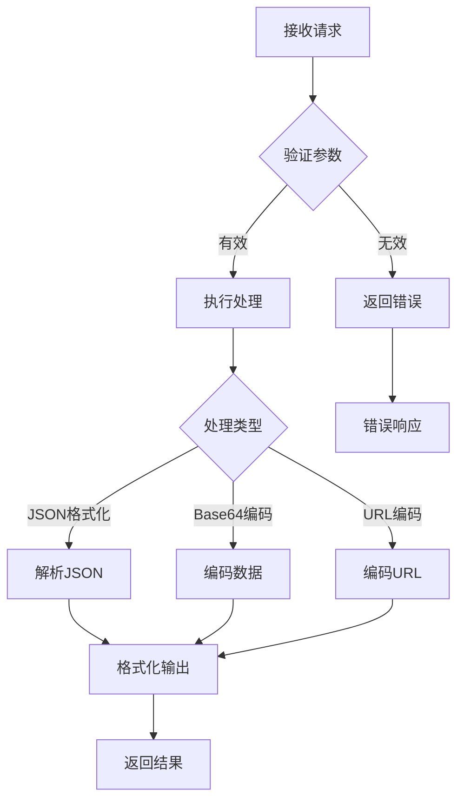

**流程图来源**
- [text.py](file://backend/routers/text.py#L13-L42)

#### 密码生成器

后端密码生成器支持多种字符集组合，满足不同安全需求。

#### 正则表达式测试

提供强大的正则表达式测试功能，支持匹配详情和分组信息。

## 数据流与交互机制

100_Code项目建立了完整的数据流和交互机制，确保用户操作的流畅性和系统的稳定性。

### API通信架构

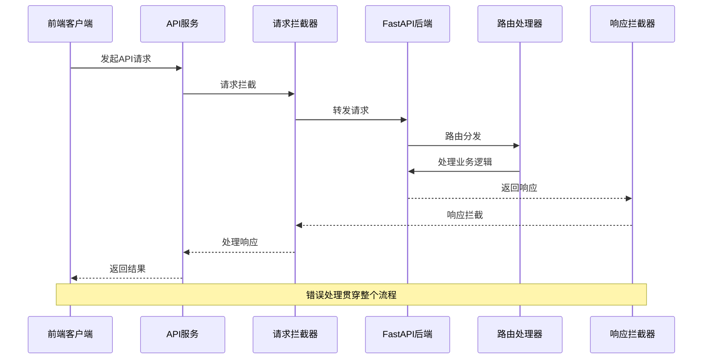

**通信图来源**
- [api.ts](file://ZYTool/src/services/api.ts#L13-L33)
- [app.py](file://backend/app.py#L1-L33)

### 错误处理机制

系统实现了多层次的错误处理机制，确保用户体验的连续性。

#### 前端错误处理

1. **请求级错误**：网络异常、超时等情况的处理
2. **业务级错误**：API返回的错误信息展示
3. **用户友好提示**：使用Ant Design Vue的消息组件

#### 后端错误处理

1. **参数验证**：Pydantic模型自动验证输入参数
2. **异常捕获**：全局异常处理器统一处理
3. **状态码返回**：标准化的HTTP状态码和错误信息

### 状态管理策略

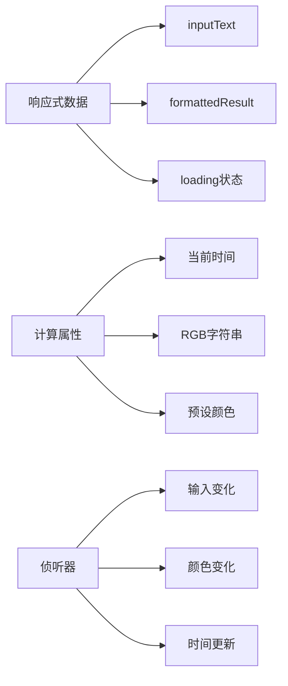

**状态图来源**
- [JsonToolView.vue](file://ZYTool/src/views/JsonToolView.vue#L95-L122)
- [TimestampToolView.vue](file://ZYTool/src/views/TimestampToolView.vue#L150-L170)

## 项目启动与部署

100_Code项目提供了简洁明了的启动流程，支持开发环境和生产环境的不同配置。

### 开发环境启动

#### 后端服务启动

```bash
# 进入后端目录
cd backend

# 安装Python依赖
pip install -r requirements.txt

# 启动FastAPI服务
python app.py
```

后端服务将在 `http://localhost:8000` 运行，提供完整的API接口。

#### 前端服务启动

```bash
# 进入前端目录
cd ZYTool

# 安装前端依赖
npm install

# 启动开发服务器
npm run dev
```

前端开发服务器将在 `http://localhost:5173` 运行，提供热重载功能。

### 生产环境部署

#### 前端部署

1. **构建生产包**：
   ```bash
   cd ZYTool
   npm run build
   ```

2. **部署静态文件**：将 `dist` 目录部署到Web服务器或CDN

#### 后端部署

1. **安装依赖**：
   ```bash
   pip install -r requirements.txt
   ```

2. **启动服务**：
   ```bash
   uvicorn backend.app:app --host 0.0.0.0 --port 8000
   ```

### 环境配置

项目使用环境变量进行配置管理，主要配置项包括：

- **CORS配置**：允许前端开发服务器访问
- **API基础路径**：默认为 `/api`
- **超时设置**：10秒请求超时

**配置图来源**
- [app.py](file://backend/app.py#L13-L20)
- [api.ts](file://ZYTool/src/services/api.ts#L4-L10)

## 性能优化策略

100_Code项目在多个层面实施了性能优化策略，确保应用的高效运行。

### 前端性能优化

#### 组件懒加载

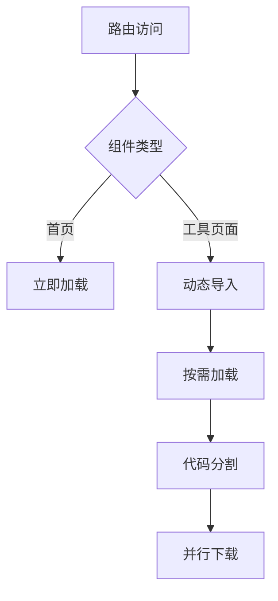

#### 状态优化

1. **响应式数据**：使用Vue 3的响应式系统，避免不必要的重新渲染
2. **计算属性**：缓存计算结果，减少重复计算
3. **事件防抖**：对频繁触发的操作进行防抖处理

#### 资源优化

1. **CSS模块化**：使用CSS变量和模块化样式
2. **组件复用**：共享通用组件和样式
3. **图片优化**：使用SVG图标和适当的图片格式

### 后端性能优化

#### 异步处理

FastAPI的异步特性确保了高并发场景下的良好性能。

#### 内存管理

1. **对象池**：重用常用的对象实例
2. **垃圾回收**：及时释放不再使用的资源
3. **缓存策略**：对频繁访问的数据进行缓存

#### 并发处理

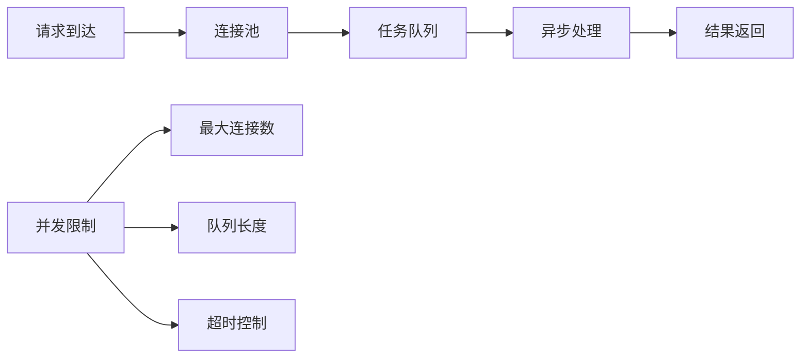

**优化图来源**
- [app.py](file://backend/app.py#L30-L33)

## 扩展性设计

100_Code项目具有良好的扩展性设计，支持功能的平滑扩展和维护。

### 模块化架构

#### 前端模块化

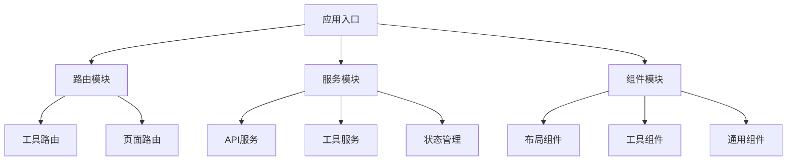

**模块图来源**
- [index.ts](file://ZYTool/src/router/index.ts#L1-L59)
- [api.ts](file://ZYTool/src/services/api.ts#L99-L177)

#### 后端模块化

后端采用路由器模式，每个功能模块对应独立的路由文件。

### 插件化扩展

#### 新工具添加流程

1. **前端工具**：
   - 创建新的Vue组件
   - 添加路由配置
   - 更新工具分类数据

2. **后端工具**：
   - 创建新的路由处理器
   - 添加数据模型
   - 更新API文档

#### 配置化管理

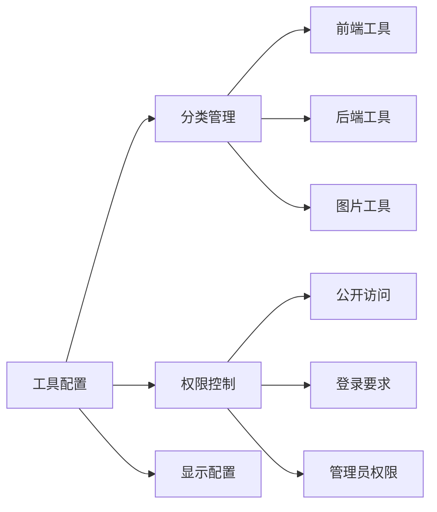

### 国际化支持

项目预留了国际化支持的基础架构，便于未来支持多语言版本。

### 主题定制

通过CSS变量系统，支持主题的灵活切换和定制。

**扩展图来源**
- [HomeView.vue](file://ZYTool/src/views/HomeView.vue#L67-L114)

## 总结

100_Code项目作为一个全栈开发者工具平台，成功地展示了现代Web应用开发的最佳实践。通过Vue 3 + TypeScript前端与FastAPI后端的完美结合，项目实现了以下核心价值：

### 技术价值

1. **架构先进性**：采用前后端分离架构，符合现代Web开发趋势
2. **技术栈现代化**：使用Vue 3、TypeScript、FastAPI等前沿技术
3. **开发体验优秀**：完善的TypeScript支持和现代化的开发工具链

### 用户价值

1. **功能实用性**：提供开发者日常工作中最需要的工具集合
2. **操作便捷性**：直观的界面设计和流畅的交互体验
3. **性能可靠性**：高效的处理能力和稳定的系统表现

### 社区价值

1. **开源贡献**：为开发者社区提供了一个优秀的学习案例
2. **知识传播**：展示了最佳实践和设计模式的应用
3. **协作平台**：为开发者交流和协作提供了良好基础

### 发展前景

100_Code项目具有良好的扩展性和可持续发展能力，能够随着技术演进和用户需求的变化而不断演进。项目的模块化设计和清晰的架构为未来的功能扩展和性能优化奠定了坚实基础。

对于初学者而言，这是一个绝佳的学习项目，可以帮助理解现代Web应用开发的完整流程；对于经验丰富的开发者，项目展示了如何构建高质量、可维护的企业级应用。无论是个人学习还是团队参考，100_Code都提供了宝贵的价值和启示。